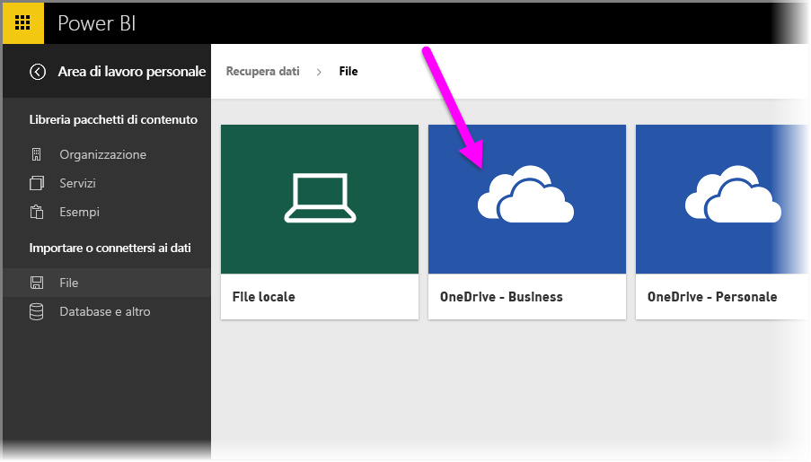
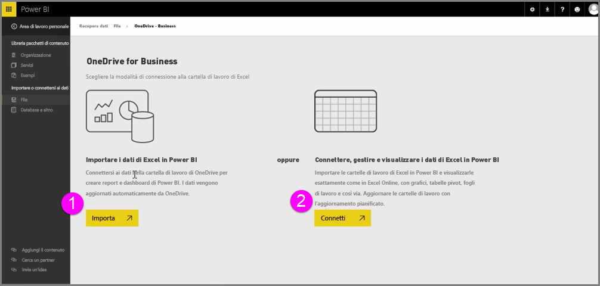
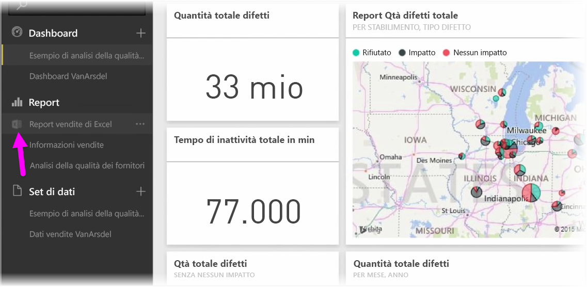
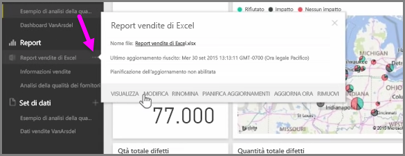

Ottenere l'integrazione perfetta tra Excel e Power BI quando si salvano le cartelle di lavoro di Excel in OneDrive.

Poiché OneDrive è nel cloud, come Power BI, viene stabilita una connessione diretta tra Power BI e OneDrive. Se si apportano modifiche alla cartella di lavoro su OneDrive, le modifiche vengono *automaticamente sincronizzate* con Power BI. Le visualizzazioni nei report e nei dashboard vengono aggiornate in modo automatico. Se la cartella di lavoro si connette a origini dati esterne come un database o un feed OData, è possibile usare la funzionalità **Pianifica aggiornamento** di Power BI per verificare la disponibilità di aggiornamenti. Domande sui dati nella cartella di lavoro? ma si tratta di un problema facilmente risolvibile. È possibile usare la funzionalità **Domande e risposte** di Power BI.

Esistono due modi per connettere i file di Excel a OneDrive for Business:

1. Importare i dati di Excel in Power BI
2. Connettere, gestire e visualizzare i dati di Excel in Power BI

### Importare i dati di Excel in Power BI
Quando si sceglie di importare i dati di Excel in Power BI, i dati della tabella dalla cartella di lavoro vengono caricati in un nuovo set di dati in Power BI. Se sono presenti fogli **Power View** della cartella di lavoro, vengono importati e vengono automaticamente creati nuovi report in Power BI.

Power BI manterrà la connessione tra questo e il file della cartella di lavoro in OneDrive for Business. Se si apportano modifiche alla cartella di lavoro, quando si salva le modifiche saranno *automaticamente sincronizzate** con Power BI, generalmente entro un'ora. Se la cartella di lavoro si connette a origini dati esterne, è possibile configurare la pianificazione dell'aggiornamento in modo che il set di dati in Power BI sia sempre aggiornato. Poiché le visualizzazioni nei report e nei dashboard in Power BI usa i dati dal set di dati, durante l'esplorazione le query sono rapidissime.

### Connetti, gestisci e visualizza i dati di Excel in Power BI
Quando si sceglie di connettersi alla cartella di lavoro di Excel, si otterrà un'esperienza perfetta di lavoro con la cartella di lavoro in Excel e Power BI. Quando si esegue questa connessione, il report della cartella di lavoro presenta una piccola icona di Excel lateralmente.

Nel report si visualizza la cartella di lavoro di Excel in Power BI come si visualizza su **Excel Online**. È possibile esplorare e modificare i fogli di lavoro in Excel Online selezionando Modifica dal menu di puntini di sospensione. Quando si apportano modifiche, le visualizzazioni che sono state aggiunte ai dashboard vengono aggiornate in automatico.

Non viene creato alcun set di dati in Power BI. Tutti i dati rimangono nella cartella di lavoro in OneDrive. Uno dei numerosi vantaggi di questo approccio consiste nella possibilità di configurare l'**aggiornamento pianificato** se la cartella di lavoro si connette a origini dati esterne. È possibile selezionare elementi quali tabelle pivot e grafici e **aggiungerli** direttamente al dashboard in Power BI. Eventuali modifiche apportate vendono applicate automaticamente in Power BI. È anche possibile usare la meravigliosa funzionalità **Domande e risposte** di Power BI per porre domande sui dati nella cartella di lavoro.  

