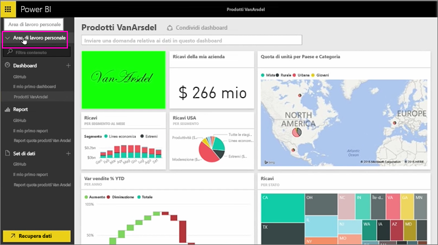
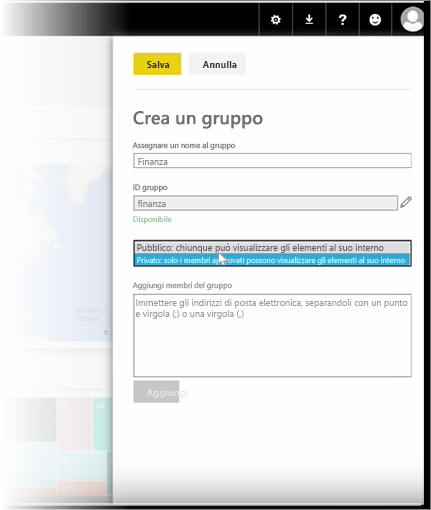
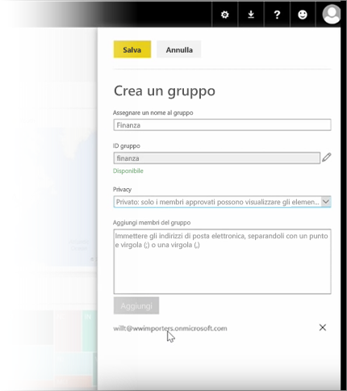

Per iniziare, in questa lezione viene creato un *gruppo*. Un **gruppo** definisce un set di utenti che hanno accesso a dashboard, report e dati specifici.

Poiché i gruppi in Power BI sono basati sui gruppi di Office 365, se si usano già gruppi di Office 365 per gestire la posta elettronica, il calendario e i documenti del proprio gruppo, si noterà che Power BI offre le stesse funzionalità, insieme ad altre ancora. Quando si crea un gruppo in Power BI, si crea in realtà un gruppo di Office 365.

Questo modulo usa lo scenario di configurazione di un nuovo gruppo per le attività finanziarie. Verrà descritto come configurare il gruppo, condividere dashboard, report e set di dati nel gruppo e aggiungere membri che avranno accesso agli elementi nel gruppo.

Iniziare da Area di lavoro personale... Si tratta dei dashboard, dei report e dei set di dati già creati o condivisi da qualcun altro.

Se si espande Area di lavoro personale, è possibile selezionare **Crea un gruppo**.

Qui è possibile assegnare un nome al gruppo. Poiché questo è lo scenario di un gruppo per attività finanziarie, assegnare il nome Finance al gruppo. Power BI verifica che il nome non esista già nel dominio.

È possibile impostare il livello di privacy stabilendo se qualcuno nell'organizzazione può visualizzare il contenuto del gruppo o se possono solo i membri del gruppo.

Digitare qui gli indirizzi di posta elettronica, i gruppi di sicurezza e le liste di distribuzione. Selezionare **Aggiungi** per definire gli utenti come membri del gruppo e salvare il gruppo.

Alla prossima lezione!

