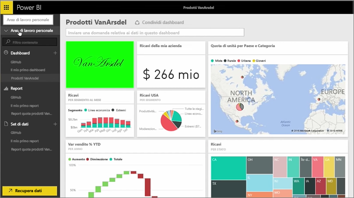
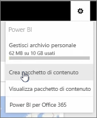
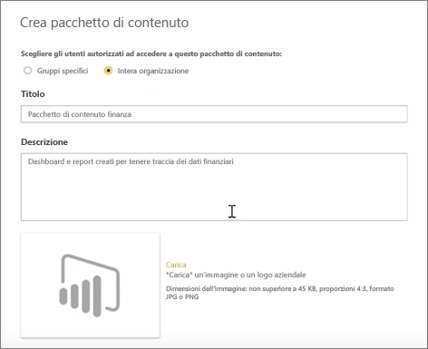
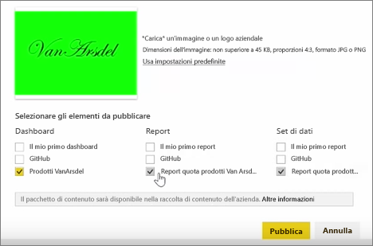
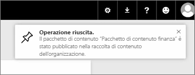

In questa lezione, ci occupiamo della creazione di un *pacchetto di contenuto* con gli elementi già presenti in Power BI e della condivisione con i colleghi. 

In **Area di lavoro** è presente un dashboard, il report sottostante e il set di dati. Si desidera condividerli come pacchetto con le persone nell'organizzazione, in modo che possano essere riutilizzati.

Quando seleziona il **impostazioni** icona (l'ingranaggio in alto a destra del servizio), posso vedere ho utilizzato lo spazio di archiviazione e creare un'app (in precedenza denominata pacchetti di contenuto).

Nella finestra di dialogo visualizzata, è possibile scegliere se distribuirlo a utenti o gruppi specifici e anche specificare un titolo. È anche consigliabile fornire una descrizione dettagliata del **descrizione** finestra di utenti che accedono a un'app per conoscere il relativo contenuto o le caratteristiche.

Nella parte inferiore della finestra di dialogo, ho la possibilità di caricare un'immagine per l'app e quindi il passaggio più importante: Selezionare il dashboard da includere nell'app e quando si esegue questa operazione, Power BI seleziona automaticamente il report e set di dati utilizzati nel dashboard. Non è possibile deselezionare il report o set di dati, perché il dashboard da includere nell'app è necessarie.

Sarebbe inoltre possibile selezionare altri dashboard, report e set di dati, ma non a questo punto.

Al momento della pubblicazione, l'app viene aggiunto alla raccolta di contenuto dell'organizzazione.

Alla prossima lezione!

