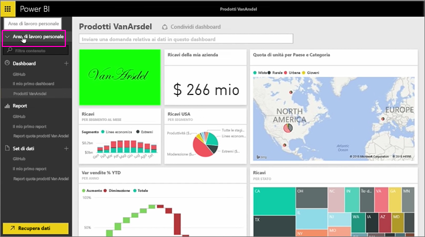
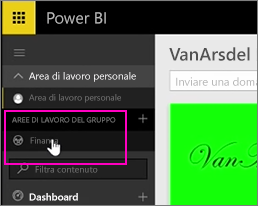
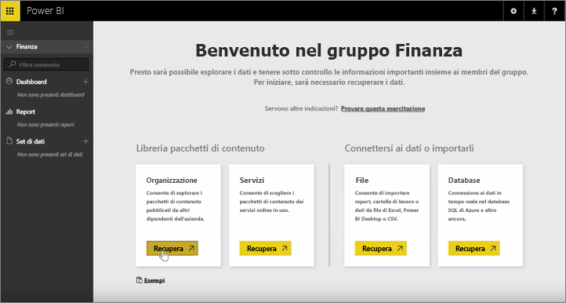
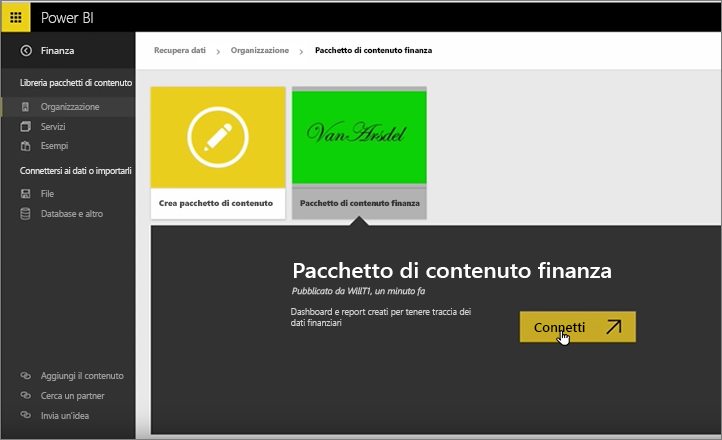
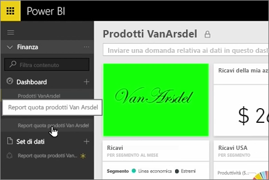
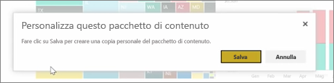
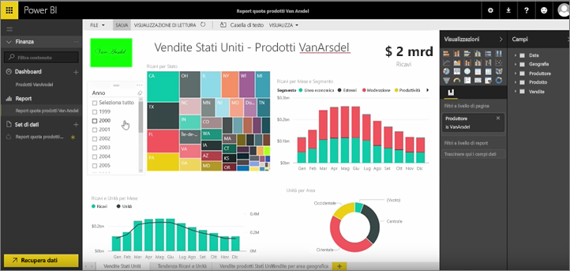

Nelle lezioni precedenti sono già stati creati un pacchetto di contenuto e un gruppo. In questa lezione si creerà un'istanza del pacchetto di contenuto per tutti gli utenti nel gruppo.

Iniziare da Area di lavoro personale...

...e tornare al gruppo Finance creato nella lezione precedente.

Il gruppo è ancora privo di dashboard, report o set di dati. Devo usare l'app che è stata creata. Esplorare le app dalla mia organizzazione anziché quelle di servizi di terze parti.

Trovare le app che ho creato un minuto fa. È importante assegnargli un titolo, una descrizione e un'immagine appropriati, perché gli altri utenti riescano a trovarlo. Connettersi al pacchetto di contenuto.

Power BI Importa i dashboard, report e i set di dati nell'app.

Quando si seleziona il set di dati, Power BI chiede se si vuole personalizzare l'app.

Sto creando una copia dell'app che è possibile apportare modifiche e disconnetterla dalla versione pubblicata dell'app. Se all'autore dell'app apporta modifiche alla versione pubblicata, si otterranno automaticamente gli aggiornamenti.

Tuttavia, è possibile modificare il dashboard, il report e persino il set di dati, se si vuole.

Pertanto, l'app si trovino in modo semplice per riutilizzare contenuto creato da altri utenti nell'organizzazione.

Alla prossima lezione!

