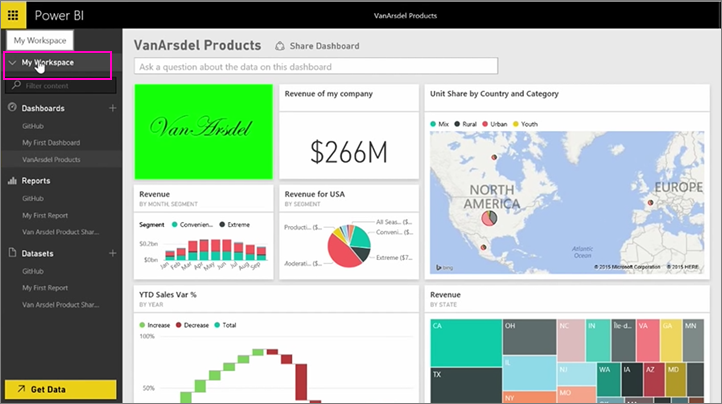
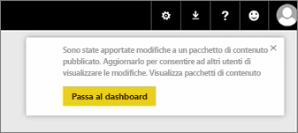
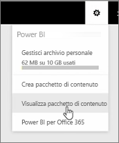
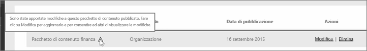
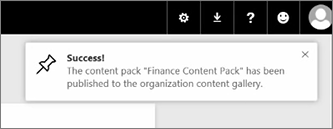

In questa lezione si andiamo sostanzialmente a modificare l'app originale che è stato creato in precedenza e vedere come che aggiorna gli altri utenti che vi sono connessi a esso.

Tornare ad Area di lavoro personale per modificare il dashboard originale.

Ogni volta che viene apportata una modifica al dashboard, viene visualizzato questo promemoria che è stato modificato un elemento condiviso con altri utenti in un'app, e richiede se si desidera aggiornare la versione condivisa.

Tornare indietro per l'icona delle impostazioni e selezionare **app visualizzazione** per visualizzare le app già pubblicati.

Visualizzare l'app che dopo aver apportato. Questa piccola icona indica che è stato modificato un elemento nell'app e ho bisogno di modificare l'app in modo che altri utenti possano visualizzare le modifiche.

Quando si seleziona **Modifica**, viene visualizzata di nuovo la schermata in cui è possibile modificare il titolo e la descrizione, ma ora è presente il pulsante **Aggiorna**. Selezionare questo pulsante.

Power BI acquisisce le modifiche e pubblica l'app aggiornata nella raccolta di app.

Chiunque sia connesso alla mia app riceve un messaggio che l'app è stato modificato e chiede se accettare le modifiche o mantenere la versione precedente.

Così come il proprietario dell'app, è possibile gestire le versioni che usano i colleghi.

