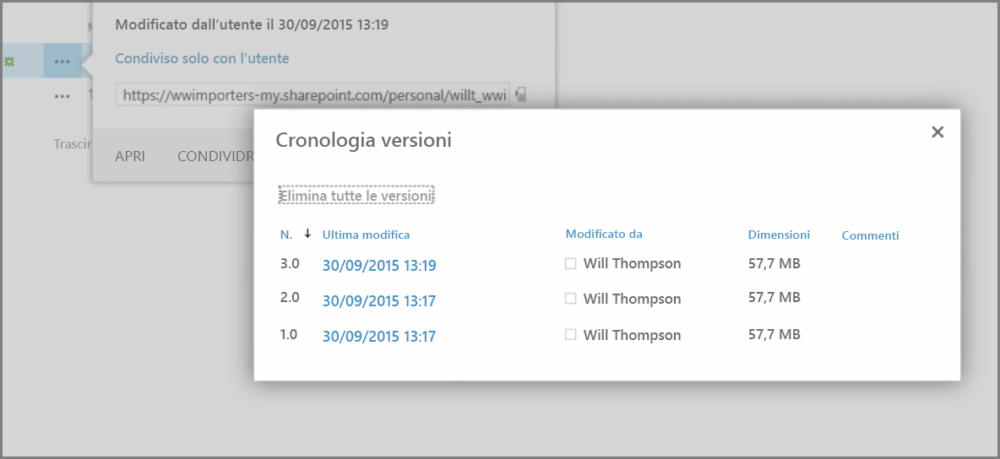
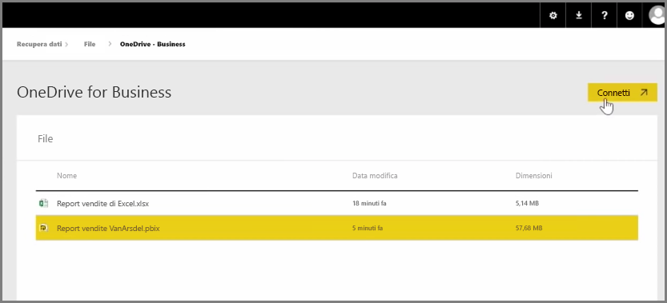
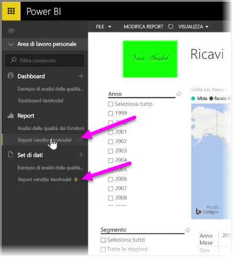

In un articolo precedente è stata esaminata la creazione di gruppi per aiutare l'organizzazione a gestire e a collaborare sui contenuti che si trovano in Power BI. È anche possibile usare i gruppi di Power BI/Office365 per collaborazione e condivisione usando **OneDrive for Business**.

L'uso di OneDrive for Business come origine per il contenuto di Power BI permette di accedere a diversi strumenti utili, come la cronologia delle versioni. È anche possibile condividere i file con un gruppo di Office365 da OneDrive for Business per offrire l'accesso e permettere a molti utenti di lavorare agli stessi file di Power BI o di Excel.

Per connettersi a un file PBIX (Power BI Desktop) in OneDrive for Business, accedere al servizio Power BI e selezionare **Recupera dati**. Scegliere **File** in Connettersi ai dati o importarli e quindi fare clic su **OneDrive - Lavoro**. Evidenziare il file desiderato e quindi selezionare **Connetti**.

Il contenuto viene visualizzato nella barra di spostamento sul lato destro.

A questo punto, tutte le modifiche apportate al file in **OneDrive for Business** si rifletteranno automaticamente anche nell'ambiente Power BI e verranno registrate nella cronologia delle versioni.

