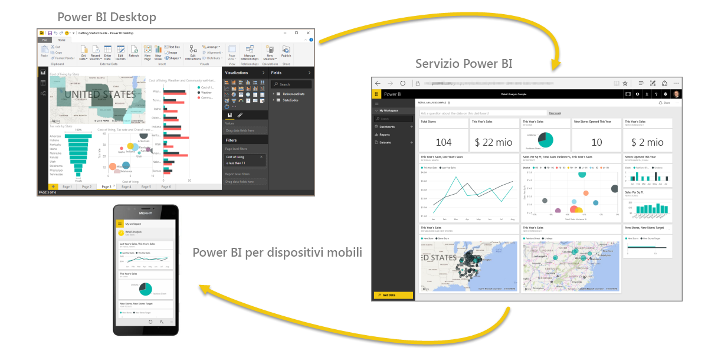
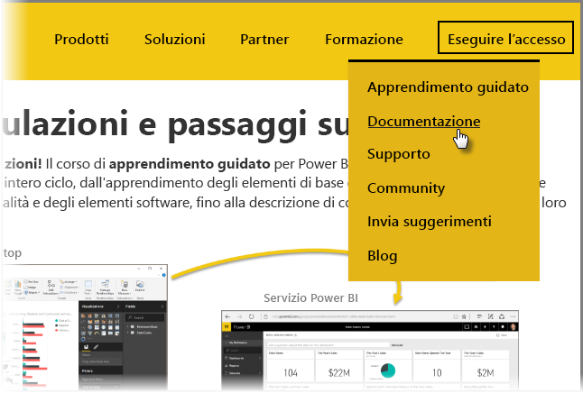

L'operazione è stata completata. **Congratulazioni!** Il corso di **apprendimento guidato** per Power BI è stata completato. È stato completato l'intero ciclo, dall'apprendimento degli elementi di base di Power BI a una presentazione delle funzionalità e degli elementi software, fino alla descrizione di come questi si integrino tutti tra loro.

Dal momento che questa è l'ultima sezione del corso (e l'argomento finale, a meno che non si voglia apprendere DAX), se tutte le sezioni sono state seguite nell'ordine corretto, è arrivato il momento di tirare le somme con orgoglio riguardo al percorso intrapreso. Ottimo lavoro! A questo punto, si avrà una buona familiarità con tutti i **concetti importanti**:

* Che [cos'è Power BI](0-0-what-is-power-bi.md)
* [Componenti essenziali](0-0b-building-blocks-power-bi.md) di Power BI
* [Recupero](1-2-connect-to-data-sources-in-power-bi-desktop.md) e [modellazione](2-1-intro-modeling-data.md) dei dati
* [Visualizzazioni](3-1-intro-visualizations.md)
* [Esplorazione dei dati](4-0-intro-power-bi-service.md) nel servizio Power BI
* Uso di [Excel e Power BI](5-1-intro-excel-data.md) insieme
* Infine, [pubblicazione e condivisione](6-0-intro-content-packs-groups.md) del lavoro

Ora che sono state acquisite le innumerevoli competenze oggetto di questo corso, è possibile usarle con profitto. Ecco alcuni **collegamenti a download** o per **connettere il browser al servizio Power BI**:

* È sempre possibile [ottenere la versione più recente di Power BI Desktop](https://powerbi.microsoft.com/desktop)
* L'accesso al [servizio Power BI](https://powerbi.microsoft.com/) è semplice
* La capacità di ottenere [app per dispositivi mobili per Power BI](https://powerbi.microsoft.com/mobile/) è a portata di mano

Sono anche disponibili altre **informazioni di riferimento e di supporto**. È sufficiente tornare all'inizio di questa pagina e selezionare **Formazione > Documentazione** per visualizzare l'esteso set di contenuti di riferimento per Power BI.

Microsoft si augura che gli utenti abbiano apprezzato questa esperienza **di apprendimento guidato di Power BI** e che sia ora possibile per tutti creare oggetti visivi di Power BI coinvolgenti e accattivanti.

## Un'altra sezione per gli utenti di DAX
Se si è interessati ad altre informazioni sull'uso di **DAX (Data Analysis Expressions)** per creare, filtrare o usare colonne e tabelle personalizzate in Power BI, ecco un'altra sezione destinata agli utenti che sono propensi a scrivere codice in Power BI, dal titolo **Introduzione a DAX**, che usa lo stesso approccio descrittivo del resto dell'Apprendimento guidato.

