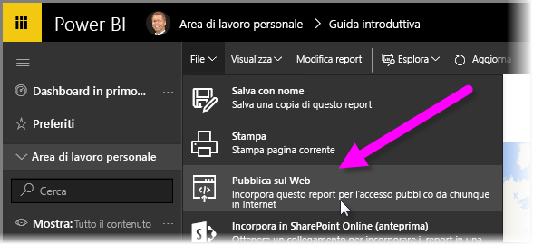
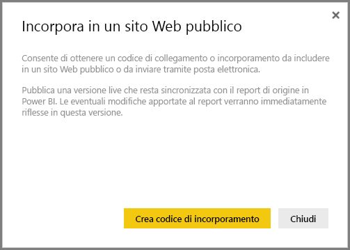
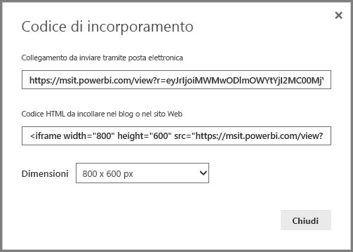
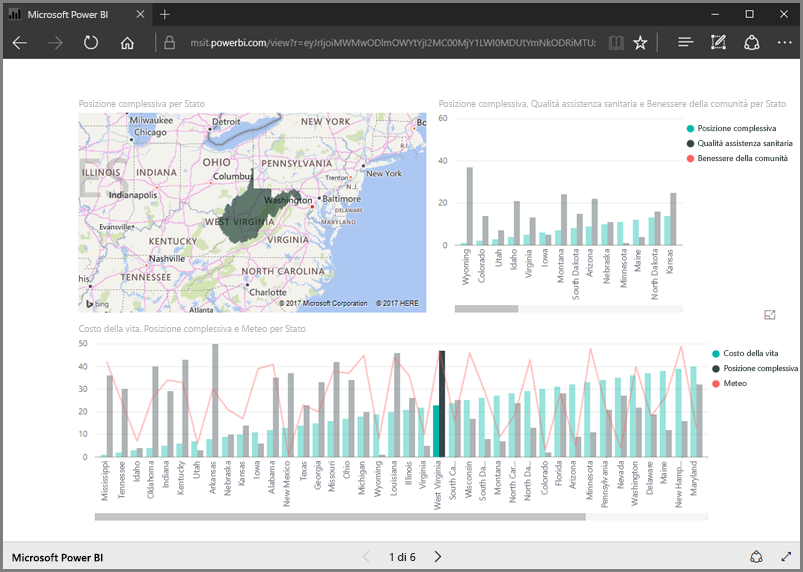
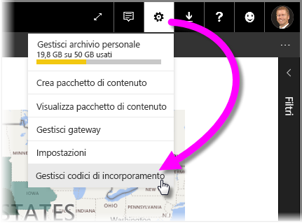
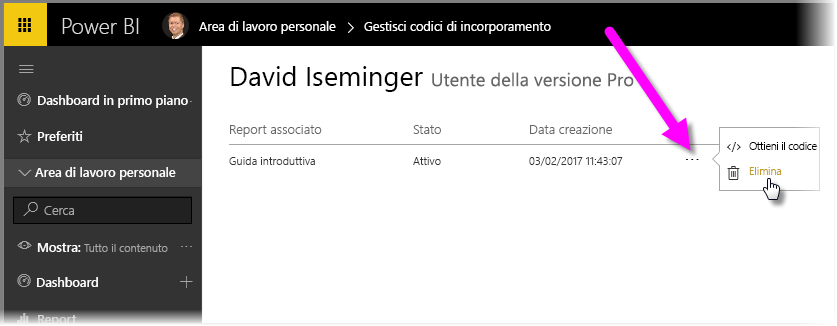

In questa lezione viene spiegato come condividere un report di Power BI in una pagina Web o tramite posta elettronica, in pochi semplici passaggi. Questa funzionalità di Power BI, nota anche come **Pubblica sul Web**, è facile da usare e gestire.

In Power BI selezionare il report che si vuole condividere, in modo che venga visualizzato nell'area di disegno. A quel punto, nel menu selezionare **File > Pubblica sul Web**.

Viene visualizzata una finestra di dialogo che spiega che si otterrà un *codice di incorporamento* che consente di includere il report in un sito Web o in un messaggio di posta elettronica.

Quando si seleziona **Crea codice di incorporamento**, Power BI mostra un'altra finestra di dialogo che indica nuovamente che i dati verranno condivisi con chiunque su Internet. Assicurarsi che questo sia il risultato che si vuole ottenere.

Power BI presenta una finestra di dialogo con due collegamenti:

* Un collegamento che può essere condiviso tramite posta elettronica per visualizzare il report come pagina Web
* Un codice HTML (un collegamento all'interno di un iframe) per incorporare il report direttamente in una pagina Web

Per il collegamento HTML è possibile selezionare una delle dimensioni predefinite per il report incorporato oppure modificare manualmente il codice iframe e personalizzarne le dimensioni.

Il collegamento inviato tramite posta elettronica può essere semplicemente incollato in un browser per visualizzare il report come pagina Web. Si può interagire con la pagina Web esattamente come si farebbe con il report visualizzato in Power BI. Le immagini seguenti mostrano una pagina **Pubblica sul Web** quando il collegamento è stato copiato direttamente dalla finestra di dialogo in un browser:

È anche possibile incorporare il collegamento iframe in un post di blog o sito Web o anche in Sway.

Si vuole eliminare un codice incorporato che è stato creato? Non c'è problema. In Power BI selezionare l'icona dell'**ingranaggio** in alto a destra, quindi selezionare **Gestisci codici di incorporamento**.

L'area di lavoro di Power BI mostra i codici di incorporamento creati (nell'immagine seguente ne è presente uno solo). Quando si fa clic sui puntini di sospensione, è possibile decidere di ottenere il codice per il codice di incorporamento o di eliminarlo del tutto.

Non c'è altro da sapere per pubblicare un report di Power BI sul Web e condividerlo con tutti. È semplice.

