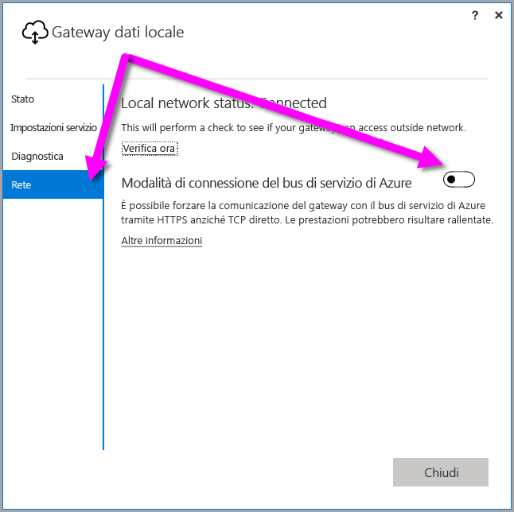
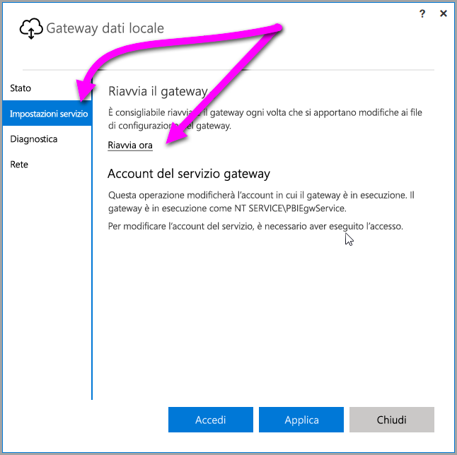

## <a name="sign-in-account"></a>Account di accesso
Gli utenti eseguiranno l'accesso con un account aziendale o dell'istituto di istruzione. Questo è l'account aziendale. Se è stata effettuata l'iscrizione per un'offerta di Office 365 senza specificare l'indirizzo di posta elettronica dell'ufficio, questo può apparire come nancy@contoso.onmicrosoft.com. All'interno di un servizio cloud, l'account viene archiviato in un tenant di Azure Active Directory (AAD). Nella maggior parte dei casi, l'UPN dell'account AAD corrisponderà all'indirizzo di posta elettronica.

## <a name="windows-service-account"></a>Account del Servizio di Windows
Il gateway dati locale è configurato in modo da usare *NT SERVICE\PBIEgwService* per il servizio Windows di Registro credenziali. Per impostazione predefinita, ha il diritto Accedi come servizio a seconda del contesto del computer su cui si sta installando il gateway.

> [!NOTE]
> Se è stata selezionata la modalità personale, configurare separatamente l'account del servizio di Windows.
> 
> 

Questo non è l'account usato per connettersi alle origini dati locali.  Non si tratta neanche dell'account aziendale o dell'istituto di istruzione con cui si accede ai servizi cloud.

Se si verificano problemi di autenticazione con il server proxy, è possibile modificare l'account del servizio Windows in un account utente di dominio o in un account del servizio gestito. Per informazioni su come modificare l'account, vedere la [configurazione proxy](../service-gateway-proxy.md#changing-the-gateway-service-account-to-a-domain-user).

## <a name="ports"></a>Porte
Il gateway crea una connessione in uscita al Bus di servizio di Azure. Esso comunica su porte in uscita: TCP 443 (predefinita), 5671, 5672, 9350 a 9354.  Il gateway non richiede porte in entrata. [Altre informazioni](https://azure.microsoft.com/documentation/articles/service-bus-fundamentals-hybrid-solutions/)

È consigliabile aggiungere all'elenco elementi consentiti nel firewall gli indirizzi IP per l'area dati. È possibile scaricare l'[elenco di IP del data center di Microsoft Azure](https://www.microsoft.com/download/details.aspx?id=41653). Questo elenco viene aggiornato ogni settimana. Il gateway comunicherà con un Bus di servizio di Azure usando l'indirizzo IP insieme al nome di dominio completo (FQDN). Se si impone al gateway di comunicare tramite HTTPS, verrà usato esclusivamente il nome di dominio completo e non avrà luogo alcuna comunicazione usando gli indirizzi IP.

> [!NOTE]
> Gli indirizzi IP elencati nell'elenco di IP del data center di Azure sono in notazione CIDR. Ad esempio, 10.0.0.0/24 non significa da 10.0.0.0 a 10.0.0.24. Altre informazioni sulla [notazione CIDR](http://whatismyipaddress.com/cidr).
> 
> 

Di seguito è riportato un elenco dei nomi di dominio completi usati dal gateway.

| Nomi di dominio | Porte in uscita | Descrizione |
| --- | --- | --- |
| *.download.microsoft.com |80 |Protocollo HTTP usato per scaricare il programma di installazione. |
| *.powerbi.com |443 |HTTPS |
| *.analysis.windows.net |443 |HTTPS |
| *.login.windows.net |443 |HTTPS |
| *.servicebus.windows.net |5671-5672 |Advanced Message Queuing Protocol (AMQP) |
| *.servicebus.windows.net |443, 9350-9354 |Listener in Inoltro del bus di servizio su TCP (è richiesta la porta 443 per l'acquisizione del token di Controllo di accesso) |
| *.frontend.clouddatahub.net |443 |HTTPS |
| *.core.windows.net |443 |HTTPS |
| login.microsoftonline.com |443 |HTTPS |
| *.msftncsi.com |443 |Usato per testare la connettività a internet se il gateway non è raggiungibile dal servizio Power BI. |
| *.microsoftonline-p.com |443 |Usato per l'autenticazione a seconda della configurazione. |

> [!NOTE]
> Il traffico destinato a visualstudio.com o a visualstudioonline.com riguarda le informazioni dettagliate sull'app e non è richiesto per il funzionamento del gateway.
> 
> 

## <a name="forcing-https-communication-with-azure-service-bus"></a>Forzare la comunicazione HTTPS con il bus di servizio di Azure
È possibile forzare il gateway per comunicare con il bus di servizio di Azure usando HTTPS anziché il TCP diretto. Ciò può avere un impatto sulle prestazioni. A questo scopo, modificare il file *Microsoft.PowerBI.DataMovement.Pipeline.GatewayCore.dll.config* cambiando il valore da `AutoDetect` a `Https`, come mostrato nel frammento di codice riportato subito dopo questo paragrafo. Per impostazione predefinita, il file si trova in *C:\Programmi\Gateway dati locale*.

```
<setting name="ServiceBusSystemConnectivityModeString" serializeAs="String">
    <value>Https</value>
</setting>
```

Il valore del parametro *ServiceBusSystemConnectivityModeString* rispetta la distinzione tra maiuscole e minuscole. I valori validi sono *AutoDetect* e *Https*.

In alternativa, è possibile imporre al gateway di adottare questo comportamento usando l'interfaccia utente del gateway, a partire dalla versione di [marzo 2017](https://powerbi.microsoft.com/blog/power-bi-gateways-march-update/). Nell'interfaccia utente del gateway selezionare **Rete**, quindi impostare **Modalità di connettività del bus di servizio di Azure** su **Attiva**.



Una volta modificato, quando si seleziona **Applica** (un pulsante che viene visualizzato solo quando si apporta una modifica), il *gateway del servizio Windows* viene riavviato automaticamente, in modo che le modifiche abbiano effetto.

Per riferimento futuro, è possibile riavviare il *servizio Windows del gateway* nella finestra di dialogo dell'interfaccia utente, selezionando **Impostazioni servizio** e quindi *Riavvia adesso*.



## <a name="support-for-tls-1112"></a>Supporto per TLS 1.1/1.2
A partire dall'aggiornamento di agosto 2017 e versioni successive, per impostazione predefinita il gateway dati locale usa il protocollo TLS (Transport Layer Security) 1.1 o 1.2 per comunicare con il **servizio Power BI**. Le versioni precedenti del gateway dati locale usano TLS 1.0 per impostazione predefinita. A partire dal 15 marzo 2018 il supporto per TLS 1.0 terminerà e il gateway non potrà più interagire con il **servizio Power BI** tramite TLS 1.0. Entro tale data è necessario aggiornare le installazioni del gateway dati locale alla versione di agosto 2017 o a una versione più recente, per garantire che i gateway continuino a funzionare correttamente.

È importante notare che TLS 1.0 è ancora supportato dal gateway dati locale prima dell'1 novembre e viene usato dal gateway come meccanismo di fallback. Per assicurare che tutto il traffico del gateway usi TLS 1.1 o 1.2 e per evitare l'uso di TLS 1.0 nel gateway, è necessario aggiungere o modificare le chiavi del Registro di sistema seguenti nel computer che esegue il servizio gateway:

        [HKEY_LOCAL_MACHINE\SOFTWARE\Microsoft\.NETFramework\v4.0.30319]"SchUseStrongCrypto"=dword:00000001
        [HKEY_LOCAL_MACHINE\SOFTWARE\Wow6432Node\Microsoft\.NETFramework\v4.0.30319]"SchUseStrongCrypto"=dword:00000001

> [!NOTE]
> L'aggiunta o la modifica di queste chiavi del Registro di sistema viene applicata a tutte le applicazioni .NET. Per informazioni sulle modifiche del Registro di sistema che influiscono su TLS per altre applicazioni, vedere [Impostazioni del Registro di sistema per TLS (Transport Layer Security)](https://docs.microsoft.com/windows-server/security/tls/tls-registry-settings).
> 
> 

## <a name="how-to-restart-the-gateway"></a>Come riavviare il gateway
Il gateway viene eseguito come servizio di Windows. È possibile avviarlo e arrestarlo come qualsiasi servizio di Windows. A questo scopo è possibile procedere in diversi modi. Ecco come farlo dal prompt dei comandi.

1. Sul computer in cui è in esecuzione il gateway, avviare un prompt dei comandi come amministratore.
2. Usare il comando seguente per arrestare il servizio.
   
   net stop PBIEgwService
3. Usare il comando seguente per avviare il servizio.
   
   net start PBIEgwService

