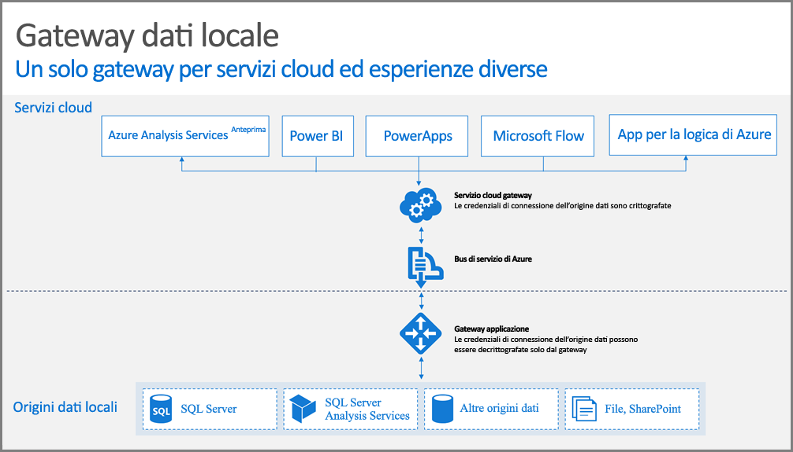

## Come funziona il gateway

Questa sezione descrive cosa accade quando un utente interagisce con un elemento connesso a un'origine dati locale. 

> [!NOTE]
> Per Power BI è necessario configurare un'origine dati per il gateway.

1. Verrà creata una query dal servizio cloud, insieme alle credenziali crittografate per l'origine dati locale, che verrà quindi inviata alla coda di elaborazione nel gateway.
2. Il servizio cloud gateway analizzerà la query e invierà la richiesta al [bus di servizio di Azure](/azure/service-bus-messaging/service-bus-messaging-overview/).
3. Il gateway dati locale esegue il polling delle richieste in sospeso sul bus di servizio di Azure.
4. Il gateway riceve la query, decrittografa le credenziali e si connette all'origine o alle origini dati con tali credenziali.
5. Il gateway invia la query all'origine dati per l'esecuzione.
6. I risultati vengono inviati dall'origine dati al gateway, quindi al servizio cloud. Il servizio usa quindi i risultati.

