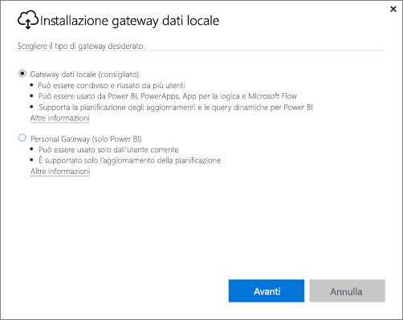
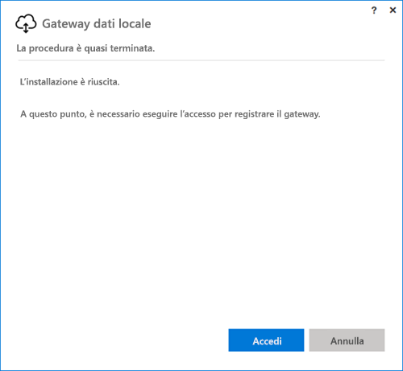
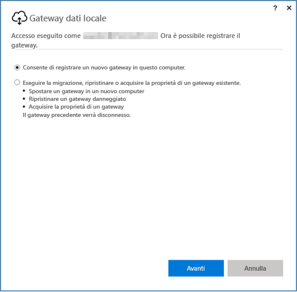
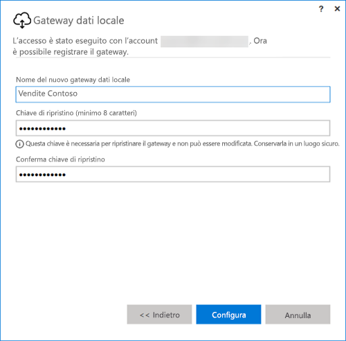

## Installare il gateway dati locale
Il gateway dati viene installato ed eseguito nel computer. È consigliabile installare il gateway in un computer che può essere lasciato sempre in esecuzione.

> [!NOTE]
> Il gateway è supportato solo nei sistemi operativi Windows a 64 bit.
> 
> 

La prima scelta da fare per Power BI è la modalità del gateway.

* **Gateway dati locale:** in questa modalità più utenti possono condividere e riusare un gateway. Questo gateway può essere usato da Power BI, PowerApps, Flow o App per la logica. Per Power BI è compreso il supporto sia per la pianificazione dell'aggiornamento che per DirectQuery
* **Personal:** questa modalità è solo per Power BI e può essere usata come utente singolo senza alcuna configurazione dell'amministratore. Può essere usata solo per l'aggiornamento su richiesta e la pianificazione dell'aggiornamento. Questa selezione avvia l'installazione del gateway personale.

Occorre notare alcuni aspetti dell'installazione di entrambe le modalità del gateway:

* Con entrambi i gateway sono richiesti sistemi operativi Windows a 64 bit.
* I gateway non possono essere installati in un controller di dominio.
* È possibile installare fino a due gateway dati locali nello stesso computer, uno per ogni modalità di esecuzione (Personale e Standard). 
* Non è possibile avere più di un gateway in esecuzione con la stessa modalità nello stesso computer.
* È possibile installare più gateway dati locali in computer diversi e gestirli tutti dalla stessa interfaccia di gestione gateway di Power BI, ad eccezione della modalità Personale, come indicato al punto seguente.
* È possibile eseguire un solo gateway in modalità Personale per ogni utente di Power BI. Se si installa un altro gateway in modalità Personale per lo stesso utente, anche in un computer diverso, l'installazione più recente sostituisce l'installazione esistente precedente.

Di seguito sono riportati alcuni aspetti da considerare prima di installare il gateway.

* Se si esegue l'installazione in un portatile e il portatile è spento, non è connesso a Internet o è in modalità di sospensione, il gateway non funzionerà e i dati nel servizio cloud non verranno sincronizzati con i dati locali.
* Se il computer è connesso a una rete wireless, le prestazioni del gateway possono risultare rallentate e la sincronizzazione dei dati nel servizio cloud con i dati locali richiederà più tempo.

Dopo aver installato il gateway, è necessario eseguire l'accesso con l'account aziendale o dell'istituto di istruzione.

Dopo aver eseguito l'accesso, sarà possibile scegliere se configurare un nuovo gateway oppure se eseguire la migrazione, ripristinare o acquisire la proprietà di un gateway esistente.

## Configurare un nuovo gateway
1. Immettere un **nome** per il gateway.
2. Immettere una **chiave di ripristino**. La chiave deve essere di almeno 8 caratteri.
3. Selezionare **Configura**.

> [!NOTE]
> La chiave di ripristino è necessaria per eseguire la migrazione, ripristinare o acquisire la proprietà di un gateway. Assicurarsi di conservare questa chiave in un luogo sicuro.
> 
> 

### Eseguire la migrazione, ripristinare o acquisire la proprietà di un gateway esistente
È necessario selezionare il gateway che si vuole ripristinare e fornire la chiave di ripristino usata per creare il gateway.

### Gateway dati locale connesso
Dopo aver configurato il gateway, sarà possibile usarlo per connettersi alle origini dati locali.

Se il gateway è per Power BI, è necessario aggiungere le origini dati per il gateway all'interno del servizio Power BI. Questa operazione viene eseguita nell'area **Gestisci gateway**. Per altre informazioni è possibile consultare gli articoli sulla gestione delle origini dati.

Per PowerApps è necessario selezionare un gateway per una connessione definita per le origini dati supportate. Per Flow e App per la logica il gateway è pronto per essere usato con le connessioni locali.

