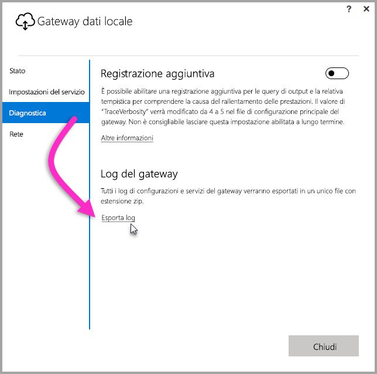
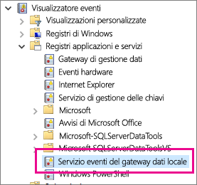

## Strumenti per la risoluzione dei problemi
<a name="logs" />

### Raccolta di registri dallo strumento di configurazione del gateway
È possibile raccogliere diversi log per il gateway ed è necessario iniziare sempre dai log. Il modo più semplice per raccogliere i log dopo l'installazione del gateway consiste nell'usare l'interfaccia utente. Nell'interfaccia utente **Gateway dati locale** selezionare **Diagnostica** e quindi selezionare il collegamento **Esporta log** nella parte inferiore della pagina, come mostrato nell'immagine seguente.

**Registri di installazione**

    %localappdata%\Temp\On-premises_data_gateway_*.log

**Registri di configurazione**

    %localappdata%\Microsoft\On-premises Data Gateway\GatewayConfigurator*.log

**Registri eventi del gateway dati locale**

    C:\Users\PBIEgwService\AppData\Local\Microsoft\On-premises Data Gateway\Gateway*.log

### Registri eventi
I registri eventi del **Gateway dati locale** sono presenti in **Registri applicazioni e servizi**.

<a name="fiddler" />

### Traccia di Fiddler
[Fiddler](http://www.telerik.com/fiddler) è uno strumento gratuito di Telerik che monitora il traffico HTTP.  È possibile visualizzare il traffico dal servizio Power BI al computer client e viceversa. Potrebbero essere illustrati errori e altre informazioni correlate.

