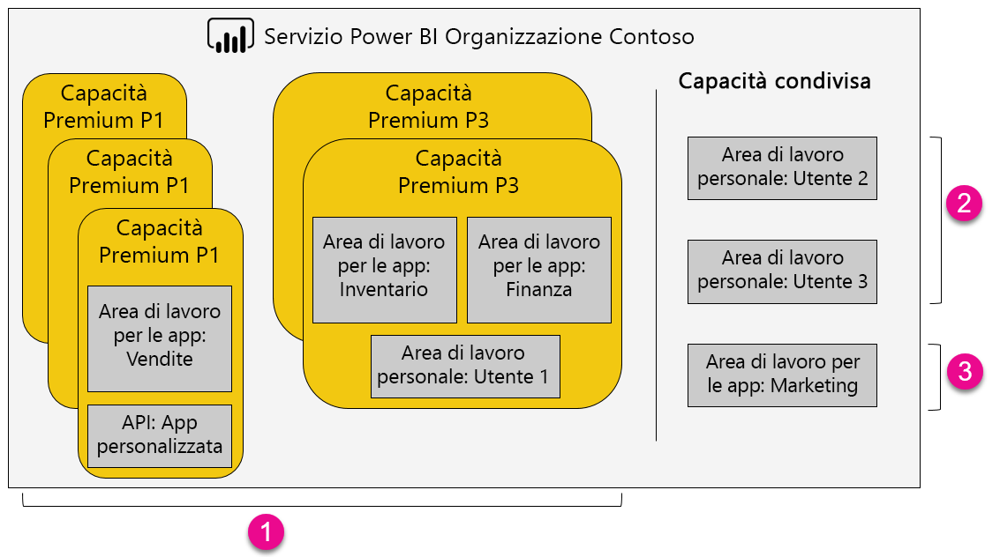

1. Elementi all'interno di una capacità Premium
   
   * L'accesso alle aree di lavoro delle app, come membri o amministratori, e la pubblicazione di app richiedono una licenza di Power BI Pro.
   * I lettori di app possono essere utenti di Power BI Pro o della versione gratuita.
   * La condivisione richiede una licenza di Power BI Pro ma i destinatari possono essere utenti di Power BI Pro o della versione gratuita.
   * Indipendentemente dal fatto che abbiano una licenza di Power BI Pro o gratuita, i destinatari del dashboard possono impostare avvisi sui dati.
   * Le API REST per l'incorporamento usano un account del servizio con una licenza di Power BI Pro, piuttosto che un utente.
2. Area di lavoro in capacità Condivisa
   
   * È necessaria una licenza Pro per la condivisione. Le licenze di Power BI Pro sono necessarie anche per i destinatari.
3. Area di lavoro in capacità Condivisa
   
   * Sono necessarie licenze Pro per l'uso di qualsiasi app.

