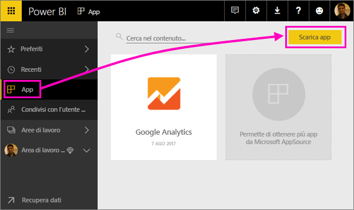

1. Selezionare **App** nel riquadro di spostamento a sinistra e quindi selezionare **Scarica app** nell'angolo in alto a destra.
   
     
2. In AppSource selezionare la scheda **App** e cercare il servizio desiderato.
   
    

