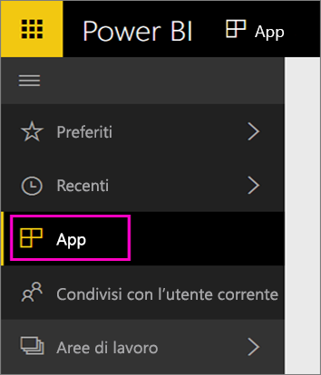

Al termine dell'importazione, la nuova app verrà visualizzata nella pagina App.

1. Selezionare **App** nel riquadro di spostamento a sinistra e selezionare l'app.
   
     
2. È possibile porre una domanda digitandola in Domande e risposte o fare clic su un riquadro per aprire il report sottostante. 

