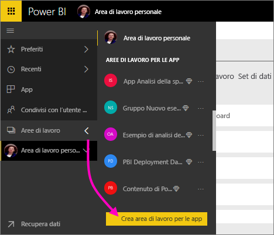

1. Iniziare creando l'area di lavoro. Selezionare **Aree di lavoro** > **Creare un'area di lavoro per le app**.
   
     
   
    Questa sarà la posizione in cui inserire il contenuto su cui collaborare assieme ai colleghi.

2. Assegnare un nome all'area di lavoro. Se il corrispondente **ID area di lavoro** non è disponibile, modificarlo in modo da ottenere un ID univoco.
   
     Questo sarà anche il nome dell'app.
   
     

3. Ci sono alcune opzioni da impostare. Se si sceglie **Pubblica**, chiunque nell'organizzazione potrà visualizzare il contenuto dell'area di lavoro. **Privata**, d'altra parte, significa che solo i membri dell'area di lavoro potranno visualizzarne il contenuto.
   
     
   
    Dopo aver creato il gruppo, non è possibile modificare l'impostazione di gruppo pubblico o privato.

4. È anche possibile scegliere se i membri possono **modificare** o avere l'accesso di **sola visualizzazione**.
   
     
   
     Aggiungere all'area di lavoro per le app solo utenti che possono modificare il contenuto. Se l'utente potrà soltanto visualizzare il contenuto, non aggiungerlo all'area di lavoro. È possibile includerlo quando si pubblica l'app.

5. Aggiungere gli indirizzi di posta elettronica delle persone che avranno accesso all'area di lavoro e selezionare **Aggiungi**. Non è possibile aggiungere alias di gruppo, soli singoli utenti.

6. Decidere se ogni persona è un membro o un amministratore.
   
     
   
    Gli amministratori possono modificare l'area di lavoro stessa, inclusa l'aggiunta di altri membri. I membri possono modificare il contenuto nell'area di lavoro, a meno che non abbiano accesso in sola visualizzazione. Sia gli amministratori che i membri possono pubblicare l'app.

7. Selezionare **Salva**.

Power BI crea l'area di lavoro, che verrà aperta e visualizzata nell'elenco delle aree di lavoro di cui si è membri. Gli amministratori potranno a questo punto selezionare i puntini di sospensione (…) per tornare indietro e apportare modifiche, aggiungere nuovi membri o modificarne le autorizzazioni.

