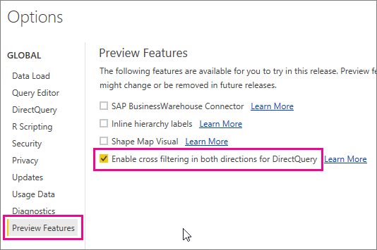
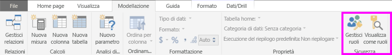
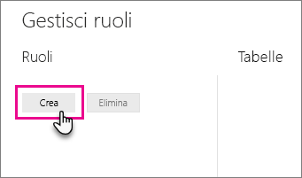
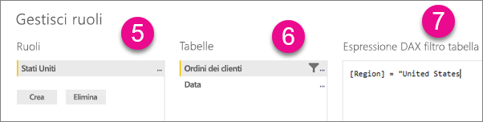
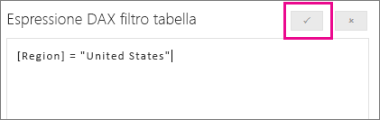

## Definire i ruoli e le regole in Power BI Desktop
È possibile definire i ruoli e le regole in Power BI Desktop. Quando si esegue la pubblicazione in Power BI, verranno pubblicate anche le definizioni dei ruoli.

Per sfruttare i vantaggi della sicurezza dinamica, sarà necessario abilitare l'opzione di anteprima Abilita il filtro incrociato in entrambe le direzioni per DirectQuery. Ciò consentirà di usare il filtro incrociato e di applicare il filtro di sicurezza in entrambe le direzioni.

Per definire i ruoli di sicurezza, seguire questa procedura.

1. Importare dati nel report di Power BI Desktop o configurare una connessione DirectQuery.
   
   > [!NOTE]
   > Non è possibile definire i ruoli in Power BI Desktop per connessioni dinamiche di Analysis Services. Sarà necessario eseguire questa operazione nel modello di Analysis Services.
   > 
   > 
2. Selezionare la scheda **Creazione di modelli**.
3. Selezionare **Gestisci ruoli**.
   
   
4. Selezionare **Crea**.
   
   
5. Specificare un nome per il ruolo. 
6. Selezionare la tabella a cui si vuole applicare una regola DAX.
7. Immettere le espressioni DAX. Questa espressione deve restituire true o false. Ad esempio: [Entity ID] = "Valore".
   
   > [!NOTE]
   > È possibile usare *username()* in questa espressione. Occorre notare che *username()* avrà il formato *DOMINIO\nomeutente* in Power BI Desktop. Nel servizio Power BI avrà il formato del valore UPN dell'utente. In alternativa, è possibile usare *userprincipalname()*, che restituirà sempre l'utente nel formato nome dell'entità utente.
   > 
   > 
   
   
8. Dopo la creazione dell'espressione DAX, è possibile selezionare il segno di spunta sopra la casella dell'espressione per convalidare l'espressione.
   
   
9. Selezionare **Salva**.

Non è possibile assegnare gli utenti a un ruolo in Power BI Desktop. Questa operazione viene eseguita nel servizio Power BI. È possibile abilitare la sicurezza dinamica in Power BI Desktop usando le funzioni DAX *username()* o *userprincipalname()* e configurando le relazioni appropriate.

