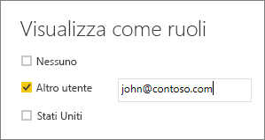

## Convalidare i ruoli in Power BI Desktop
Dopo aver creato i ruoli è possibile testare i risultati corrispondenti all'interno di Power BI Desktop.

1. Dalla scheda **Creazione di modelli** selezionare **Visualizza come ruoli**. 

    

    Verrà aperta la finestra **Visualizza come ruoli** in cui sono visualizzati i ruoli creati.

    

3. Selezionare un ruolo creato e quindi scegliere **OK** per applicare il ruolo. 

   Il report esegue il rendering dei dati pertinenti a tale ruolo.

4. È anche possibile selezionare **Altro utente** e indicare un determinato utente. 

    

   È consigliabile specificare il nome dell'entità utente (UPN), che verrà usato dal servizio Power BI e dal server di report Power BI.

   All'interno di Power BI Desktop l'opzione **Altro utente** visualizza risultati diversi solo se si usa la sicurezza dinamica basata sulle espressioni DAX. 

5. Scegliere **OK**. 

   Il rendering del report viene eseguito in base ai dati visibili all'utente.

