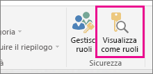

## Convalida del ruolo all'interno di Power BI Desktop
Dopo aver creato il ruolo, è possibile testare i risultati del ruolo all'interno di Power BI Desktop. A tale scopo, selezionare **Visualizza come ruoli**.

La finestra di dialogo **Visualizza come ruoli** consente di modificare la visualizzazione dei dati in base all'utente o al ruolo specifico. Verranno visualizzati i ruoli creati.

Selezionare il ruolo creato e quindi scegliere **OK** per applicarlo ai dati visualizzati. I report eseguiranno il rendering solo dei dati pertinenti a tale ruolo.

È anche possibile selezionare Altro utente e indicare un determinato utente. È consigliabile fornire il nome dell'entità utente (UPN), cioè quello che verrà usato dal servizio Power BI. Selezionare **OK** in modo che i report eseguano il rendering in base ai dati visibili all'utente. 

> [!NOTE]
> All'interno di Power BI Desktop verranno visualizzati risultati differenti solo se si usa la sicurezza dinamica basata sulle espressioni DAX.
> 
> 

