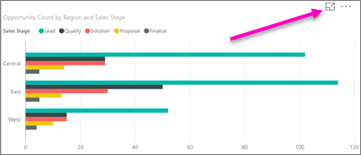
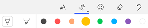
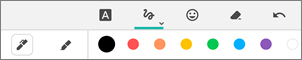
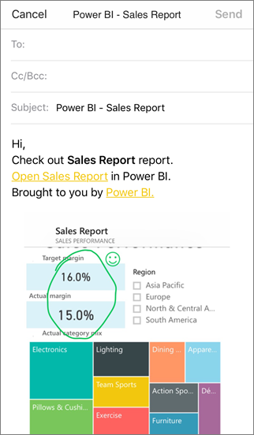

# Annotare e condividere un riquadro, un report o un oggetto visivo nelle app Power BI per dispositivi mobili
Si applica a:

|  |  |  |  |
|:--- |:--- |:--- |:--- |
| iPhone |iPad |Telefoni Android |Tablet Android |

È possibile aggiungere annotazioni e condividere lo snapshot di un riquadro, un report o un oggetto visivo dall'app Power BI per dispositivi mobili per iOS e Android. I destinatari lo vedono esattamente com'era quando è stato inviato il messaggio di posta elettronica, oltre a un collegamento. È possibile inviare snapshot dei riquadri a chiunque, non solo ai colleghi dello stesso dominio di posta elettronica. Prima di condividerlo, è possibile aggiungere annotazioni, come linee, testo o timbri.

*Un report con annotazioni*

La posta elettronica con lo snapshot del riquadro, del report o dell'oggetto visivo include anche un collegamento all'oggetto effettivo nel servizio Power BI ([https://powerbi.com](https://powerbi.com)). I destinatari possono fare clic sul collegamento e passare direttamente a tale riquadro, report o oggetto visivo, se l'utente e i destinatari hanno licenze Power BI Pro o il contenuto ha una [capacità Premium](service-premium.md) e si è già condiviso l'elemento con essi. 

È possibile [condividere un riquadro anche dall'app Power BI per dispositivi mobili Windows 10](mobile-share-tile-windows-10-phone-app.md), ma non annotarlo.

## Aprire un riquadro per l'annotazione
1. Toccare il riquadro per aprirlo in stato attivo.
2. Toccare l'icona Annota  nell'angolo in alto a destra del riquadro.
3. È ora possibile [aggiungere annotazioni e condividere il riquadro](mobile-annotate-and-share-a-tile-from-the-mobile-apps.md#annotate-and-share-the-tile-report-or-visual).

## Aprire un report per l'annotazione
1. Aprire un report. 
2. Toccare l'icona Annota  nell'angolo in alto a destra del report.
3. È ora possibile [aggiungere annotazioni e condividere il report](mobile-annotate-and-share-a-tile-from-the-mobile-apps.md#annotate-and-share-the-tile-report-or-visual).

## Aprire un oggetto visivo per l'annotazione
1. In un report, toccare un oggetto visivo, quindi toccare l'icona di espansione per aprirlo in modalità messa a fuoco. 
   
    
2. Toccare l'icona Annota  nell'angolo in alto a destra dell'oggetto visivo.
3. È ora possibile [aggiungere annotazioni e condividere l'oggetto visivo](mobile-annotate-and-share-a-tile-from-the-mobile-apps.md#annotate-and-share-the-tile-report-or-visual).

## Aggiungere annotazioni e condividere il riquadro, il report o l'oggetto visivo
1. Ecco come è possibile aggiungere annotazioni:  
   
   
   
   *La barra di annotazione in iPhone e iPad*
   
   
   
   *La barra di annotazione nei dispositivi Android*
   
   * Per tracciare linee di diversi colori e spessori, toccare l'icona a forma di linea ondulata, scegliere un'ampiezza e un colore, quindi disegnare.  
   * Per inserire commenti, toccare **AA**, scegliere la dimensione e il colore del testo e digitare.  
   * Per incollare timbri (come le emoticon) nel riquadro, toccare lo smile, scegliere un colore e toccare il punto in cui si vuole inserirli.   
2. Dopo aver inserito le annotazioni, toccare **Condividi** nell'angolo in alto a destra.
3. Nell'app di posta elettronica, digitare i nomi dei destinatari ed eventualmente modificare il messaggio.  
   
   
   
   Il messaggio di posta elettronica contiene un'immagine e un collegamento a un riquadro, un report o un oggetto visivo specifici. 
4. Toccare **Invia**.

## Passaggi successivi
* [Condividere un dashboard dall'app Power BI per dispositivi mobili](mobile-share-dashboard-from-the-mobile-apps.md)
* Domande? [Provare a rivolgersi alla community di Power BI](http://community.powerbi.com/)

