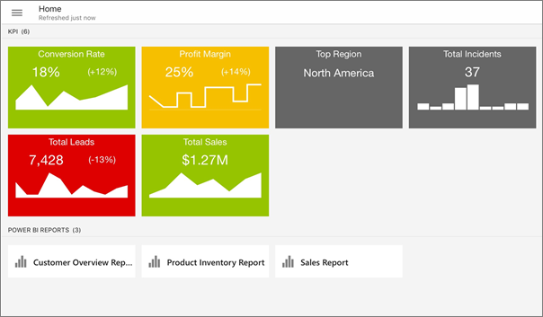
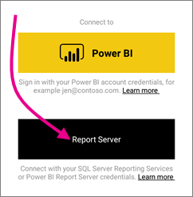
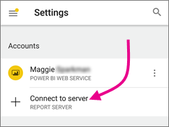
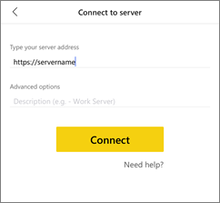
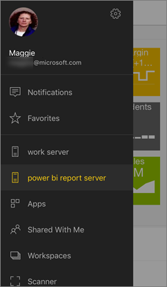
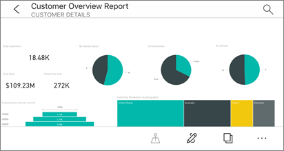
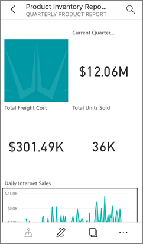
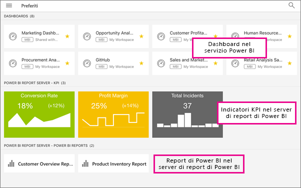

# Visualizzare report e indicatori KPI locali dei server di report nelle app Power BI per dispositivi mobili
Si applica a:

|  |  |  |  |
|:--- |:--- |:--- |:--- |
| iPhone |iPad |Telefoni Android |Tablet Android |

L'app Power BI per dispositivi mobili consente di accedere in tempo reale a informazioni aziendali in locale usando dispositivi mobili abilitati per il tocco nel server di report di Power BI e in SQL Server 2016 Reporting Services (SSRS). 

 

## Operazioni preliminari
**Le app per dispositivi mobili in cui visualizzare il contenuto di Power BI, non in cui crearlo.**

* Tutti gli autori di contenuti nell'organizzazione [creano report di Power BI con Power BI Desktop, quindi li pubblicano nel portale Web del server di report di Power BI](report-server/quickstart-create-powerbi-report.md). 
* È possibile creare [indicatori KPI nel portale Web](https://docs.microsoft.com/sql/reporting-services/working-with-kpis-in-reporting-services), organizzarli in cartelle e contrassegnare i Preferiti, per poterli trovare facilmente. 
* [Creare report per dispositivi mobili di Reporting Services](https://docs.microsoft.com/sql/reporting-services/mobile-reports/create-mobile-reports-with-sql-server-mobile-report-publisher) con SQL Server 2016 Enterprise Edition Mobile Report Publisher e pubblicarli nel [portale Web di Reporting Services](https://docs.microsoft.com/sql/reporting-services/web-portal-ssrs-native-mode).  

Quindi, nell'app Power BI per dispositivi mobili, connettersi a un massimo di cinque server di report per visualizzare i report e gli indicatori KPI di Power BI, organizzati in cartelle o raccolti come Preferiti. 

## Esplorare gli esempi nelle app per dispositivi mobili senza una connessione al server
Anche se non si ha accesso a un portale Web di Reporting Services, è comunque possibile esplorare le funzionalità dei report per dispositivi mobili e agli indicatori KPI di Reporting Services. 

1. Toccare il pulsante di spostamento globale  nell'angolo superiore sinistro, quindi toccare l'icona a forma di ingranaggio in alto a destra .
2. Toccare **Esempi per Reporting Services** quindi esplorare per interagire con gli indicatori KPI e i report per dispositivi mobili di esempio.
   
   

## Connettersi a un server locale
È possibile visualizzare report di Power BI locali, report per dispositivi mobili di Reporting Services e indicatori KPI nelle app Power BI per dispositivi mobili. 

1. Nel dispositivo mobile aprire l'app Power BI.
2. Se non è ancora stato effettuato l'accesso a Power BI, toccare **Server di report**.
   
   
   
   Se è già stato effettuato l'accesso all'app Power BI, toccare il pulsante di spostamento globale , quindi toccare l'icona a forma di ingranaggio  in alto a destra.
3. Toccare **Connetti al server**.
   
    

     L'app per dispositivi mobili deve accedere al server in qualche modo. Sono disponibili alcune modalità:

    - L'uso della stessa rete o della stessa VPN è la modalità più semplice.
    - È possibile usare un proxy applicazione Web per connettersi dall'esterno dell'organizzazione. Per informazioni dettagliate, vedere [Uso di OAuth per connettersi a Reporting Services](mobile-oauth-ssrs.md). 
    - Aprire una connessione (porta) nel firewall.

1. Specificare l'indirizzo del server, il nome utente e la password. Usare questo formato per l'indirizzo del server:
   
     `http://<servername>/reports`
   
     OR
   
     `https://<servername>/reports`
   
   Includere **http** o **https** davanti alla stringa di connessione.
   
    
5. (Facoltativo) in **Opzioni avanzate** è possibile assegnare un nome descrittivo al server, se si vuole.
6. È ora possibile visualizzare il server nella barra di spostamento a sinistra (chiamato "server di report di power bi" in questo esempio).
   
   

## Visualizzare report e indicatori KPI di Power BI nell'app Power BI
I report di Power BI, i report per dispositivi mobili di Reporting Services e gli indicatori KPI vengono visualizzati nelle stesse cartelle in cui si trovano nel portale Web di Reporting Services. 

* Toccare un report di Power BI . per aprirlo in modalità orizzontale e interagire con esso nell'app Power BI.
  
    
* In Power BI Desktop, i proprietario dei report possono [ottimizzare un report](desktop-create-phone-report.md) per le app Power BI per dispositivi mobili. Sul telefono cellulare, i report ottimizzati hanno un layout e un'icona speciale, .
  
    
* Toccare un indicatore KPI per visualizzarlo in modalità messa a fuoco.
  
    

## Visualizzare i report e gli indicatori KPI preferiti
È possibile contrassegnare gli indicatori KPI e i report come preferiti nel portale Web e quindi visualizzarli in un'unica cartella nel dispositivo mobile, assieme ai dashboard di Power BI preferiti.

* Toccare **Preferiti**.
  
   
  
   Gli indicatori KPI e i report preferiti dal portale Web si trovano tutti in questa pagina, assieme ai dashboard di Power BI nel servizio Power BI:
  
   

## Rimuovere una connessione a un server di report
1. Nella parte inferiore della barra di spostamento a sinistra toccare **Impostazioni**.
2. Toccare il nome del server a cui non si vuole essere connessi.
3. Toccare **Rimuovi server**.

## Passaggi successivi
* [Introduzione a Power BI](service-get-started.md)  
* Domande? [Provare a rivolgersi alla community di Power BI](http://community.powerbi.com/)

