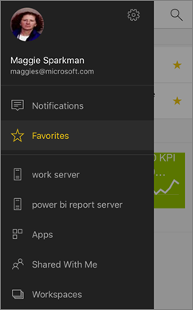
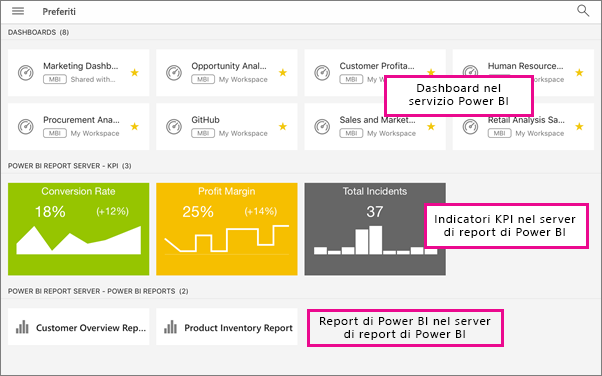
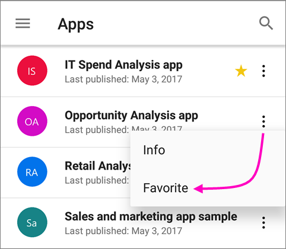
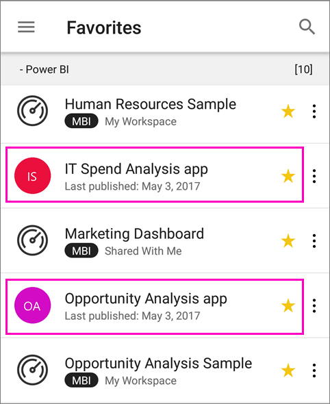
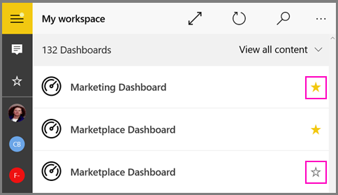
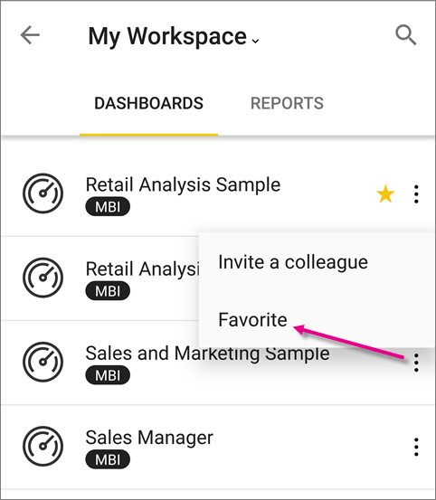
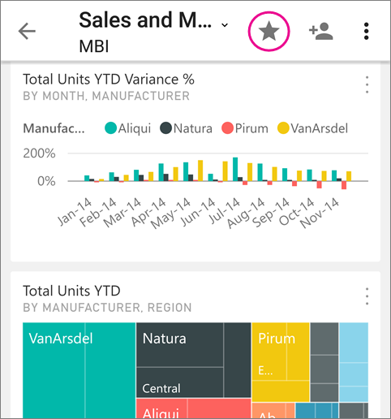

# Aggiungere dashboard, app e report locali a Preferiti nelle app Power BI per dispositivi mobili
Si applica a:

|  |  |  |  |  |
|:--- |:--- |:--- |:--- |:--- |
| iPhone |iPad |Telefoni Android |Tablet Android |Dispositivi Windows 10 |

Nella pagina Preferiti delle app per dispositivi mobili vengono visualizzati i dashboard e le app preferiti di Power BI, insieme ai report per dispositivi mobili e agli indicatori KPI locali del Server di report di Power BI e di Reporting Services preferiti. Quando si aggiunge un dashboard o un'app ai *Preferiti* nelle app Power BI per dispositivi mobili, è possibile visualizzarli nella pagina Preferiti del servizio Power BI ([https://powerbi.com](https://powerbi.com)) e da tutti i dispositivi mobili. 

È anche possibile [aggiungere dashboard e app di Power BI ai Preferiti nel servizio Power BI](service-dashboard-favorite.md). In questo modo saranno visibili nella pagina Preferiti dell'app per dispositivi mobili.

È possibile contrassegnare gli indicatori KPI e i report come preferiti nel portale Web del server di report di Power BI o di Reporting Services e quindi visualizzarli in un'unica cartella nel dispositivo mobile, assieme ai dashboard di Power BI preferiti.

## Visualizzare i dashboard e le app preferiti e i report e indicatori KPI locali di Power BI
* Toccare il menu di spostamento in alto , quindi toccare **Preferiti**.
  
  
  
  Tutti i preferiti sono visibili insieme in questa pagina:
  
  

## Aggiungere un'app ai Preferiti
1. Nell'elenco di app nell'app per dispositivi mobili toccare i puntini di sospensione (...) accanto all'app > **Aggiungi a Preferiti**.
   
    
   
    L'app è ora elencata insieme alle altre app e agli altri dashboard preferiti.
   
    

## Aggiungere un dashboard ai Preferiti nelle app per dispositivi mobili iOS e Windows 10
È possibile aggiungere un dashboard o un'app di Power BI ai Preferiti dall'elenco dei dashboard o dal dashboard stesso.

* Nell'elenco dei dashboard nell'app per dispositivi mobili toccare la stella vuota accanto al nome del dashboard . La stella diventa gialla .
  
    
* Nel dashboard toccare la stella vuota sulla barra multifunzione in alto . La stella diventa gialla .
  
    

## Aggiungere un dashboard ai Preferiti nelle app per dispositivi mobili Android
È possibile aggiungere un dashboard ai Preferiti dall'elenco dei dashboard o dal dashboard stesso.

* Nell'elenco dei dashboard nell'app per dispositivi mobili toccare i puntini di sospensione verticali (...) accanto al nome del dashboard, quindi toccare **Preferiti**. Verrà visualizzata una stella gialla accanto al nome .
  
    
* Nel dashboard toccare la stella vuota sulla barra multifunzione in alto . La stella diventa di colore grigio scuro .
  
    

## Aggiungere ai Preferiti i report e gli indicatori KPI del server di report di Power BI e di Reporting Services
È possibile visualizzare i report e gli indicatori KPI del server di report di Power BI e di Reporting Services nelle app Power BI per dispositivi mobili, ma non è possibile aggiungerli ai Preferiti nelle app per dispositivi mobili. È possibile [contrassegnarli come Preferiti nel portale Web](report-server/getting-around.md#tag-your-favorite-reports-and-kpis). 

## Passaggi successivi
* [Aggiungere dashboard ai Preferiti nel servizio Power BI](service-dashboard-favorite.md) 
* Domande? [Provare a rivolgersi alla community di Power BI](http://community.powerbi.com/)

