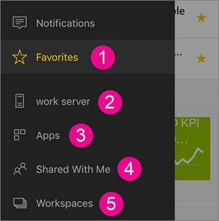
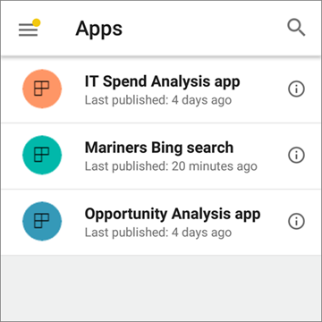
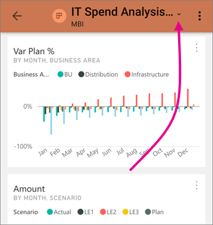
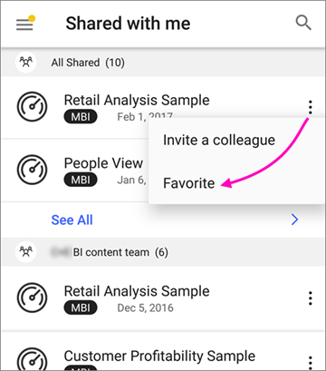
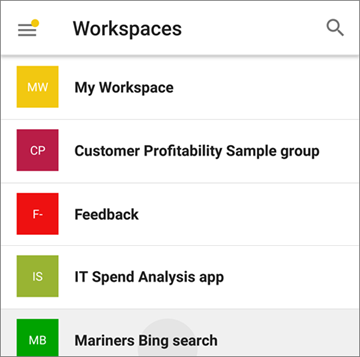
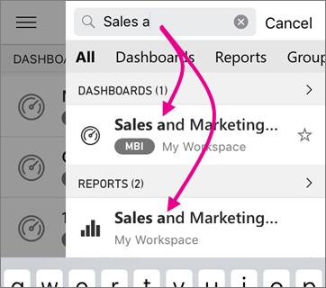

# Trovare dashboard, report e app nelle app Power BI per dispositivi mobili
Si applica a:

|  |  |  |  |  |
|:--- |:--- |:--- |:--- |:--- |
| iPhone |iPad |Telefoni Android |Tablet Android |Dispositivi Windows 10 |

A seconda della provenienza, i dashboard, i report e le app sono memorizzati in posizioni diverse nelle app Power BI per dispositivi mobili. Questo articolo illustra dove si trova il contento. In più, è sempre possibile [cercare qualsiasi contenuto](mobile-apps-find-content-mobile-devices.md#search) presente in Power BI. 

1. [Preferiti](mobile-apps-find-content-mobile-devices.md#1-favorites)
2. [Server di report](mobile-apps-find-content-mobile-devices.md#2-report-servers) (facoltativo)
3. [App](mobile-apps-find-content-mobile-devices.md#3-apps)
4. [Condivisi con l'utente corrente](mobile-apps-find-content-mobile-devices.md#4-shared-with-me)
5. [Aree di lavoro](mobile-apps-find-content-mobile-devices.md#5-workspaces)

## 1 Preferiti
Raccogliere i dashboard e le app visualizzati più spesso contrassegnandoli come Preferiti. Altre informazioni sui [dashboard preferiti nelle app Power BI per dispositivi mobili](mobile-apps-favorites.md).

## 2 Server di report
Si potrebbero avere connessioni a uno o più server di report di Power BI o server di SQL Server Reporting Services. In tal caso, gli indicatori KPI, i report di Power BI e i report impaginati nel server vengono visualizzati qui. Se uno qualsiasi tra questi è stato aggiunto ai preferiti sul server, sarà visualizzato anche nell'elenco Preferiti. Altre informazioni sulla [visualizzazione degli indicatori KPI e dei report locali nelle app Power BI per dispositivi mobili](mobile-app-ssrs-kpis-mobile-on-premises-reports.md).

## 3 App
Un'app è costituita da una raccolta di dashboard e report appositamente creata dall'organizzazione allo scopo di fornire metriche chiave che consentano di prendere decisioni basate sui dati in modo semplice e rapido. Nel servizio Power BI ([https://powerbi.com](https://powerbi.com)) è facile rilevare e installare le app. Dopo l'installazione, è possibile visualizzarle da qualsiasi dispositivo. 

Con le app si ottengono automaticamente tutti gli aggiornamenti eseguiti dall'autore, il quale controlla anche la frequenza con cui è pianificato l'aggiornamento dei dati. Non è necessario preoccuparsi di stare al passo con le modifiche dell'autore.

È possibile tornare all'elenco del contenuto dell'app toccando la freccia di spostamento a destra del nome dell'app.

Altre informazioni sulle [app nel servizio Power BI](service-install-use-apps.md).

### Scaricare un'app in un dispositivo mobile
Nelle app Power BI per dispositivi mobili, è possibile visualizzare tutte le app già installate. Il proprietario di un'app può inviare un collegamento diretto alla stessa. Quando si fa clic sul collegamento, l'app viene scaricata nel proprio account e viene aperta nell'app Power BI per dispositivi mobili. 

Nel servizio Power BI, è possibile passare a Microsoft AppSource per cercare altre applicazioni, ma non dalle app Power BI per dispositivi mobili. 

## 4 Condivisi con l'utente corrente
È la posizione in cui sono presenti tutti i dashboard che i colleghi hanno condiviso con l'utente. È possibile filtrare in base al proprietario del dashboard o cercare ciò che interessa. Per quanto riguarda il contenuto condiviso a cui si accede di frequente, è possibile aggiungerlo ai Preferiti direttamente da **Condivisi con l'utente corrente** toccando i puntini di sospensione (...).

## 5 Aree di lavoro
Chiamate anche *aree di lavoro per le app*, si tratta di ambienti di gestione temporanea nel servizio Power BI ([https://powerbi.com](https://powerbi.com)) in cui è possibile collaborare con colleghi alla creazione di una raccolta di dashboard e report. Quindi, si distribuisce la raccolta come un *app*. 

Nelle app per dispositivi mobili, è possibile visualizzare e interagire con il contenuto in qualsiasi area di lavoro di cui si è un membro o un amministratore. Non è possibile pubblicare app dalle aree di lavoro nelle app per dispositivi mobili.

Altre informazioni sulle [app nel servizio Power BI](service-install-use-apps.md).

## Cerca
È sempre possibile cercare il contenuto di Power BI dalle pagine **Preferiti**, **App**, **Condivisi con l'utente corrente** o **Aree di lavoro**. I risultati della ricerca mostreranno tutti i dashboard, i report e le app da ogni posizione che corrispondono alla ricerca. 

## Passaggi successivi
* [Introduzione a Power BI](service-get-started.md)
* Domande? [Provare a rivolgersi alla community di Power BI](http://community.powerbi.com/)

