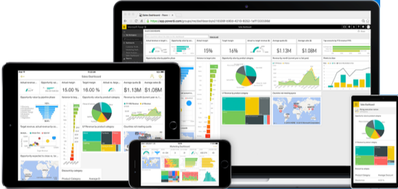

# Power BI può essere usato in qualsiasi app per dispositivi mobili nei dispositivi mobili
È possibile visualizzare i dashboard e i report di Power BI nel servizio Power BI ([https://powerbi.com](https://powerbi.com)) e i report di Power BI locali nel [Server di Report di Power BI](report-server/get-started.md). Dalle app per dispositivi mobili Power BI è ora possibile connettersi ai dati locali e cloud. Provare a visualizzare e a interagire con i dashboard e i report di Power BI nel dispositivo mobile, sia esso un dispositivo iOS (iPad, iPhone, iPod Touch o Apple Watch), un telefono o tablet Android o un dispositivo Windows 10.

## Vedere Novità delle app Power BI per dispositivi mobili
* Leggere il [blog di Microsoft Power BI](https://powerbi.microsoft.com/blog/tag/mobile/) per le nuove funzionalità nelle app per dispositivi mobili.
* Vedere l'elenco delle [novità delle app Power BI per dispositivi mobili](mobile-whats-new-in-the-mobile-apps.md).

## App Power BI per dispositivi mobili
| **Dispositivo** | **Novità di rilievo** |
| --- | --- |
|  |Il dispositivo **iPhone** è sempre a portata di mano e l'[app Power BI per dispositivi mobili per iPhone](mobile-iphone-app-get-started.md) è sempre disponibile nell'iPhone. Oltre a visualizzare i [report di Power BI in una visualizzazione speciale del layout del telefono](mobile-apps-view-phone-report.md), è possibile [aggiungere Power BI all'Apple Watch](mobile-apple-watch.md) e [porre domande con l'analista virtuale Domande e risposte](mobile-apps-ios-qna.md). Introduzione all'[app Power BI per dispositivi mobili per iPhone](mobile-iphone-app-get-started.md). |
|  |Nell'**iPad**, l'app Power BI per dispositivi mobili visualizza dashboard e report nel modo in cui sono stati progettati per il servizio Power BI. In più è possibile visualizzare gli [indicatori KPI e i report di Reporting Services e del server di report Power BI](mobile-app-ssrs-kpis-mobile-on-premises-reports.md) direttamente dall'iPad. Gli [avvisi per i dati possono essere impostati nell'app Power BI per dispositivi mobili](mobile-set-data-alerts-in-the-mobile-apps.md) e consentono di ricevere una notifica quando i dati in un dashboard superano i limiti impostati. Introduzione all'[app Power BI per dispositivi mobili per iPad](mobile-ipad-app-get-started.md). |
|  |Grazie all'app Power BI per dispositivi mobili per **telefono Android** è possibile accedere in qualsiasi momento a informazioni aziendali aggiornate usando dispositivi mobili abilitati per il tocco. È possibile [filtrare un report in base alla propria posizione geografica](mobile-apps-geographic-filtering.md). È anche possibile [scansionare un codice a matrice con il proprio telefono Android](mobile-apps-qr-code.md) e passare direttamente a un dashboard o report di Power BI. Introduzione all'[app Power BI per dispositivi mobili per telefoni Android](mobile-android-app-get-started.md). |
|  |Questa app per dispositivi mobili può essere eseguita in una serie di diversi **tablet Android** permettendo di accedere a informazioni aziendali aggiornate con telefoni abilitati per il tocco. Nel tablet Android, l'app Power BI per dispositivi mobili visualizza dashboard e report nel modo in cui sono stati progettati per il servizio Power BI. È possibile [contrassegnare i dashboard e i report preferiti](mobile-apps-favorites.md) in modo da accedervi rapidamente, assieme agli indicatori KPI e ai report di Reporting Services e del server di report Power BI preferiti. Introduzione all'[app Power BI per dispositivi mobili per tablet Android](mobile-android-tablet-app-get-started.md). |
|  |L'app Power BI per dispositivi mobili per **Windows 10** può essere eseguita in qualsiasi dispositivo Windows 10, inclusi i telefoni Windows 10. Insieme a tutte le funzionalità delle altre app per dispositivi mobili, l'app Power BI per dispositivi mobili per **Windows 10** offre alcune funzionalità speciali. Ad esempio, è possibile [aggiungere un riquadro o dashboard di Power BI alla schermata Start di Windows 10](mobile-pin-dashboard-start-screen-windows-10-phone-app.md) dall'app Power BI per dispositivi mobili. In più, è possibile [eseguire Power BI in modalità presentazione in Surface Hub](mobile-windows-10-app-presentation-mode.md) e nell'app Power BI per dispositivi mobili Windows 10. Introduzione all'[app Power BI per dispositivi mobili per Windows 10](mobile-windows-10-phone-app-get-started.md). |

## Supporto aziendale per le app Power BI per dispositivi mobili
Le organizzazioni possono usare Microsoft Intune per gestire dispositivi e applicazioni, tra cui le app Power BI per dispositivi mobili iOS e Android.

Microsoft Intune permette alle organizzazioni di controllare aspetti come la richiesta di un PIN di accesso, la modalità di gestione dei dati nell'applicazione e anche la crittografia dei dati dell'applicazione quando l'app non è in uso.

Altre informazioni sulla [configurazione delle app Power BI per dispositivi mobili per Android e iOS con Microsoft Intune](service-admin-mobile-intune.md). 

## Passaggi successivi
* [Licenze per Power BI gratuito e Pro](service-free-vs-pro.md)
* Domande? [Provare a rivolgersi alla community di Power BI](http://community.powerbi.com/)

