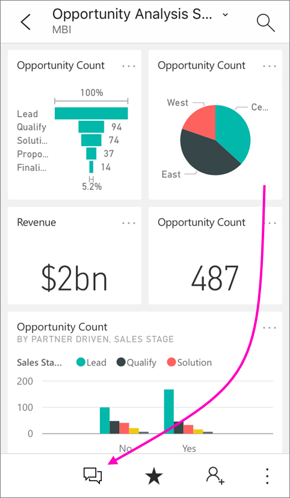
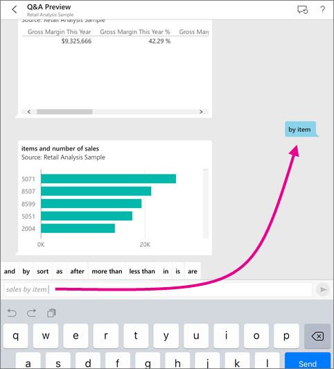
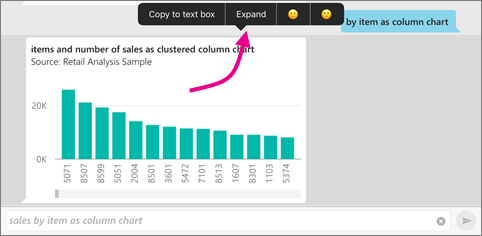
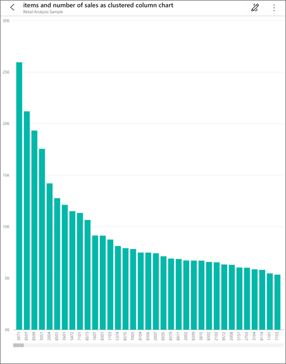
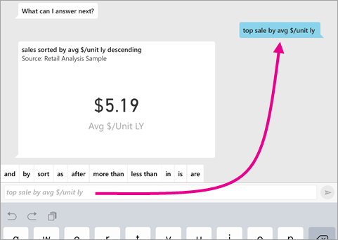
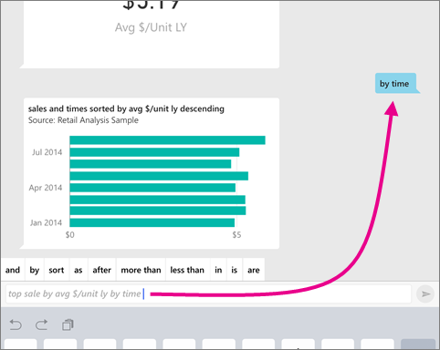
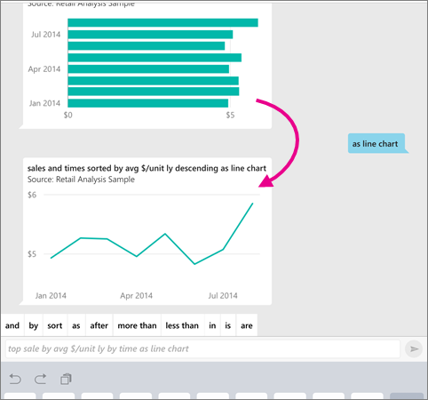
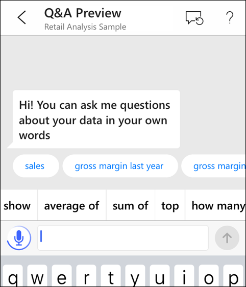
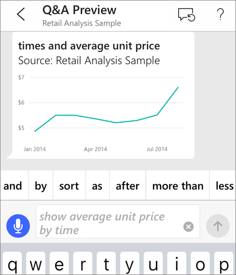
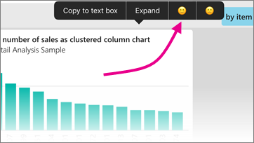

# Porre domande sui dati con l'analista virtuale Domande e risposte nelle app iOS - Power BI
Si applica a:

|  |  |
|:--- |:--- |
| iPhone |iPad |

Il modo più semplice per conoscere i dati consiste nel porre domande a tal proposito con parole proprie. In questa esercitazione provare a porre domande e visualizzare le informazioni dettagliate in evidenza sui dati di esempio con l'analista virtuale Domande e risposte.

Nell'app Microsoft Power BI per dispositivi mobili su iPad, iPhone e iPod Touch l'analista virtuale Domande e risposte è un'esperienza di BI discorsiva che migliora la versione precedente di Domande e risposte in iOS. L'analista virtuale Domande e risposte accede ancora ai dati di Domande e risposte sottostanti nel servizio Power BI [(https://powerbi.com)](https://powerbi.com). È ancora possibile digitare o formulare una domanda e anche le informazioni sui dati vengono fornite nel contesto.

## Scaricare gli esempi
Il primo passaggio dell'esercitazione consiste nel download degli esempi di analisi delle vendite al dettaglio e di analisi delle opportunità del servizio Power BI.

* Nell'area di lavoro del servizio Power BI ([https://powerbi.com](https://powerbi.com)):

  * Selezionare **Recupera dati** > **Esempi** > **Esempio di analisi delle opportunità** > **Connetti**.
  * Al termine del download dell'esempio di analisi delle opportunità selezionare **Recupera dati** > **Esempi** > **Esempio di analisi delle vendite al dettaglio** > **Connetti**.

## Provare le informazioni dettagliate in primo piano
1. Nell'iPhone o iPad aprire l'app Power BI e passare al dashboard Esempio di analisi delle opportunità.
2. Toccare l'icona dell'analista virtuale Domande e risposte  dal menu azione nella parte inferiore della pagina (nella parte superiore della pagina in un iPad).

     

     Lo strumento di analisi virtuale Domande e risposte di Power BI offre alcuni suggerimenti iniziali.

     
3. Toccare **featured insights** (informazioni dettagliate in primo piano).

     Lo strumento di analisi virtuale Domande e risposte suggerisce alcune informazioni dettagliate.
4. Scorrere verso destra e toccare **Insight 2** (Informazioni dettagliate 2).

    

     Lo strumento di analisi virtuale Domande e risposte mostra la seconda casella di informazioni dettagliate.

    
5. Toccare il grafico per aprirlo in stato attivo.

    
6. Toccare la freccia nell'angolo in alto a sinistra per tornare all'esperienza dell'analista virtuale Domande e risposte.

## Provare a formulare domande nell'iPhone o iPad
1. Nell'iPhone o iPad, aprire l'app Power BI e passare al dashboard di esempio di analisi delle vendite al dettaglio.
2. Toccare l'icona dell'analista virtuale Domande e risposte  dal menu azione nella parte inferiore della pagina (nella parte superiore della pagina in un iPad).
     Lo strumento di analisi virtuale Domande e risposte offre alcuni suggerimenti iniziali.
3. Digitare **show**, toccare **sales** dall'elenco di suggerimenti, quindi toccare **Invia** .

    
4. Toccare **by** tra le parole chiave, quindi toccare **item** dall'elenco dei suggerimenti > **Invia** .

    
5. Toccare **as** tra le parole chiave, toccare l'icona del grafico colonna , quindi toccare **Invia** .
6. Toccare a lungo il grafico risultante, quindi toccare **Espandi**.

    

    Il grafico viene aperto in modalità messa a fuoco nell'app.

    
7. Toccare la freccia nell'angolo in alto a sinistra per tornare alla finestra chat dell'analista virtuale Domande e risposte.
8. Toccare la X a destra della casella di testo per eliminare il testo e ricominciare.
9. Provare una nuova domanda: toccare **top** tra le parole chiave, toccare **sale by avg $/unit ly** > **Invia** .

    
10. Scegliere **by** tra le parole chiave, toccare **item** dall'elenco dei suggerimenti in alto > **Invia** .

     
11. Digitare **as**, selezionare l'icona del grafico a linee  dall'elenco dei suggerimenti > **Invia** .

    

## Provare a formulare domande
È ora possibile porre domande sui dati nell'app Power BI per dispositivi mobili parlando anziché digitando.

1. Toccare l'icona dell'analista virtuale Domande e risposte  dal menu azione nella parte inferiore della pagina (nella parte superiore della pagina in un iPad).
2. Toccare l'icona di microfono .

    

1. Quando l'icona di microfono è attiva, iniziare a parlare. Ad esempio, pronunciare "prezzo unitario medio in base all'ora", quindi toccare **Invia** .

    

### Domande sulla privacy durante l'uso del riconoscimento vocale?
Vedere la sezione dedicata al riconoscimento vocale della pagina sulle [novità di iOS](https://go.microsoft.com/fwlink/?linkid=845624) nelle Guide per gli sviluppatori iOS Apple.

## Guida e commenti e suggerimenti
* Serve aiuto? Basta dire "Ciao" o "Aiuto" per ottenere assistenza su come iniziare una nuova domanda.
* Si vuole inviare commenti e suggerimenti sui risultati? Effettuare un tocco prolungato su un grafico o un altro risultato, quindi toccare la faccina sorridente o imbronciata.

    

    I commenti e suggerimenti sono anonimi e sono utili per migliorare le risposte alle domande.

## Migliorare i risultati dell'analista virtuale Domande e risposte
È possibile migliorare i risultati che gli utenti e i clienti ottengono quando usano l'analista virtuale Domande e risposte in un set di dati, ponendo domande più mirate o migliorando il set di dati.

### Come porre domande
* Seguire i [Suggerimenti per porre domande in Domande e risposte](service-q-and-a-tips.md) nel servizio Power BI o nell'analista virtuale Domande e risposte nell'app per dispositivi mobili iOS.

### Come migliorare il set di dati
* Migliorare il set di dati in Power BI Desktop o nel servizio Power BI per [verificare che i dati funzionino bene con Domande e risposte e l'analista virtuale Domande e risposte](service-prepare-data-for-q-and-a.md).

## Passaggi successivi
* [Domande e risposte nel servizio Power BI](power-bi-q-and-a.md)
* Domande? Controllare la [sezione dedicata alle app per dispositivi mobili della Community di Power BI](https://go.microsoft.com/fwlink/?linkid=839277)
