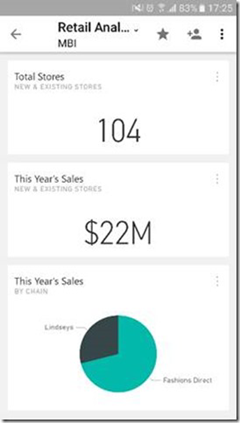
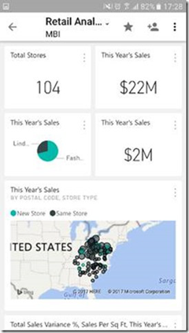

# Ottimizzare il dashboard di Power BI per i telefoni
### Qualsiasi momento è quello giusto per creare un dashboard ottimale
| **Per passare da questo...** | **...a questo in pochi minuti** |
|:---:|:---:|
|  | |

### Programmare l'ottimizzazione nel calendario oppure [iniziare subito](service-create-dashboard-mobile-phone-view.md).
> [!NOTE]
> Solo i proprietari di dashboard possono creare una visualizzazione telefono per un dashboard. Se non si è il proprietario, far sapere al proprietario come creare un dashboard ottimale.
> 
> 

