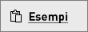

# Guida introduttiva: Esplorare dashboard e report nelle app Power BI per dispositivi mobili
In questa guida introduttiva si esplorano un dashboard e un report di esempio nell'app Power BI per dispositivi mobili su un dispositivo Android. È possibile seguire la procedura anche nelle altre app per dispositivi mobili. 

Si applica a:

|  |  |  |  |
|:--- |:--- |:--- |:--- |
| iPhone | iPad | Android | Windows 10 |

I dashboard rappresentano il portale per accedere al ciclo di vita e ai processi aziendali. Un dashboard offre infatti una panoramica, ovvero una posizione unica da cui controllare lo stato corrente delle attività aziendali. Un report è una vista interattiva dei dati con elementi visivi che rappresentano conclusioni e approfondimenti diversi ottenuti da tali dati. 

## Prerequisiti

### Iscriversi a Power BI
Se non si è ancora iscritti a Power BI, [iscriversi per ottenere una versione di prova gratuita](https://app.powerbi.com/signupredirect?pbi_source=web) prima di iniziare.

### Installare l'app Power BI per Android
[Scaricare l'app Power BI per Android](http://go.microsoft.com/fwlink/?LinkID=544867) da Google Play.

Power BI può essere eseguito nei dispositivi Android con sistema operativo Android 5.0 o versioni successive. Per verificare la versione nel proprio dispositivo, passare a **Impostazioni** > **Informazioni sul dispositivo** > **Versione di Android**.

### Scaricare l'esempio di analisi delle vendite al dettaglio
Il primo passaggio della guida introduttiva consiste nel download dell'esempio di analisi delle vendite al dettaglio nel servizio Power BI.

1. Aprire il servizio Power BI nel browser (app.powerbi.com) ed eseguire l'accesso.

1. Selezionare l'icona di spostamento globale per aprire il riquadro di spostamento a sinistra.

    

2. Nel riquadro di spostamento a sinistra selezionare **Aree di lavoro** > **Area di lavoro personale**.

    

3. Nell'angolo in basso a sinistra selezionare **Recupera dati**.
   
    

3. Nella pagina Recupera dati selezionare l'icona **Esempi**.
   
   

4. Selezionare **Esempio di analisi delle vendite al dettaglio**.
 
    
 
8. Selezionare **Connetti**.  
  
   
   
5. Power BI importa l'esempio, aggiungendo un nuovo dashboard, report e set di dati all'area di lavoro personale.
   
   

A questo punto si è pronti per visualizzare l'esempio nel dispositivo Android.

## Visualizzare un dashboard in un dispositivo Android
1. Nel dispositivo Android aprire l'app Power BI e accedere con le credenziali dell'account Power BI, le stesse usate nel servizio Power BI nel browser.

1.  Toccare il pulsante di spostamento globale .

2.  Toccare **Aree di lavoro** > **Area di lavoro personale**

    

3. Toccare il dashboard dell'esempio di analisi delle vendite al dettaglio per aprirlo.
 
    
   
    Una notazione sotto il nome di ogni dashboard (in questo caso la lettera "C") illustra come vengono classificati i dati in ogni dashboard. Altre informazioni sulla [classificazione dei dati in Power BI](service-data-classification.md).

    I dashboard di Power BI hanno un aspetto leggermente diverso sul telefono Android. Tutti i riquadri hanno la stessa larghezza e sono disposti consecutivamente dall'alto verso il basso.

4. Toccare l'icona a forma di stella  nella barra del titolo per impostare il dashboard come preferito.

    Quando si aggiunge un elemento ai Preferiti nell'app per dispositivi mobili, viene contrassegnato come preferito anche nel servizio Power BI e viceversa.

4. Scorrere verso il basso e toccare il grafico a linee "This Year's Sales, Last Year's Sales".

    

    Si apre in modalità messa a fuoco.

7. In modalità messa a fuoco toccare Apr nel grafico. Nella parte superiore del grafico vengono visualizzati i valori per aprile.

    

8. Toccare l'icona del report  nell'angolo in alto a destra. Il report correlato a questo riquadro viene aperto in modalità orizzontale.

    

9. Toccare la bolla gialla "040 - Juniors" nel grafico a bolle. I valori correlati negli altri grafici vengono evidenziati. 

    

10. Scorrere rapidamente verso l'alto fino a vedere la barra degli strumenti nella parte inferiore e quindi toccare l'icona della matita.

    

11. Toccare l'icona della faccina sorridente sulla barra degli strumenti Annota e aggiungere alcuni emoticon alla pagina del report.
 
    

12. Toccare **Condividi** nell'angolo in alto a destra.

1. Inserire gli indirizzi di posta elettronica e, volendo, aggiungere un messaggio.  

    

    È possibile condividere lo snapshot con chiunque, sia all'interno che all'esterno dell'organizzazione. Se gli utenti fanno parte dell'organizzazione e hanno un account di Power BI, potranno anche aprire il report di esempio di analisi delle vendite al dettaglio.

## Pulire le risorse

Dopo aver completato questa Guida rapida, se si vuole è possibile eliminare il dashboard, il report e il set di dati dell'esempio di analisi delle vendite al dettaglio.

1. Aprire il servizio Power BI (app.powerbi.com) ed eseguire l'accesso.

2. Nel riquadro di spostamento a sinistra selezionare **Aree di lavoro** > **Area di lavoro personale**.

    La stella gialla indica che si tratta di un Preferito.

3. Nella scheda **Dashboard** selezionare l'icona **Elimina** a forma di bidone della spazzatura accanto al dashboard di analisi delle vendite al dettaglio.

    

4. Selezionare la scheda **Report** e scegliere lo stesso per il report di analisi delle vendite al dettaglio.

5. Selezionare la scheda **Set di dati** e scegliere lo stesso per il set di dati di analisi delle vendite al dettaglio.

## Passaggi successivi

In questa guida introduttiva si sono esplorati un dashboard e un report di esempio nel dispositivo Android. Continuare per altre informazioni sull'uso del servizio Power BI. 

> [!div class="nextstepaction"]
> [Guida introduttiva: Navigazione nel servizio Power BI](service-the-new-power-bi-experience.md)

