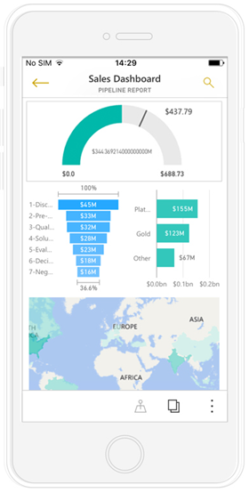
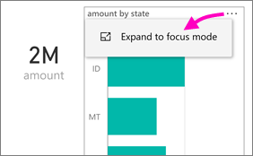
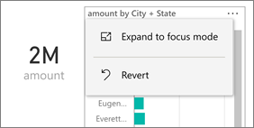
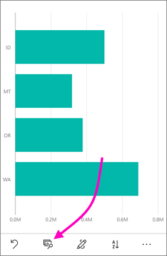
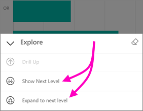
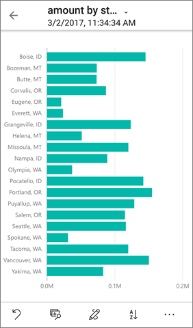
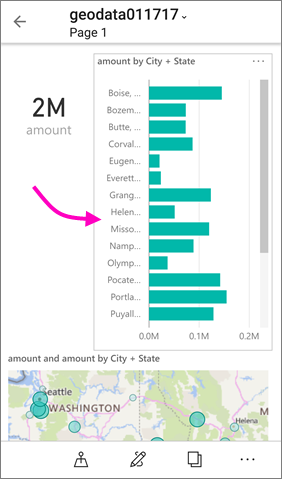

# Visualizzare i report di Power BI ottimizzati per il proprio telefono
Quando si crea un report di Power BI in Power BI Desktop, è possibile creare anche una versione di tale [report ottimizzata per la visualizzazione nell'app Power BI in un telefono](desktop-create-phone-report.md).

Quando si apre un report di Power BI in un telefono, Power BI rileva quindi se il report è stato ottimizzato per i telefoni e apre automaticamente il report ottimizzato in visualizzazione verticale.

Se non esiste un report ottimizzato per il telefono, il report viene comunque aperto ma in visualizzazione orizzontale non ottimizzata. Persino in un report con ottimizzazione per il telefono, se si gira il telefono sul lato il report si apre nella visualizzazione non ottimizzata con il layout originale del report. Se si ottimizzano solo alcune pagine, si vedrà un messaggio in modalità verticale, che indica che il report è disponibile in modalità orizzontale.

Tutte le altre funzionalità dei report di Power BI continueranno a funzionare nei report ottimizzati per il telefono. Altre informazioni sulle operazioni possibili in:

* [Report negli iPhone](mobile-reports-in-the-mobile-apps.md). 
* [Report nei telefoni Android](mobile-reports-in-the-mobile-apps.md).

## Filtrare la pagina del report in un telefono
Se per un report ottimizzato per il telefono sono stati definiti dei filtri, quando si visualizza il report in un telefono è possibile usare tali filtri. 

1. Toccare l'icona del filtro  nella parte inferiore della pagina. 
2. Usare il filtro di base o avanzato per visualizzare i risultati desiderati.
   
    

## Evidenziare oggetti visivi
L'evidenziazione degli oggetti visivi nel report per il telefono funziona esattamente come avviene nel servizio Power BI e nei report per telefoni in visualizzazione orizzontale: quando si selezionano i dati in un oggetto visivo, vengono evidenziati i dati correlati negli altri oggetti visivi in tale pagina.

Altre informazioni su [filtri ed evidenziazione in Power BI](power-bi-reports-filters-and-highlighting.md).

## Selezionare gli oggetti visivi
Nei report per il telefono, quando si seleziona un oggetto visivo il report per il telefono lo evidenzia e si concentra su di esso, neutralizzando i gesti nell'area di disegno.

Con l'oggetto visivo selezionato è possibile eseguire operazioni come lo scorrimento al suo interno. Per deselezionare un oggetto visivo, è sufficiente toccare in un punto qualsiasi all'esterno dell'area dell'oggetto visivo.

## Aprire gli oggetti visivi in modalità messa a fuoco
I report per il telefono offrono anche una modalità messa a fuoco, che consente di ottenere una visualizzazione più grande di un singolo oggetto visivo e di esplorare tale oggetto e il report.

* In un report per il telefono toccare i puntini di sospensione (**...**) nell'angolo in alto a destra di un oggetto visivo > **Espandi in modalità messa a fuoco**.
  
    

Le operazioni eseguite in modalità messa a fuoco si estendono all'area di disegno del report e viceversa, per un'esperienza di esplorazione senza problemi. Ad esempio, se si evidenzia un valore in un oggetto visivo e quindi si torna al report completo, questo verrà filtrato in base al valore evidenziato nell'oggetto visivo.

Alcune azioni sono possibili solo in modalità messa a fuoco a causa di limitazioni delle dimensioni dello schermo:

* **Eseguire il drill-down** nelle informazioni visualizzate in un oggetto visivo. Altre informazioni sul [drill-down e drill-up](mobile-apps-view-phone-report.md#drill-down-in-a-visual) in Power BI.
* **Ordinare** i valori nell'oggetto visivo.
* **Annullare**: cancellare i passaggi di esplorazione eseguiti in un oggetto visivo e annullare la definizione impostata quando il report è stato creato.
  
    Per cancellare qualsiasi esplorazione da un oggetto visivo, toccare i puntini di sospensione (**...**) > **Annulla**.
  
    
  
    L'annullamento è disponibile a livello di report, per cancellare qualsiasi esplorazione da tutti gli oggetti visivi, oppure a livello di oggetto visivo, per cancellare qualsiasi esplorazione dallo specifico oggetto visivo selezionato.   

## Eseguire il drill-down in un oggetto visivo
Se in un oggetto visivo sono definiti i livelli della gerarchia, è possibile eseguire il drill-down nelle informazioni dettagliate visualizzate in un oggetto visivo, quindi eseguire il backup. È possibile [aggiungere il drill-down in un oggetto visivo](power-bi-visualization-drill-down.md) nel servizio Power BI o in Power BI Desktop. Il drill-down funziona solo nei report di Power BI ottimizzati per il telefono quando vengono visualizzati in un telefono. 

1. In un report nel telefono toccare i puntini di sospensione (**...**) nell'angolo in alto a destra > **Espandi in modalità messa a fuoco**.
   
    
   
    In questo esempio le barre mostrano i valori per gli stati.
2. Toccare l'icona Esplora  in basso a sinistra.
   
    
3. Toccare **Mostra il livello successivo** o **Espandi al livello successivo**.
   
    
   
    Ora le barre mostrano i valori per le città.
   
    
4. Se si tocca la freccia nell'angolo in alto a sinistra, si torna al report per il telefono con i valori ancora espansi al livello inferiore.
   
    
5. Per tornare al livello originale, toccare di nuovo i puntini di sospensione (**...**) > **Annulla**.
   
    

## Passaggi successivi
* [Creare report ottimizzati per le app per telefoni di Power BI](desktop-create-phone-report.md)
* [Creare una visualizzazione telefono di un dashboard in Power BI](service-create-dashboard-mobile-phone-view.md)
* [Creare oggetti visivi reattivi ottimizzati per qualsiasi dimensione](desktop-create-responsive-visuals.md)
* Altre domande? [Provare a rivolgersi alla community di Power BI](http://community.powerbi.com/)

