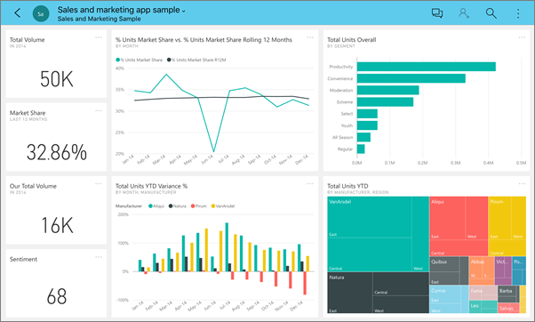
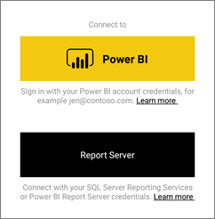
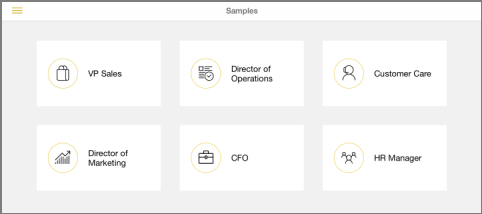
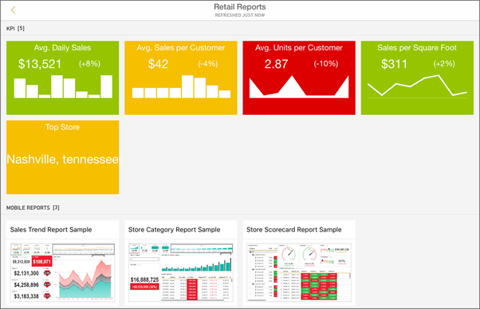
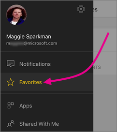
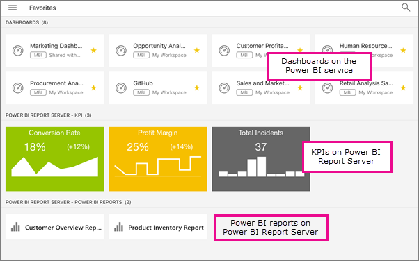

# Introduzione dell'app Power BI per dispositivi mobili in un iPad
L'app Microsoft Power BI per iOS nell'iPad offre l'esperienza BI per dispositivi mobili per Power BI, Server di report di Power BI e Reporting Services. Visualizzare e interagire con i dashboard aziendali locali e nel cloud ovunque ci si trovi con l'accesso mobile in tempo reale e abilitato per il tocco. Esplorare i dati nei dashboard e condividerli con i colleghi nei messaggi di posta elettronica o di testo. 

È possibile creare report di Power BI in Power BI Desktop e pubblicarli:

* [Pubblicarli nel servizio Power BI](service-get-started.md) e creare dashboard.
* [Pubblicarli in locale nel Server di report di Power BI](report-server/quickstart-create-powerbi-report.md).

Quindi, nell'app Power BI per l'iPad, è possibile interagire con i dashboard e i report, in locale o nel cloud.

Informazioni sulle [Novità delle app Power BI per dispositivi mobili](mobile-whats-new-in-the-mobile-apps.md).

## Scaricare l'app iOS per iPad
[Scaricare l'app iPad](http://go.microsoft.com/fwlink/?LinkId=522062) dall'App Store di Apple.

> [!NOTE]
> L'iPad deve eseguire almeno iOS 10. 
> 
> 

## Iscriversi al servizio Power BI
Passare a Power BI (https://powerbi.com) per iscriversi al servizio, se non è stato ancora fatto. È gratuito.

## Introduzione all'app Power BI
1. Nell'iPad aprire l'app Power BI.
2. Per visualizzare i dashboard e i report di Power BI, toccare **Power BI**. Accedere con le stesse credenziali dell'account di Power BI nel Web. 
   
   Per visualizzare i report per dispositivi mobili di Reporting Services e gli indicatori KPI, toccare **SQL Server Reporting Services**. Accedere con le credenziali di SQL Server Reporting Services.
   
   
   
   All'interno dell'app è sufficiente toccare il pulsante di spostamento globale  nell'angolo superiore sinistro per spostarsi tra i due servizi. 

## Provare gli esempi di Power BI e Reporting Services
Anche senza iscriversi, è possibile provare a usare gli esempi di Power BI e Reporting Services. Dopo avere scaricato l'app, è possibile visualizzare gli esempi o iniziare a usarli. È possibile tornare agli esempi in qualsiasi momento dalla home page dei dashboard.

### Esempi di Power BI
È possibile visualizzare e interagire con gli esempi di dashboard Power BI, ma non sarà possibile eseguire alcune operazioni, come ad esempio aprire i report dietro i dashboard, condividere gli esempi con altre persone o impostarli come preferiti.

1. Toccare il pulsante di spostamento globale  nell'angolo superiore sinistro, quindi toccare l'icona Impostazioni .
2. Toccare **Esempi di Power BI**, quindi selezionare un ruolo ed esplorare il dashboard degli esempi per tale ruolo.  
   
   
   
   > [!NOTE]
   > Non tutte le funzionalità sono disponibili negli esempi. Ad esempio, non è possibile visualizzare i report di esempio sottostanti ai dashboard. 
   > 
   > 

### Esempi di report per dispositivi mobili di Reporting Services
1. Toccare il pulsante di spostamento globale  nell'angolo superiore sinistro, quindi toccare l'icona Impostazioni .
2. Toccare **Esempi per Reporting Services**, quindi aprire la cartella dei report sulle vendite al dettaglio o dei report sulle vendite per analizzare gli indicatori KPI e i report per dispositivi mobili.
   
   

## Cercare il contenuto nelle app Power BI per dispositivi mobili
A seconda della provenienza, i dashboard e i report sono memorizzati in posizioni diverse nelle app Power BI per dispositivi mobili. Leggere altre informazioni su come [cercare il contenuto nelle app per dispositivi mobili](mobile-apps-find-content-mobile-devices.md). In più, è sempre possibile cercare qualsiasi contenuto presente nelle app Power BI per dispositivi mobili. 

## Ricerca di un dashboard o report
* Toccare la lente di ingrandimento nell'angolo superiore destro , quindi digitare il termine da trovare.
  
    
  
    Per impostazione predefinita la ricerca viene eseguita in tutti i dashboard e report, ma è anche possibile cercare solo nell'uno o nell'altro.

## Visualizzare i dashboard, i report e gli indicatori KPI preferiti
Nella pagina Preferiti delle app per dispositivi mobili vengono visualizzati tutti i dashboard preferiti di Power BI, insieme ai report e agli indicatori KPI del Server di report di Power BI e di Reporting Services. Quando si aggiunge un dashboard ai *Preferiti* nell'app Power BI per dispositivi mobili, è possibile accedervi da tutti i dispositivi, incluso il servizio Power BI nel proprio browser. 

* Toccare **Preferiti**.
  
   
  
   I Preferiti di Power BI i preferiti nel portale Web del server di report vengono visualizzati tutti in questa pagina.
  
   

Altre informazioni sui [dashboard preferiti nelle app Power BI per dispositivi mobili](mobile-apps-favorites.md).

## Supporto aziendale per le app Power BI per dispositivi mobili
Le organizzazioni possono usare Microsoft Intune per gestire dispositivi e applicazioni, tra cui le app Power BI per dispositivi mobili iOS e Android.

Microsoft Intune permette alle organizzazioni di controllare aspetti come la richiesta di un PIN di accesso, la modalità di gestione dei dati nell'applicazione e anche la crittografia dei dati dell'applicazione quando l'app non è in uso.

> [!NOTE]
> Se si usa l'app Power BI per dispositivi mobili nell'iPad e l'organizzazione ha configurato Microsoft Intune MAM, l'aggiornamento dati in background è disattivato. La volta successiva che si accede all'app, Power BI aggiorna i dati dal servizio Power BI sul Web.
> 
> 

Altre informazioni sulla [configurazione delle app Power BI per dispositivi mobili con Microsoft Intune](service-admin-mobile-intune.md). 

## Passaggi successivi
Ecco alcune operazioni che è possibile eseguire nell'app iPad con dashboard e report di Power BI e con report e indicatori KPI nel Server di report di Power BI o nel portale Web di Reporting Services.

### Dashboard e report di Power BI
* Visualizzare le [app](service-install-use-apps.md).
* Visualizzare i [dashboard di Power BI](mobile-apps-view-dashboard.md).
* [Ottenere risposte dai dati](mobile-apps-ios-qna.md) usando termini personalizzati con Domande e risposte
* [Scansionare un codice a matrice di Power BI](mobile-apps-qr-code.md) per aprire un riquadro del dashboard correlato o un report.
* [Impostare gli avvisi per i dati](mobile-set-data-alerts-in-the-mobile-apps.md) per ricevere notifiche quando i dati vengono modificati.
* Visualizzare le [notifiche sugli aggiornamenti all'account di Power BI](mobile-apps-notification-center.md), ad esempio sui dashboard condivisi con i colleghi.
  
  

### Report e indicatori KPI nei portali Web del server di report
* [Visualizzare report e indicatori KPI nel portale Web](mobile-app-ssrs-kpis-mobile-on-premises-reports.md) nell'app Power BI per dispositivi iOS.
* Creare [gli indicatori KPI nel portale Web](https://docs.microsoft.com/sql/reporting-services/working-with-kpis-in-reporting-services).
* Creare [report in Power BI Desktop e pubblicarli nel portale Web del server di report di Power BI](report-server/quickstart-create-powerbi-report.md)

### Vedere anche
* [Introduzione a Power BI](service-get-started.md)  
* Domande? Provare a rivolgersi alla [community di Power BI](http://community.powerbi.com/).

