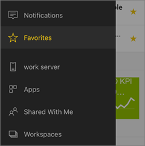
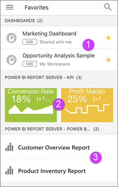

# Introduzione all'app Power BI per dispositivi mobili nei dispositivi iOS
L'app Microsoft Power BI per iOS in dispositivi iPhone, iPad o iPod Touch offre l'esperienza BI per dispositivi mobili per Power BI, il Server di report di Power BI e Reporting Services. Visualizzare e interagire con i dashboard aziendali locali e nel cloud ovunque ci si trovi con l'accesso mobile in tempo reale e abilitato per il tocco. Esplorare i dati nei dashboard e condividerli con i colleghi nei messaggi di posta elettronica o di testo. Tenersi al corrente con i dati più aggiornati sul proprio [Apple Watch](mobile-apple-watch.md).  

È possibile creare report di Power BI in Power BI Desktop e pubblicarli:

* [Pubblicarli nel servizio Power BI](service-get-started.md) e creare dashboard.
* [Pubblicarli in locale nel Server di report di Power BI](report-server/quickstart-create-powerbi-report.md).

Nell'app Power BI per dispositivi mobili per iOS è quindi possibile interagire con i dashboard e i report, in locale o nel cloud.

Informazioni sulle [Novità delle app Power BI per dispositivi mobili](mobile-whats-new-in-the-mobile-apps.md).

## Scarica l'app
[Scaricare l'app iOS](http://go.microsoft.com/fwlink/?LinkId=522062 "Scaricare l'app iOS") dall'App Store di Apple per iPhone, iPad o iPod Touch.

È possibile eseguire l'app Power BI per iOS su iPhone 5 e versioni successive con iOS 10 o versioni successive. È anche possibile eseguirla in un iPad o iPod Touch con iOS 10 o versioni successive. 

## Iscriversi al servizio Power BI
Se non si è ancora eseguito l'accesso, andare a [powerbi.com](https://powerbi.microsoft.com/get-started/) e in **Power BI - Cloud collaboration and sharing** (Collaborazione e condivisione nel cloud), selezionare **Prova gratuitamente**.

## Introduzione all'app Power BI
1. Aprire l'app Power BI nel dispositivo iOS.
2. Per visualizzare i dashboard di Power BI, toccare **Power BI**.  
   Per visualizzare i report per dispositivi mobili di Reporting Services e gli indicatori KPI, toccare **SQL Server Reporting Services**.
   
   
   
   All'interno dell'app è sufficiente toccare il pulsante di spostamento globale  nell'angolo superiore sinistro per spostarsi tra i due. 

## Provare gli esempi di Power BI e Reporting Services
Anche senza iscriversi, è possibile provare a usare gli esempi di Power BI e Reporting Services. Dopo avere scaricato l'app, è possibile visualizzare gli esempi o iniziare a usarli. È possibile tornare dal menu di spostamento globale agli esempi in qualsiasi momento.

### Esempi di Power BI
È possibile visualizzare e interagire con gli esempi di dashboard Power BI, ma non sarà possibile eseguire alcune operazioni, come ad esempio aprire i report dietro i dashboard, condividere gli esempi con altre persone o impostarli come preferiti.

1. Toccare il pulsante di spostamento globale  nell'angolo in alto a sinistra.
2. Toccare l'icona a forma di ingranaggio in alto a destra , quindi toccare **Esempi di Power BI**.
3. Selezionare un ruolo ed esplorare il dashboard degli esempi per tale ruolo.  
   
   
   
   > [!NOTE]
   > Non tutte le funzionalità sono disponibili negli esempi. Ad esempio, non è possibile visualizzare i report di esempio sottostanti ai dashboard. 
   > 
   > 

### Esempi di report per dispositivi mobili di Reporting Services
1. Toccare il pulsante di spostamento globale  nell'angolo in alto a sinistra.
2. Toccare l'icona a forma di ingranaggio in alto a destra , quindi toccare **Esempi per Reporting Services**.
3. Aprire la cartella dei report sulle vendite al dettaglio o dei report sulle vendite per analizzare gli indicatori KPI e i report per dispositivi mobili.
   
   

## Cercare il contenuto nelle app Power BI per dispositivi mobili
A seconda della provenienza, i dashboard e i report sono memorizzati in posizioni diverse nelle app Power BI per dispositivi mobili. Leggere altre informazioni su come [cercare il contenuto nelle app per dispositivi mobili](mobile-apps-find-content-mobile-devices.md). In più, è sempre possibile cercare qualsiasi contenuto presente nelle app Power BI per dispositivi mobili. 

Leggere altre informazioni su come [cercare il contenuto nelle app per dispositivi mobili](mobile-apps-find-content-mobile-devices.md).

## Visualizzare i dashboard, i report e gli indicatori KPI preferiti
Nella pagina Preferiti delle app per dispositivi mobili vengono visualizzati tutti i dashboard preferiti di Power BI, insieme ai report e agli indicatori KPI del Server di report di Power BI e di Reporting Services. Quando si aggiunge un dashboard ai *Preferiti* nell'app Power BI per dispositivi mobili, è possibile accedervi da tutti i dispositivi, incluso il servizio Power BI nel proprio browser. 

* Toccare **Preferiti**.
  
   
  
   Tutti i preferiti sono visibili insieme in questa pagina:
  
   
  
  1. Dashboard nel servizio Power BI
  2. Indicatori KPI nel server di report di Power BI
  3. Report di Power BI nel server di report di Power BI

Altre informazioni sui [dashboard preferiti nelle app Power BI per dispositivi mobili](mobile-apps-favorites.md).

## Supporto aziendale per le app Power BI per dispositivi mobili
Le organizzazioni possono usare Microsoft Intune per gestire dispositivi e applicazioni, tra cui le app Power BI per dispositivi mobili iOS e Android.

Microsoft Intune permette alle organizzazioni di controllare aspetti come la richiesta di un PIN di accesso, la modalità di gestione dei dati nell'applicazione e anche la crittografia dei dati dell'applicazione quando l'app non è in uso.

> [!NOTE]
> Se si usa l'app Power BI per dispositivi mobili in un dispositivo iOS e l'organizzazione ha configurato il software MAM di Microsoft Intune, l'aggiornamento dati in background è disattivato. La volta successiva che si accede all'app, Power BI aggiorna i dati dal servizio Power BI sul Web.
> 

Altre informazioni sulla [configurazione delle app Power BI per dispositivi mobili con Microsoft Intune](service-admin-mobile-intune.md). 

## Passaggi successivi

* [Che cos'è Power BI?](power-bi-overview.md)
* Domande? [Provare a rivolgersi alla community di Power BI](http://community.powerbi.com/)

