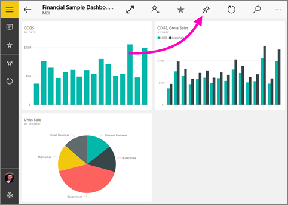
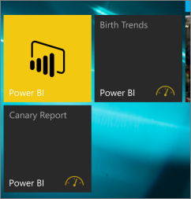

# Aggiungere un dashboard alla schermata Start di Windows 10 dall'app Power BI per dispositivi mobili
È possibile aggiungere dashboard di Power BI alla schermata Start di Windows dall'app Power BI per dispositivi mobili per Windows 10. Questi diventano *riquadri animati*, in modo da visualizzare le metriche importanti a colpo d'occhio. Quando si tocca il riquadro nella schermata Start, il dashboard viene aperto nell'app Power BI per dispositivi mobili per Windows 10.

## Aggiungere un dashboard alla schermata Start come riquadro animato
1. Aprire un dashboard.
2. Toccare **Aggiungi a start** .
   
   
   
   Passare alla schermata Start del dispositivo per visualizzare il riquadro animato.
   
   

## Passaggi successivi
* [Scaricare l'app Power BI per dispositivi mobili per Windows 10](http://go.microsoft.com/fwlink/?LinkID=526478) da Windows Store  
* [Introduzione all'app Power BI per dispositivi mobili per Windows 10](mobile-windows-10-phone-app-get-started.md)  
* [Introduzione a Power BI](service-get-started.md)
* Domande? [Provare a rivolgersi alla community di Power BI](http://community.powerbi.com/)

