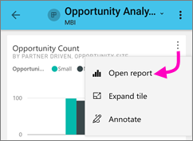
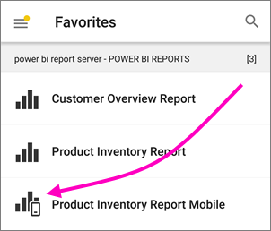
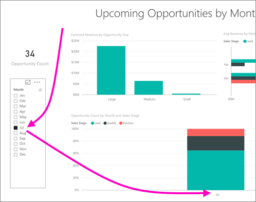
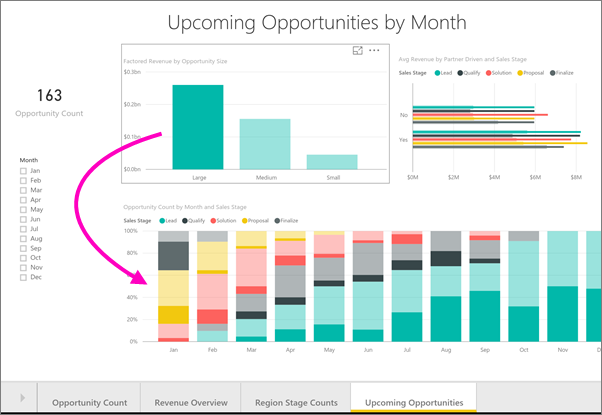
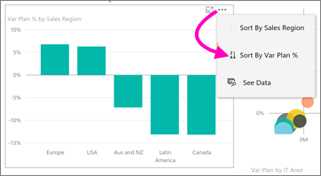
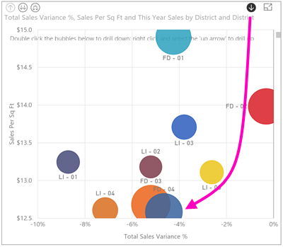
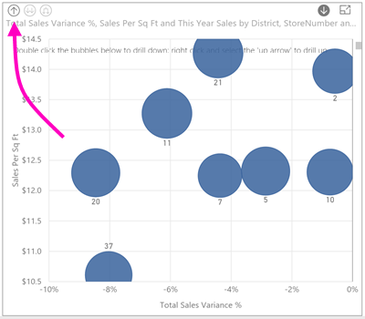
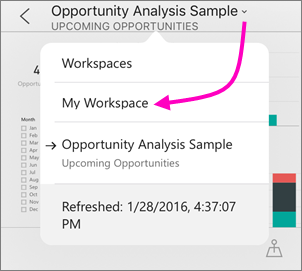

# Esplorare i report nelle app Power BI per dispositivi mobili
Si applica a:

|  |  |  |  |  |
|:--- |:--- |:--- |:--- |:--- |
| iPhone |iPad |Telefoni Android |Tablet Android |Dispositivi Windows 10 |

Un report di Power BI è una vista interattiva dei dati con elementi visivi che rappresentano conclusioni e approfondimenti diversi ottenuti da tali dati. La visualizzazione dei report nella app Power BI per dispositivi mobili è il terzo passaggio in un processo in tre fasi.

1. [Creare report in Power BI Desktop](desktop-report-view.md). In Power BI Desktop è persino possibile [ottimizzare un report per i telefoni](mobile-apps-view-phone-report.md). 
2. Pubblicare i report nel servizio Power BI [(https://powerbi.com)](https://powerbi.com) o in [Server di report di Power BI](report-server/get-started.md).  
3. È quindi possibile interagire con questi report nelle app Power BI per dispositivi mobili.

## Aprire un report di Power BI nell'app per dispositivi mobili
A seconda della provenienza, i report di Power BI sono archiviati in posizioni diverse nell'app per dispositivi mobili. Possono trovarsi in App, Condivisi con l'utente corrente, Aree di lavoro (inclusa l'Area di lavoro personale) oppure in un server di report. In alcuni casi si accede attraverso un dashboard correlato per ottenere un report, e talvolta sono elencati.

* In un dashboard, toccare i puntini di sospensione (...) nell'angolo superiore destro di un riquadro > **Apri report**.
  
  
  
  Non tutti i riquadri offrono l'opzione di apertura in un report. Ad esempio, i riquadri creati ponendo una domanda nella casella Domande e risposte non aprono i report quando vengono toccati. 
  
  In un telefono, il report verrà aperto in modalità orizzontale, a meno che non sia [ottimizzato per la visualizzazione in un telefono](mobile-reports-in-the-mobile-apps.md#view-reports-optimized-for-phones).
  
  

## Visualizzare i report ottimizzati per i telefoni
Gli autori di report di Power BI possono creare un layout di report ottimizzato in modo specifico per telefoni. Le pagine dei report ottimizzate per i telefoni includono funzionalità aggiuntive. È ad esempio possibile eseguire il drill-down e ordinare gli oggetti visivi ed è possibile accedere ai [filtri aggiunti dall'autore del report alla pagina del report](mobile-apps-view-phone-report.md#filter-the-report-page-on-a-phone). Il report viene aperto in un telefono filtrato in base ai valori usati per filtrare il report sul Web con un messaggio che segnala che ci sono filtri attivi nella pagina. È possibile modificare i filtri nel telefono.

In un elenco di report un report ottimizzato è contrassegnato da un'icona speciale :

Quando si visualizza tale report in un telefono, viene aperto in visualizzazione verticale.

 Un report può includere una combinazione di pagine che non sono ottimizzate per i telefoni. In tal caso, quando si scorrono i report la visualizzazione passerà da verticale a orizzontale per ogni pagina.

Altre informazioni sui [report ottimizzati per la visualizzazione telefono](mobile-apps-view-phone-report.md).

## Usare i filtri dei dati per filtrare un report
Quando si progetta un report in Power BI Desktop o nel servizio Power BI, prendere in considerazione l'[aggiunta di filtri dei dati a una pagina del report](power-bi-visualization-slicers.md). Sia l'autore che i colleghi potranno così usare i filtri dei dati per filtrare la pagina in un browser e nelle app per dispositivi mobili. Quando si visualizza il report in un telefono, è possibile visualizzare e interagire con i filtri dei dati in modalità orizzontale e in una pagina ottimizzata per la modalità verticale del telefono. Se si seleziona un valore in un filtro dei dati o in un filtro nel browser, il valore verrà selezionato anche quando si visualizza la pagina nell'app per dispositivi mobili. Viene visualizzato un messaggio che indica che sono presenti filtri attivi nella pagina.  

* Quando si seleziona un valore in un filtro dei dati nella pagina del report, vengono filtrati gli altri oggetti visivi nella pagina.
  
  
  
  In questa illustrazione, il filtro dei dati filtra l'istogramma in modo da mostrare solo i valori di luglio.

## Applicare un filtro incrociato ed evidenziare un report
Quando si seleziona un valore in un oggetto visivo, gli altri oggetti visivi non vengono filtrati, ma vengono evidenziati i valori correlati in altri oggetti visivi.

* Toccare un valore in un oggetto visivo.
  
  
  
  Se si tocca la colonna Large in un grafico, vengono evidenziati i valori correlati negli altri oggetti visivi. 

## Ordinare un oggetto visivo in un iPad o un tablet
* Toccare il grafico, toccare i puntini di sospensione (**...**) e toccare il nome del campo.
  
   
* Per invertire l'ordinamento, toccare di nuovo i puntini di sospensione (**...**), quindi toccare di nuovo il nome dello stesso campo.

## Eseguire il drill-down in un iPad o un tablet
Se l'autore di un report ha aggiunto funzionalità di drill-down a un oggetto visivo, in un tablet o un iPad è possibile eseguire il drill-down in un oggetto visivo per visualizzare i valori che ne fanno parte. È possibile [aggiungere il drill-down a un oggetto visivo](power-bi-visualization-drill-down.md) in Power BI Desktop o nel servizio Power BI. 

> [!NOTE]
> Attualmente il drill-down non funziona con le mappe nell'iPad o nel tablet.
> 
> 

* Toccare un elemento visivo. Se sono presenti frecce in su e in giù negli angoli superiori , è possibile eseguire il drill-down. Per eseguire il drill-down in un valore, toccare la freccia nell'angolo superiore destro, quindi toccare un valore nell'oggetto visivo (in questo caso, la bolla FD-04 di colore blu scuro).
  
  
* Per eseguire il drill-down del backup, toccare la freccia in su nell'angolo superiore sinistro.
  
  

## Tornare all'Area di lavoro
* Toccare la freccia accanto al nome del report > toccare **Area di lavoro personale**.
  
  

## Passaggi successivi
* [Visualizzare e interagire con i report di Power BI ottimizzati per il proprio telefono](mobile-apps-view-phone-report.md)
* [Creare una versione di un report ottimizzata per i telefoni](desktop-create-phone-report.md)
* Domande? [Provare a rivolgersi alla community di Power BI](http://community.powerbi.com/)

