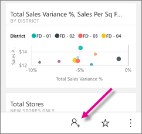
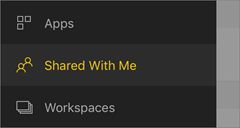
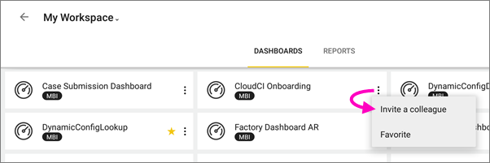
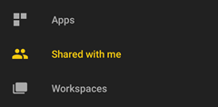
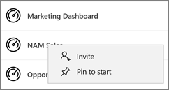
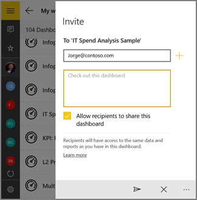

# Condividere un dashboard dall'app Power BI per dispositivi mobili
Si applica a:

|  |  |  |  |  |
|:--- |:--- |:--- |:--- |:--- |
| iPhone |iPad |Telefoni Android |Tablet Android |Dispositivi Windows 10 |

Con una [licenza Power BI Pro](service-free-vs-pro.md) è possibile invitare i colleghi a visualizzare i dashboard condividendo i collegamenti dalle app Power BI per dispositivi mobili. Gli utenti con cui si condividono i dashboard devono avere lo stesso dominio di posta elettronica dell'utente e una licenza Power BI Pro. In caso contrario, il contenuto deve avere una [capacità Premium](service-premium.md).

Dalle app per dispositivi mobili Power BI per iOS e Android è possibile anche [aggiungere annotazioni e condividere lo snapshot di un riquadro, un report o un oggetto visivo](mobile-annotate-and-share-a-tile-from-the-mobile-apps.md) con chiunque. 

## Condividere un dashboard dall'iPhone
1. Nella barra delle azioni nella parte inferiore del dashboard toccare l'icona di condivisione .
   
   
2. Toccare **Invita un collega**.
3. Digitare i nomi, separati da virgole, e un messaggio di accompagnamento per l'invito al dashboard.
4. Per consentire la ricondivisione, lasciare selezionata l'opzione **Consenti ai destinatari di condividere questo dashboard** .
   
   La ricondivisione consente ai colleghi di inoltrare il messaggio di posta elettronica di invito ad altri utenti dell'organizzazione, usando il Web o le app per dispositivi mobili.
5. Toccare **Invia** nell'angolo in alto a destra.
   
   I colleghi riceveranno un messaggio di posta elettronica di invito contenente un collegamento diretto al dashboard. L'invito scade dopo un mese. Quando i colleghi aprono il collegamento in un browser o nell'app Power BI per dispositivi mobili, questo viene aggiunto alla sezione **Condivisi** del loro account Power BI.
   
   
   
   Leggere altre [note sulla condivisione dei dashboard con i colleghi](service-share-dashboards.md).

### Annullare la condivisione di un dashboard dall'iPhone
Solo i proprietari possono annullare la condivisione di un dashboard.

1. Nella barra delle azioni nella parte inferiore del dashboard toccare l'icona di condivisione .
2. Toccare **Invita un collega**.
   
   Verrà visualizzato l'elenco dei colleghi con cui è stato condiviso questo dashboard, con le seguenti diciture:
   
   * **Può visualizzare**: i colleghi possono visualizzare il dashboard ma non condividerlo.
   * **Può visualizzare e invitare**: i colleghi possono visualizzare il dashboard e condividerlo con altri colleghi.
3. Toccare **Modifica**.
   
    
4. Per annullare la condivisione, toccare il cerchio rosso accanto a un nome e toccare **Elimina**.

## Condividere un dashboard dall'iPad
1. Toccare l'icona di condivisione  nell'angolo in alto a destra del dashboard.
2. Toccare **Invita un collega**, quindi digitare gli indirizzi di posta elettronica e un messaggio da allegare all'invito per il dashboard.
3. Per consentire la ricondivisione, lasciare selezionata l'opzione **Consenti ai destinatari di condividere questo dashboard** .
   
   > [!NOTE]
   > La ricondivisione consente ai colleghi di inoltrare il messaggio di posta elettronica di invito ad altri utenti dell'organizzazione, usando il Web o le app per dispositivi mobili.
   > 
   > 
4. Toccare **Invia** nell'angolo in alto a destra.
   
   I colleghi riceveranno un messaggio di posta elettronica di invito contenente un collegamento diretto al dashboard. L'invito scade dopo un mese. Quando i colleghi aprono il collegamento in un browser o nell'app Power BI per dispositivi mobili, questo viene aggiunto alla sezione **Condivisi** del loro account Power BI
   
   
   
   Leggere altre [note sulla condivisione dei dashboard con i colleghi](service-share-dashboards.md).

### Annullare la condivisione di un dashboard dall'iPad
Solo i proprietari possono annullare la condivisione di un dashboard.

1. Toccare l'icona di condivisione  nell'angolo in alto a destra del dashboard.
   
   Verrà visualizzato l'elenco di colleghi con cui è stato condiviso questo dashboard. Al di sotto dei nomi dei colleghi sono presenti queste parole:
   
   * **In sospeso**: i colleghi non hanno ancora visualizzato il dashboard.
   * **Può visualizzare**: i colleghi possono visualizzare il dashboard ma non condividerlo.
   * **Può visualizzare e invitare**: i colleghi possono visualizzare il dashboard e condividerlo con altri colleghi.
2. Toccare **Modifica**.
3. Per annullare la condivisione, toccare il cerchio rosso accanto a un nome e toccare **Elimina**.

## Condividere un dashboard da un dispositivo Android
1. Nella home page Dashboard toccare i puntini di sospensione (...) e quindi **Invita un collega**.
   
   
2. In alternativa, nell'angolo in alto a destra di un dashboard toccare l'icona Invita .

    Se si è proprietari del dashboard, verrà visualizzato l'elenco di colleghi con cui è stato condiviso il dashboard unitamente alle note seguenti:

    -   **Può visualizzare**: i colleghi hanno visualizzato il dashboard ma non possono condividerlo.

    -   **Può visualizzare e invitare**: i colleghi hanno visualizzato il dashboard e possono condividerlo con altri colleghi.

1. Digitare gli indirizzi di posta elettronica e un messaggio di accompagnamento per l'invito al dashboard. In caso contrario, Power BI invia un messaggio predefinito.
2. Per consentire la ricondivisione, lasciare selezionata l'opzione **Consenti ai destinatari di condividere questo dashboard** .
   
   > [!NOTE]
   > La ricondivisione consente ai colleghi di inoltrare il messaggio di posta elettronica di invito ad altri utenti dell'organizzazione, usando il browser o le app per dispositivi mobili.
   > 
   > 
3. Toccare l'icona Invia  nell'angolo in alto a destra per inviare il messaggio.
   
   I colleghi riceveranno un messaggio di posta elettronica di invito contenente un collegamento diretto al dashboard. L'invito scade dopo un mese. Quando i colleghi aprono il collegamento in un browser o nell'app Power BI per dispositivi mobili, questo viene aggiunto alla sezione **Condivisi** del loro account Power BI
   
   
   
   Leggere altre [note sulla condivisione dei dashboard con i colleghi](service-share-dashboards.md).

### Annullare la condivisione di un dashboard da un dispositivo Android
Solo il proprietario di un dashboard ne può annullare la condivisione.

1. Nell'angolo in alto a destra del dashboard toccare l'icona Invita . 
   
   Verrà visualizzato l'elenco di colleghi con cui è stato condiviso questo dashboard.
2. Per interrompere la condivisione del dashboard con un collega, toccare la **X** accanto a un nome \>**Rimuovi**.

## Condividere un dashboard da un dispositivo Windows 10
1. In un dashboard toccare l'icona Invita .
   
   In alternativa, nella home page dei dashboard fare clic con il pulsante destro del mouse o premere e tenere premuto e toccare **Invita**.
   
   
   
   Se si è proprietari del dashboard, verrà visualizzato l'elenco di colleghi con cui è stato condiviso il dashboard unitamente alle note seguenti:
   
   **Sola lettura**: i colleghi hanno visualizzato il dashboard ma non possono condividerlo.
   
   **Lettura e ricondivisione**: i colleghi hanno visualizzato il dashboard e possono condividerlo con altri colleghi.
2. Digitare gli indirizzi di posta elettronica e un messaggio di accompagnamento per l'invito al dashboard. In caso contrario, Power BI invia un messaggio predefinito.
   
   
3. Per consentire la ricondivisione, lasciare selezionata l'opzione **Consenti ai destinatari di condividere questo dashboard** .
   
   > [!NOTE]
   > La ricondivisione consente ai collaboratori di condividere il dashboard con altri utenti dell'organizzazione, usando il browser o le app per dispositivi mobili.
   > 
   > 
4. Toccare l'icona Invia .
   
   I colleghi riceveranno un messaggio di posta elettronica di invito contenente un collegamento diretto al dashboard. L'invito scade dopo un mese. Quando i colleghi aprono il collegamento in un browser o nell'app Power BI per dispositivi mobili, questo viene aggiunto alla sezione **Condivisi** del loro account Power BI
   
   
   
   Leggere altre [note sulla condivisione dei dashboard con i colleghi](service-share-dashboards.md).

## Passaggi successivi
* [Annotate & share a snapshot of a tile, report, or visual in the mobile apps](mobile-annotate-and-share-a-tile-from-the-mobile-apps.md) (Aggiungere annotazioni e condividere lo snapshot di un riquadro, un report o un oggetto visivo nelle app per dispositivi mobili)
* [Condividere un dashboard in Power BI](service-share-dashboards.md)
* Domande? [Provare a rivolgersi alla community di Power BI](http://community.powerbi.com/)

