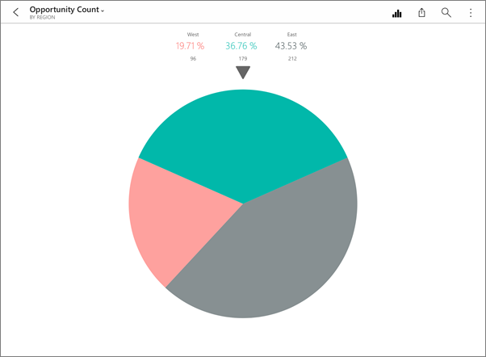
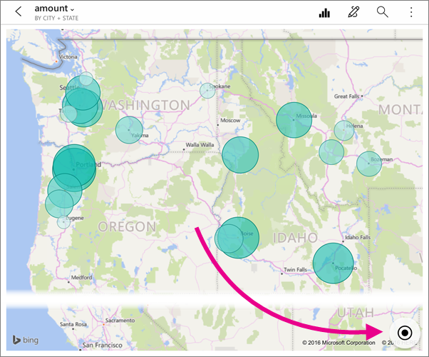
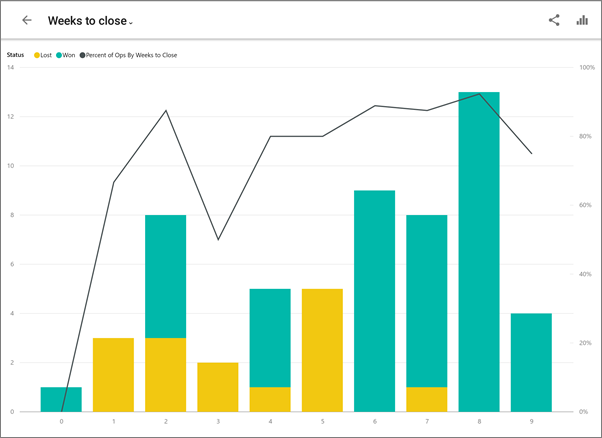
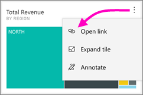
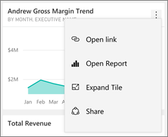
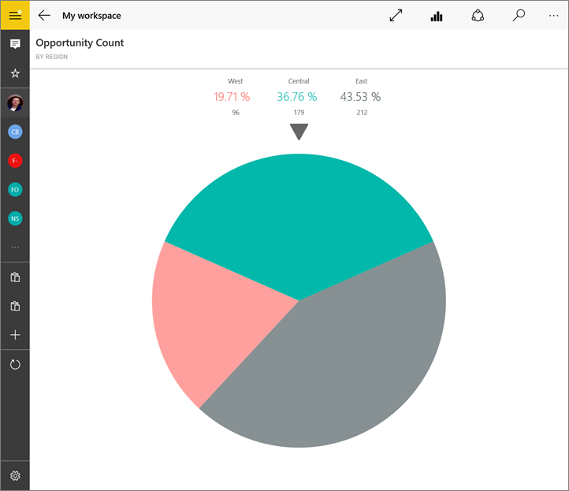
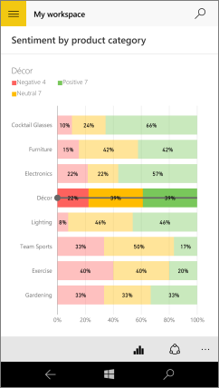

# Esplorare i riquadri nelle app Power BI per dispositivi mobili
Si applica a:

|  |  |  |  |  |
|:--- |:--- |:--- |:--- |:--- |
| iPhone |iPad |Telefoni Android |Tablet Android |Dispositivi Windows 10 |

I riquadri sono snapshot dei dati in tempo reale aggiunti a un dashboard. I relativi valori cambiano in base alle modifiche apportate ai dati. **I riquadri vengono [aggiunti a un dashboard nel servizio Power BI](service-dashboard-tiles.md).** 

È quindi possibile aprire in modalità messa a fuoco e interagire con questi riquadri nell'app Power BI per dispositivi mobili. È possibile aprire riquadri con tutti i tipi di oggetti visivi, inclusi i riquadri basati su Bing e R.

## Riquadri nelle app iOS
> [!NOTE]
> È possibile [creare riquadri immagine con l'app iPhone](mobile-iphone-app-get-started.md) e salvarli nei dashboard.
> 
> 

1. Aprire un [dashboard nell'app per dispositivi mobili per iOS](mobile-apps-view-dashboard.md).
2. Toccare un riquadro. Viene aperto in stato attivo in modo da visualizzare ed esplorare i dati del riquadro più facilmente. In questa modalità è possibile:
   
   Toccare un punto in un grafico a linee, un grafico a barre o un istogramma per visualizzare i valori relativi a parti specifiche della visualizzazione.
   
    
   
   *Ad esempio, in questo grafico a linee i valori selezionati sono relativi a **This Year Sales** (vendite di quest'anno) e **Last Year Sales** (vendite dell'anno precedente) nel periodo **August** (agosto).*  
   
   In un grafico a torta toccare una sezione della torta per visualizzarne i valori nella parte superiore della torta.  
   
   
3. In una mappa toccare l'icona **Centra mappa**  per centrare la mappa rispetto alla posizione corrente.
   
     
4. Toccare l'icona Condividi  per [aggiungere annotazioni a un riquadro e condividerlo](mobile-annotate-and-share-a-tile-from-the-mobile-apps.md) con altre persone.
5. [Aggiungere un avviso al riquadro](mobile-set-data-alerts-in-the-mobile-apps.md). Se i valori sono superiori o inferiori agli obiettivi, Power BI invierà una notifica.
6. In alcuni casi l'autore del dashboard ha aggiunto un collegamento a un riquadro. In tal caso, il riquadro conterrà un'icona di collegamento  quando è in modalità di messa a fuoco:
   
    
   
    I collegamenti possono indirizzare ad altri dashboard di Power BI o a un URL esterno. È possibile [toccare il collegamento](service-dashboard-edit-tile.md#hyperlink) per aprirlo nell'app Power BI. Nel caso di un sito esterno, Power BI chiederà l'autorizzazione prima di continuare.
   
    
   
    Dopo aver aperto il collegamento nell'app Power BI, è possibile copiarlo e aprirlo invece in una finestra del browser.
7. [Aprire il report](mobile-reports-in-the-mobile-apps.md)  su cui è basato il riquadro.
8. Per uscire dalla modalità messa a fuoco del riquadro, toccare il nome del riquadro, quindi toccare il nome del dashboard oppure **Area di lavoro**.
   
    

## Riquadri nell'app per dispositivi mobili per telefoni e tablet Android
1. Aprire un [dashboard nell'app Power BI per dispositivi mobili](mobile-apps-view-dashboard.md).
2. Toccare un riquadro per aprirlo in stato attivo in modo da visualizzare ed esplorare i dati del riquadro più facilmente.
   
   
   
    In questa modalità è possibile:
   
   * Toccare il grafico per spostare la barra in un grafico a linee, un grafico a barre, un istogramma o un grafico a bolle per visualizzare i valori relativi a un punto specifico della visualizzazione.  
   * Toccare l'icona Condividi snapshot  per [aggiungere annotazioni al riquadro e condividerlo](mobile-annotate-and-share-a-tile-from-the-mobile-apps.md) con altre persone.
   * Toccare l'icona Apri report  per [visualizzare il report](mobile-reports-in-the-mobile-apps.md) nell'app per dispositivi mobili.
3. In alcuni casi l'autore del dashboard ha aggiunto un collegamento a un riquadro. In tal caso, quando si toccano i puntini di sospensione verticali (**...**) verrà visualizzata l'opzione **Apri collegamento** :
   
    
   
    I collegamenti possono indirizzare ad altri dashboard di Power BI o a un URL esterno. È possibile [toccare il collegamento](service-dashboard-edit-tile.md#hyperlink) per aprirlo nell'app Power BI. Nel caso di un sito esterno, Power BI chiederà l'autorizzazione prima di continuare.
   
    
   
    Dopo aver aperto il collegamento nell'app Power BI, è possibile copiarlo e aprirlo invece in una finestra del browser.
4. Toccare la freccia nell'angolo in alto a sinistra per chiudere il riquadro e tornare al dashboard.

## Riquadri nell’app per dispositivi mobili Windows 10
1. Aprire un [dashboard nell'app Power BI per dispositivi mobili](mobile-apps-view-dashboard.md) per Windows 10.
2. Toccare i puntini di sospensione verticali nel riquadro. Da qui, è possibile: 
   
    
   
    [Condividere uno snapshot del riquadro](mobile-share-tile-windows-10-phone-app.md).
   
    Toccare **Apri report** per [visualizzare il report sottostante](mobile-reports-in-the-mobile-apps.md).
   
    [Aprire il collegamento](service-dashboard-edit-tile.md#hyperlink), se presente. I collegamenti possono indirizzare a dashboard di Power BI o a un URL esterno.
3. Toccare **Espandi riquadro** . Viene aperto in stato attivo in modo da visualizzare ed esplorare i dati del riquadro più facilmente. In questo stato è possibile:
   
   Ruotare un grafico a torta per visualizzare i valori della sezione nella parte superiore della torta.  
   
   
   
   Toccare il grafico per spostare la barra in un grafico a linee, un grafico a barre, un istogramma o un grafico a bolle per visualizzare i valori relativi a un punto specifico della visualizzazione.  
   
   
   
   *In questo grafico a barre, i valori della barra **Decor** vengono visualizzati nella parte superiore del grafico.*
   
   Toccare l'icona **Schermo intero**  per aprire il riquadro in modalità schermo intero, senza le barre di spostamento e dei menu.
   
   > [!NOTE]
   > È anche possibile [visualizzare i dashboard e i report in modalità schermo intero](mobile-windows-10-app-presentation-mode.md) nell'app Power BI per dispositivi mobili per Windows 10.
   > 
   > 
   
   In una mappa toccare l'icona **Centra mappa**  per centrare la mappa rispetto alla posizione corrente.
   
   
   
   Toccare l'icona Condividi snapshot  per [condividere un riquadro](mobile-share-tile-windows-10-phone-app.md) con altri utenti.   
   
   Toccare l'icona Apri report  per [visualizzare il report](mobile-reports-in-the-mobile-apps.md) su cui si basa il riquadro. 
4. Toccare la freccia Indietro o il pulsante Indietro per chiudere il riquadro e tornare al dashboard.

## Passaggi successivi
* [Introduzione a Power BI](service-get-started.md)
* Domande? [Provare a rivolgersi alla community di Power BI](http://community.powerbi.com/)

