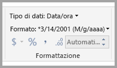
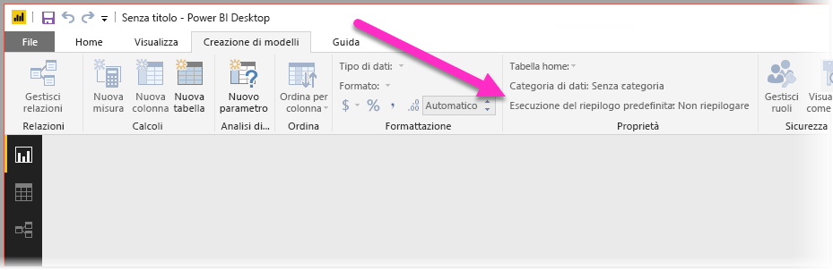
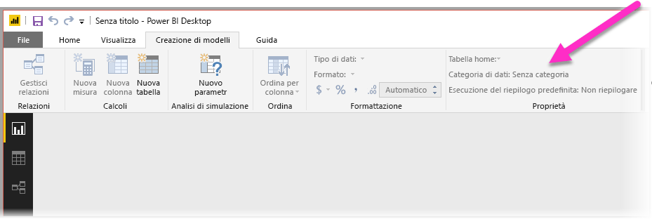

# Procedure consigliate per ottimizzare Domande e risposte in Power BI
L'uso del linguaggio naturale e di frasi comuni per porre le domande ai dati è una funzionalità molto potente. Lo è ancora di più quando i dati restituiscono una risposta, proprio come fa Domande e risposte di Power BI.

Per consentire a Domande e risposte di interpretare correttamente l'ampia raccolta di domande a cui è in grado di rispondere, Domande e risposte deve fare ipotesi sul modello. Se la struttura del modello non soddisfa almeno una di queste ipotesi, è necessario rettificare il modello. Le rettifiche per Domande e risposte corrispondono alle procedure di ottimizzazione consigliate per qualsiasi modello in Power BI, indipendentemente dal fatto che si usi Domande e risposte o meno.

Nelle sezioni seguenti viene descritto come adattare il modello per il corretto funzionamento con Domande e risposte in Power BI.

## Rettifiche automatiche di Domande e risposte

### Tabelle delle misure

Nelle versioni precedenti di Domande e risposte, le tabelle delle misure avevano l'effetto di confondere i risultati perché la tabella sottostante era disconnessa. Ora le tabelle delle misure di Domande e risposte funzionano correttamente.

### Nomi di tabella in conflitto con i nomi di colonna

Nelle versioni precedenti di Domande e risposte, se una tabella e una colonna avevano lo stesso nome, la priorità veniva assegnata alla tabella. Questo problema è stato risolto e quindi non è più necessario correggerlo nei modelli.

## Procedura manuale per migliorare Domande e risposte

### Usare i nuovi strumenti di Domande e risposte per correggere le domande

Con gli strumenti di Domande e risposte, è possibile insegnare a Domande e risposte i termini di uso più frequente nella propria organizzazione e correggere le domande poste dagli utenti finali. Talvolta continua a non essere possibile risolvere alcune domande perché i dati hanno un formato errato o risultano mancanti. In tal caso, leggere le altre sezioni riportate di seguito per facilitare l'ottimizzazione. Leggere altre informazioni sugli [strumenti di Domande e risposte](q-and-a-tooling-intro.md).

## Aggiungere relazioni mancanti

Se nel modello mancano relazioni tra tabelle, i report di Power BI e Domande e risposte non sono in grado di interpretare come unire tali tabelle. Le relazioni sono l'aspetto fondamentale di un buon modello. Non è ad esempio possibile porre una domanda relativa alle "vendite totali per i clienti di Seattle" se manca la relazione tra la tabella *ordini* e la tabella *clienti*. Le immagini seguenti mostrano un modello da modificare e un modello pronto per Domande e risposte. 

**Da modificare**

Nella prima immagine non sono presenti relazioni tra le tabelle Customers, Sales e Products.

**Pronto per Domande e risposte**

Nella prima immagine sono definite le relazioni tra le tabelle.

## Rinominare tabelle e colonne

La scelta delle tabelle e delle colonne è importante per Domande e risposte. Ad esempio, si supponga di usare una tabella denominata *RiepilogoClienti* che contiene un elenco dei clienti. Potrebbe essere necessario porre domande come "Elenca i riepiloghi dei clienti di Milano" invece di "Elenca i clienti di Milano". 

Anche se Domande e risposte può eseguire alcune operazioni di suddivisione delle parole e rilevamento dei plurali di base, presuppone che i nomi delle tabelle e delle colonne ne riflettano in modo accurato il contenuto.

Ecco un altro esempio. Si supponga di avere una tabella denominata *Personale* contenente nomi e cognomi e numeri dei dipendenti. Esiste anche un'altra tabella denominata *Dipendenti* che contiene i numeri dei dipendenti, il numero di incarico e le date di inizio collaborazione. Gli utenti che conoscono il modello potrebbero capire questa struttura. Altri utenti che pongono la domanda "conteggio dipendenti" otterranno il conteggio delle righe dalla tabella "Dipendenti". Questo non è probabilmente il risultato previsto, perché è il conteggio di ogni incarico ricevuto da ogni dipendente. Sarebbe quindi opportuno rinominare le tabelle in modo che riflettano effettivamente i dati contenuti.

**Da modificare**

I nomi di tabella come *StoreInfo* e *Product List* sono da modificare.

**Pronto per Domande e risposte**

I nomi di tabella *Store* e *Products* consentono di ottenere risultati migliori.

## Correggere i tipi di dati non corretti

I dati importati possono presentare tipi di dati non corretti. In particolare, le colonne *data* e *numero* importate come *stringhe* non vengono interpretate da Domande e rispose come date e numeri. Assicurarsi di selezionare il tipo di dati corretto nel modello di Power BI.

## Contrassegnare le colonne anno e identificatore come Non riepilogare

Per impostazione predefinita, Power BI aggrega in modo aggressivo le colonne numeriche, quindi le domande come "totale vendite per anno" possono talvolta restituire un totale generale delle vendite e un totale generale degli anni. Se non si vuole che Power BI adotti questo comportamento per colonne specifiche, impostare la proprietà **Esecuzione del riepilogo predefinita** della colonna su **Non riepilogare**. Prestare attenzione alle colonne **anno**, **mese**, **giorno** e **ID**, in quanto sono quelle in cui si verificano più di frequente i problemi. L'impostazione di **Esecuzione del riepilogo predefinita** su **Non riepilogare** o su **Media** può risultare utile anche per altre colonne non sensibili alla somma, come *età*. Questa impostazione è disponibile nella scheda **Modellazione**.

## Scegliere una categoria di dati per ogni colonna data e area geografica

La **Categoria di dati** fornisce ulteriori informazioni semantiche sul contenuto di una colonna, oltre al relativo tipo di dati. È ad esempio possibile contrassegnare una colonna di tipo numero intero come CAP, una colonna di tipo stringa come Città, Paese, Area geografica e così via. Domande e risposte usa queste informazioni in due modi importanti: per la selezione della visualizzazione e per le varianti linguistiche.

Per prima cosa, Domande e risposte usa le informazioni in **Categoria di dati** per scegliere il tipo di visualizzazione da usare. Ad esempio, riconosce che le colonne con **Categorie di dati** data e ora sono in genere una buona scelta per l'asse orizzontale di un grafico a linee o l'asse di riproduzione di un grafico a bolle. Presume inoltre che i risultati contenenti colonne con **Categorie di dati** geografiche vengono visualizzati meglio su una mappa.

In secondo luogo, Domande e risposte fa alcune ipotesi prudenti sul modo in cui gli utenti fanno riferimento alle colonne di date e aree geografiche, per aumentare la comprensione di determinati tipi di domande. Ad esempio il "Quando" nella domanda "Quando è stato assunto Davide Milani?" fa riferimento a una colonna data e "Crema" in "Conta i clienti a Crema" indica più probabilmente una città anziché un colore.

## Scegliere una colonna in base a cui ordinare per le colonne pertinenti

La proprietà **Ordina per colonna** consente di ordinare i dati di una colonna per ordinare automaticamente i dati di una colonna diversa. Ad esempio, se si pone la domanda "ordina i clienti per taglia", è più probabile che si voglia che la colonna Taglia venga ordinata in base al numero di taglia sottostante (XS, S, M, L, XL) anziché in ordine alfabetico.

## Normalizzare il modello

Questo non significa che è necessario modificare l'intero modello. Tuttavia, alcune strutture sono così complesse che Domande e risposte non le gestisce correttamente. Con alcune operazioni di normalizzazione di base della struttura del modello, è possibile aumentare in modo significativo l'usabilità dei report di Power BI e anche l'accuratezza dei risultati di Domande e risposte.

Attenersi a questa regola generale: ogni "elemento" univoco a cui l'utente si riferisce deve essere rappresentato esattamente da un solo oggetto (tabella o colonna) del modello. Se gli utenti si riferiscono ai clienti, deve essere presente un oggetto *cliente*. Se gli utenti si riferiscono alle vendite, deve essere presente un oggetto *vendite*. Sembra semplice, o no? A seconda della forma dei dati con cui si inizia, può esserlo. L'**editor di query** offre funzionalità di forma dei dati avanzate in caso di necessità, ma molte delle trasformazioni più semplici possono essere eseguite semplicemente con i calcoli nel modello di Power BI.

Le sezioni seguenti descrivono alcune trasformazioni comuni.

### Creare nuove tabelle per le entità con più colonne

Se sono presenti più colonne che agiscono come una singola unità distinta in una tabella più grande, è opportuno creare una tabella appositamente per tali colonne. Ad esempio, si supponga di avere una colonna Nome contatto, Titolo contatto e Telefono contatto all'interno della tabella *Aziende*. Una progettazione migliore consisterebbe nel definire una tabella *Contatti* separata per Nome, Titolo e Telefono con un collegamento alla tabella *Aziende*. In questo modo, diventa più facile porre domande sui contatti separatamente dalle domande sulle aziende di cui essi costituiscono il contatto, migliorando inoltre la flessibilità della visualizzazione.

**Da modificare**

**Pronto per Domande e risposte**

### Eliminare i contenitori delle proprietà

Se il modello include *contenitori delle proprietà*, è opportuno ristrutturarli e creare una singola colonna per ogni proprietà. I contenitori delle proprietà sono molto utili per gestire un elevato numero di proprietà, ma prevedono diversi limiti interni che i report di Power BI e Domande e risposte non riescono ad aggirare.

Si consideri ad esempio un tabella *CustomerDemographics* con le colonne CustomerID, Property e Value in cui ogni riga rappresenta una proprietà diversa del cliente, come età, stato civile, città e così via. Sovraccaricando il significato della colonna Value in base al contenuto della colonna Property, diventa impossibile per Domande e risposte interpretare la maggior parte delle domande che vi fanno riferimento. Una semplice domanda come "mostra l'età di ogni cliente" potrebbe funzionare, poiché può essere interpretata come "mostra i clienti e i dati demografici dei clienti dove la proprietà corrisponde a età". Tuttavia, la struttura del modello semplicemente non supporta domande leggermente più complesse, come "età media dei clienti di Chicago". Mentre gli utenti che creano direttamente i report di Power BI possono talvolta trovare soluzioni intelligenti per ottenere i dati che cercano, Domande e risposte funziona solo quando ogni colonna ha un solo significato.

**Da modificare**

**Pronto per Domande e risposte**

### Combinare i dati per eliminare il partizionamento

Se i dati sono stati partizionati su più tabelle o i valori sono stati trasformati tramite Pivot su più colonne, alcune operazioni comuni sono difficili o impossibili da eseguire. Consideriamo un tipico partizionamento di tabella: una tabella *Vendite2000-2010* e una tabella *Vendite2011-2020*. Se tutti i report importanti sono limitati a una decade specifica, ai fini dei report di Power BI si potrebbe lasciare tutto com'è. Tuttavia, considerata la flessibilità di Domande e risposte, gli utenti potrebbero aspettarsi risposte a domande come "totale vendite per anno". Perché questa query funzioni, sarà necessario combinare i dati in una singola tabella del modello di Power BI.

Analogamente, consideriamo una tipica colonna con valore trasformato tramite Pivot: una tabella *BookTour* contenente le colonne Author, Book, City1, City2 e City3. Con una struttura come questa, anche le domande più semplici, ad esempio "conta i libri per città" non può essere interpretata correttamente. Perché questa query funzioni, creare una tabella *BookTourCities* che combina i valori delle città in una singola colonna.

**Da modificare**

**Pronto per Domande e risposte**

### Dividere le colonne formattate

Se l'origine da cui vengono importati i dati contiene colonne formattate, i report di Power BI e Domande e risposte, non riescono ad accedere alle colonne per analizzarne il contenuto. Ad esempio, se è presente una colonna **Full Address** contenente indirizzo, città e paese, è consigliabile dividerla anche nelle colonne Address, City e Country per consentire agli utenti di eseguire query singolarmente su ogni colonna.

**Da modificare**

**Pronto per Domande e risposte**

Analogamente, se sono presenti colonne con nomi completi di persone, aggiungere le colonne **Nome** e **Cognome** nel caso in cui gli utenti vogliano porre domande usando nomi parziali. 

### Creare nuove tabelle per le colonne multivalore

Se l'origine da cui vengono importati i dati contiene colonne multivalore, i report di Power BI e Domande e risposte, non riescono ad accedere alle colonne per analizzarne il contenuto. Se ad esempio è presente una colonna Composer contenente i nomi di più compositori per un brano, sarà necessario dividerla in più righe in una tabella *Composers* separata.

**Da modificare**

**Pronto per Domande e risposte**

### Denormalizzare per eliminare le relazioni inattive

L'unica eccezione alla regola secondo cui è opportuno normalizzare, è quando è presente più di un percorso per passare da una tabella all'altra. Ad esempio, si supponga di avere una tabella *Voli* con le colonne IDCittàOrigine e IDCittàDestinazione, ognuna correlata alla tabella *Città*. Una di queste relazioni deve essere contrassegnata come inattiva. Poiché Domande e risposte può usare solo relazioni attive, non è possibile porre domande sull'origine o sulla destinazione, a seconda della città scelta. Se invece le colonne relative al nome della città nella tabella *Voli* vengono denormalizzate, è possibile porre domande come "elenca i voli per domani con città di origine Milano e città di destinazione Roma".

**Da modificare**

**Pronto per Domande e risposte**

### Aggiungere sinonimo a tabelle e colonne

Questa procedura si applica specificatamente a Domande e risposte e non ai report di Power BI in generale. Spesso gli utenti usano vari termini per fare riferimento alla stessa cosa, ad esempio totale vendite, vendite nette, totale vendite nette. È possibile aggiungere questi sinonimi a tabelle e colonne nel modello di Power BI. 

Questo passaggio può essere importante. Anche con nomi di tabelle e colonne estremamente semplici, gli utenti di Domande e risposte pongono domande usando i primi termini che vengono loro in mente. Non scelgono da un elenco predefinito di colonne. Aggiungendo i sinonimi più probabili e frequenti, è possibile migliorare l'esperienza degli utenti con i report. Per aggiungere sinonimi, in Power BI Desktop passare a Visualizzazione modello, fare clic sulla scheda Modellazione e selezionare un campo o una tabella. Nel riquadro Proprietà è visualizzata la casella **Sinonimi**, in cui è possibile aggiungere sinonimi.

 Aggiungere i sinonimi con attenzione. L'aggiunta dello stesso sinonimo a più di una colonna o tabella può generare ambiguità. Domande e risposte, laddove possibile, usa il contesto per scegliere tra sinonimi ambigui, ma non tutte le domande presentano contesto sufficiente. Se gli utenti pongono la domanda "conta i clienti" e nel modello sono presenti tre elementi con il sinonimo "cliente", la risposta restituita potrebbe non essere quella prevista. In casi come questo, assicurarsi che il sinonimo primario sia univoco, poiché è quello che viene usato nella riformulazione. Ad esempio, la riformulazione "mostra il numero di record dei clienti archiviati" potrebbe avvisare l'utente dell'ambiguità suggerendo di porre la domanda in modo diverso.
