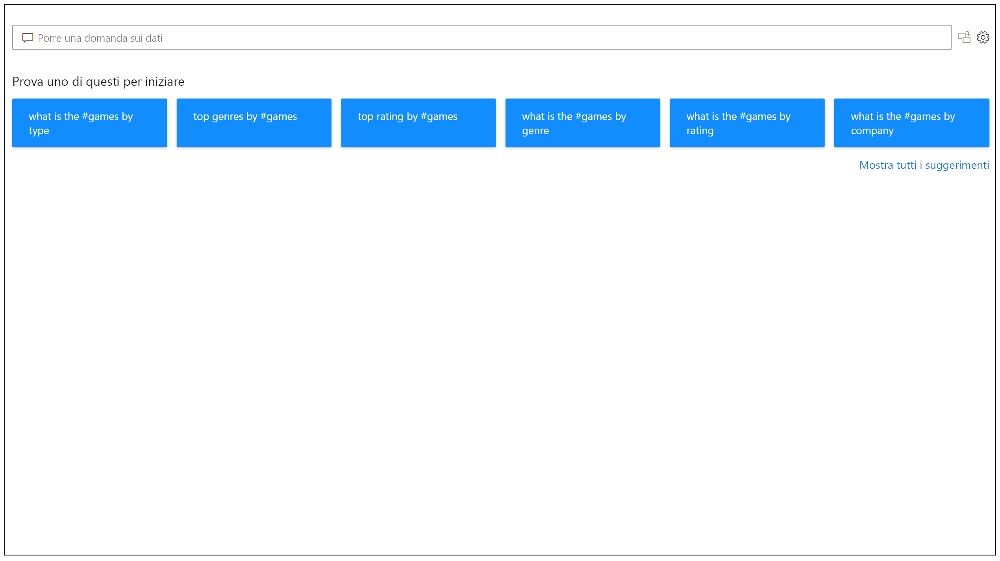
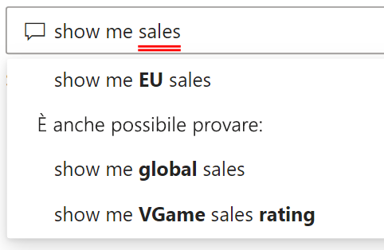
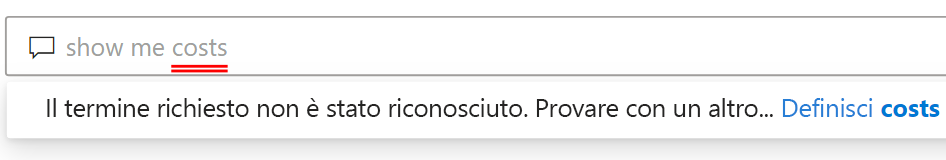
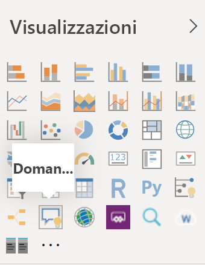
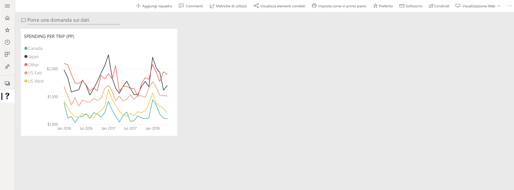

# Introduzione a Domande e risposte di Power BI

A volte il modo più rapido per ottenere una risposta dai dati consiste nell'eseguire una ricerca nei dati usando il linguaggio naturale. La funzionalità Domande e risposte di Power BI consente di esplorare i dati con le proprie parole usando il linguaggio naturale. Domande e risposte è una funzionalità interattiva ed è anche divertente. Una domanda porta spesso a formulare altre domande man mano che le visualizzazioni rivelano percorsi interessanti da seguire. Porre la domanda è solo l'inizio. È possibile spostarsi tra i dati perfezionando o espandendo una domanda, scoprendo nuove informazioni e usando le funzionalità di zoom avanti o indietro per concentrarsi sui dettagli oppure ottenere una visualizzazione più ampia. L'esperienza è interattiva e veloce ed è basata su una tecnologia di archiviazione in memoria. 

Domande e risposte di Power BI è una funzionalità gratuita e disponibile per tutti gli utenti. In Power BI Desktop, i designer di report possono usare Domande e risposte per esplorare i dati e creare visualizzazioni. Nel servizio Power BI, tutti gli utenti possono esplorare i propri dati con Domande e risposte. Se si dispone dell'autorizzazione per modificare un dashboard o un report, è possibile anche aggiungere i risultati di Domande e risposte.

## Come usare Domande e risposte

Ancora prima di iniziare a digitare, Domande e risposte mostra una nuova schermata con suggerimenti utili a formulare la domanda. Iniziare da una delle domande suggerite o digitare domande personalizzate. Domande e risposte supporta una vasta gamma di domande, tra cui:

- **Porre domande naturali**: quali vendite hanno i ricavi più alti?
- **Usare filtri basati su date relative**: mostra le vendite dell'ultimo anno
- **Restituire solo i primi N risultati**: i primi 10 prodotti in base alle vendite
- **Specificare un filtro**: mostra le vendite negli Stati Uniti
- **Specificare condizioni complesse**: mostra le vendite di prodotti della categoria 1 o 2
- **Restituire un oggetto visivo specifico**: mostra vendite per prodotto come grafico a torta
- **Usare aggregazioni complesse**: mostra il valore mediano delle vendite per prodotto
- **Ordinare i risultati**: mostra i primi 10 paesi in base alle vendite ordinate per codice paese
- **Confrontare i dati**: mostra la data in base al totale delle vendite rispetto al costo totale
- **Visualizzare le tendenze**: mostra le vendite nel tempo

### Completamento automatico

Mentre si digita la domanda, Domande e risposte di Power BI mostra i suggerimenti pertinenti e contestuali che consentono di diventare rapidamente produttivi con il linguaggio naturale. Durante la digitazione si ottengono feedback e risultati immediati. L'esperienza è simile alla digitazione in un motore di ricerca.

### Sottolineature rosse e blu

In Domande e risposte le parole vengono sottolineate per consentire di determinare quali sono state comprese o quali non sono state riconosciute dal sistema. Una sottolineatura spessa di colore blu indica che il sistema ha trovato una corrispondenza con un campo o un valore nel modello di dati. L'esempio seguente mostra che Domande e risposte ha riconosciuto la parola *EU Sales*.

Spesso, quando si digita una parola in Domande e risposte, questa viene contrassegnata con una sottolineatura rossa per indicare uno di due possibili problemi. Il primo tipo di problema è classificato come *scarsa attendibilità*. Se si digita una parola vaga o ambigua, il campo viene sottolineato in rosso. Un esempio può essere proprio il termine "vendite". Poiché più campi possono contenere la parola "vendite", il sistema usa una sottolineatura rossa per chiedere di specificare di quale campo si tratta. Un altro esempio di scarsa attendibilità può riguardare il caso in cui si digita la parola "area", ma la colonna corrispondente è in realtà identificata dalla parola "regione". Domande e risposte di Power BI riconosce le parole che hanno lo stesso significato grazie all'integrazione con Bing e Office. In questo caso, la parola viene sottolineata in rosso per indicare all'utente che non si tratta di una corrispondenza diretta.

Il secondo tipo di problema si verifica quando Domande e risposte non è in grado di riconoscere la parola. È possibile riscontrare questo problema quando si usa un termine specifico del dominio che non è menzionato nei dati oppure quando i campi dati sono denominati in modo errato. Un esempio è dato dall'uso della parola "costi" anche se questa non è presente nei dati. La parola è inclusa nel dizionario, ma Domande e risposte contrassegna questo termine con una sottolineatura rossa.

> [!NOTE]
> È possibile personalizzare la combinazione di colori blu/rosso per le sottolineature nel riquadro per la **formattazione visiva** di Domande e risposte. L'articolo [Strumenti di Domande e risposte](q-and-a-tooling-teach-q-and-a.md) illustra inoltre il funzionamento di *Insegna a Domande e risposte*, uno strumento che è possibile usare per definire i termini non riconosciuti dal motore di query.

### Visualizzazione dei risultati

Quando si digita la domanda, Domande e risposte tenta di interpretare e visualizzare immediatamente la risposta. Come parte degli aggiornamenti più recenti, Domande e risposte prova a interpretare la domanda e a tracciare automaticamente i campi sull'asse corretto. Se ad esempio si digita "Vendite per anno", Domande e risposte rileva che la parola "anno" si riferisce a un campo data e dà sempre priorità all'inserimento di questo campo sull'asse X. Se si vuole modificare il tipo di visualizzazione, digitare "come *tipo di grafico*" dopo la domanda. Domande e risposte supporta attualmente questi tipi di visualizzazioni:

- Grafico a linee
- Grafico a barre
- Matrice
- Tabella
- Scheda
- Area
- Grafico a torta
- Grafico a dispersione/bolle
 

## Aggiungere Domande e risposte a un report

È possibile aggiungere Domande e risposte a un report in Power BI Desktop o nel servizio Power BI in due modi diversi:

- Aggiungere un oggetto visivo Domande e risposte.
- Aggiungere un pulsante di Domande e risposte.

Per aggiungere l'oggetto visivo Domande e risposte a un report, selezionare la nuova icona di **Domande e risposte** nel riquadro Visualizzazione. In alternativa, fare doppio clic in un punto qualsiasi dell'area di disegno del report per inserire l'oggetto visivo Domande e risposte.

Per aggiungere un pulsante, sulla scheda **Home** della barra multifunzione selezionare **Pulsanti** > **Domande e risposte**. L'immagine del pulsante di Domande e risposte può essere completamente personalizzata.

> [!NOTE]
> Quando si avvia Domande e risposte dal pulsante, viene comunque usata la versione precedente di Domande e risposte. Questo comportamento verrà modificato nelle versioni successive di Power BI.

## Usare Domande e risposte per i dashboard

Per impostazione predefinita, Domande e risposte è disponibile nella parte superiore dei dashboard. Per usare Domande e risposte, digitare il testo nella casella **Porre una domanda sui dati**.

## Passaggi successivi

Esistono diversi modi per integrare il linguaggio naturale nei report. Per altre informazioni, vedere questi articoli:

* [Oggetto visivo Domande e risposte](../visuals/power-bi-visualization-q-and-a.md)
* [Procedure consigliate per Domande e risposte](q-and-a-best-practices.md)
