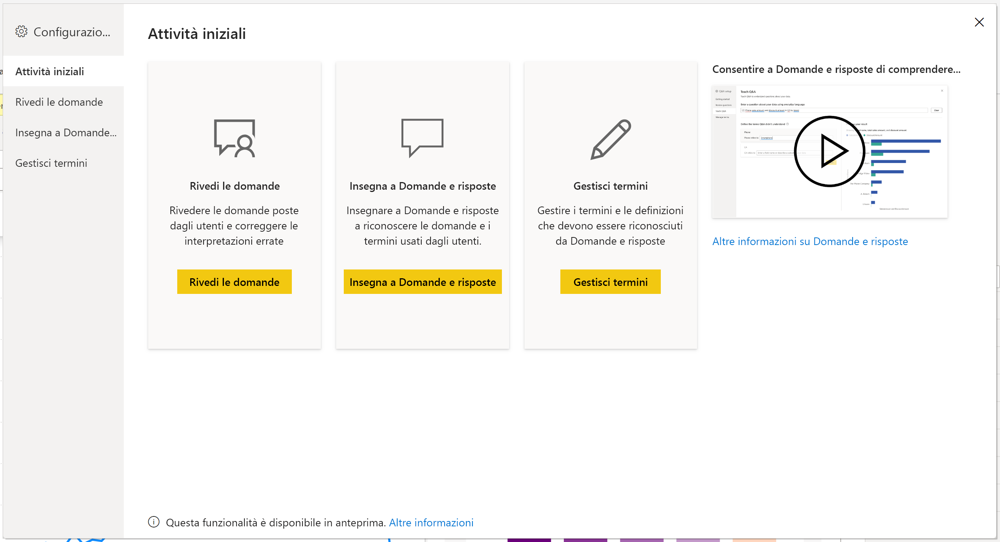
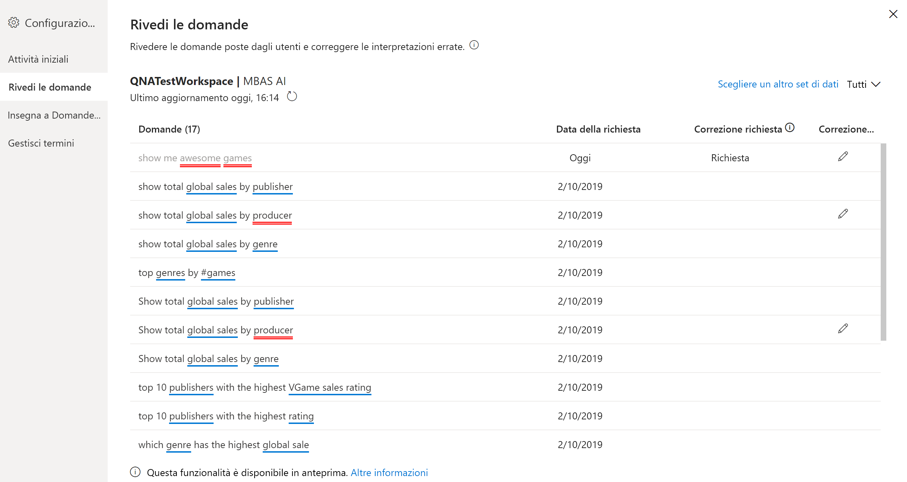
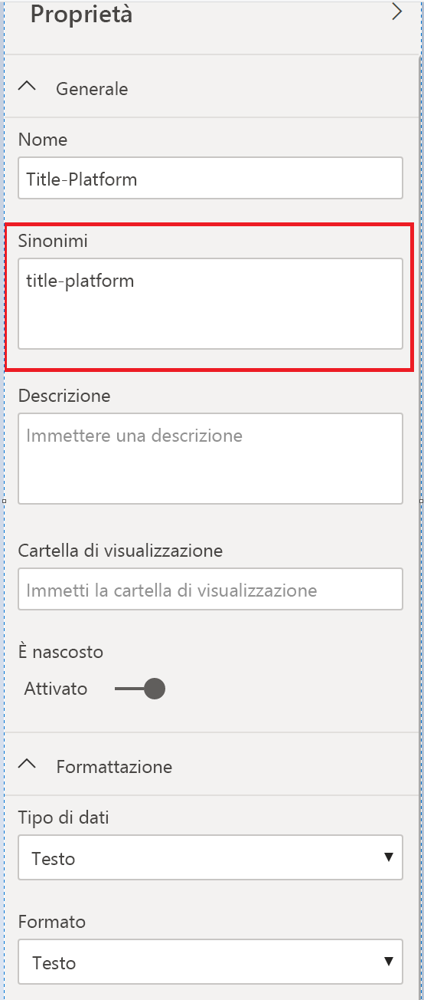

# Introduzione agli strumenti di Domande e risposte per il training di Domande e risposte di Power BI (anteprima)

Con gli *strumenti* di Domande e risposte di Power BI è possibile migliorare l'esperienza l'uso del linguaggio naturale per gli utenti. In qualità di designer o amministratore, è possibile interagire con il motore del linguaggio naturale e apportare miglioramenti in tre aree: 

- Rivedere le domande poste dagli utenti.
- Insegnare a Domande e risposte a comprendere le domande.
- Gestire i termini insegnati a Domande e risposte.

Oltre a questi strumenti dedicati, la scheda **Modellazione** di Power BI Desktop offre varie opzioni:  

- Sinonimi
- Etichette di riga
- Impostare elementi nascosti in Domande e risposte
- Configurazione dello schema linguistico (opzione avanzata)

## Introduzione agli strumenti di Domande e risposte

Gli strumenti di Domande e risposte sono disponibili solo in Power BI Desktop e attualmente supportano solo la modalità di importazione.

1. Aprire Power BI Desktop e usare Domande e risposte per creare un oggetto visivo. 
2. Dall'angolo dell'oggetto visivo selezionare l'icona a forma di ingranaggio. 

    

    Verrà visualizzata la pagina Attività iniziali.  

    

### Rivedi le domande

Selezionare **Rivedi le domande** per visualizzare un elenco di set di dati usati nel servizio Power BI per il tenant. Nella pagina **Rivedi le domande** sono visualizzati anche il proprietario del set di dati, l'area di lavoro e la data dell'ultimo aggiornamento. Da qui è possibile selezionare un set di dati e vedere quali domande sono state poste dagli utenti. Nei dati visualizzati sono incluse anche le parole che non sono state riconosciute. Tutti i dati visualizzati qui sono relativi agli ultimi 28 giorni.

### Insegna a Domande e risposte

La sezione **Insegna a Domande e risposte** consente di sottoporre a training Domande e risposte per migliorare la capacità di riconoscimento delle parole. Per iniziare, digitare una domanda contenente una o più parole che Domande e risposte non è in grado di riconoscere. Domande e risposte chiederà di specificare la definizione del termine. Immettere un filtro o un nome di campo che corrisponda a ciò che rappresenta tale parola. Domande e risposte reinterpreterà la domanda originale. Se si è soddisfatti dei risultati, è possibile salvare l'input. Per altre informazioni, vedere [Insegnare a Domande e risposte](q-and-a-tooling-teach-q-and-a.md).

### Gestisci termini

In questa sezione vengono visualizzate tutte le informazioni salvate in Insegna a Domande e risposte per consentire di rivedere o eliminare i termini definiti. Attualmente non è possibile modificare una definizione esistente e quindi, per ridefinire un termine, è necessario eliminarlo e crearlo di nuovo.

## Altre impostazioni di Domande e risposte

### Definire più sinonimi

Nella scheda **Modellazione** di Power BI Desktop sono disponibili altre opzioni per migliorare l'esperienza di Domande e risposte. 

1. In Power BI Desktop selezionare Visualizzazione di modellazione.

2. Selezionare un campo o una tabella per visualizzare il riquadro **Proprietà**.  Questo riquadro viene visualizzato sul lato destro dell'area di disegno e include diverse azioni di Domande e risposte. Una delle opzioni è **Sinonimi**. Nella casella **Sinonimi** è possibile definire rapidamente le alternative per la tabella o il campo selezionato. I sinonimi possono essere definiti anche nella sezione **Insegna a Domande e risposte**, ma questa opzione è più utile per definire rapidamente i sinonimi per numerosi campi di una tabella.

    

3. Per definire più sinonimi per un singolo campo, usare le virgole per indicare il sinonimo successivo.

### Impostazione di elementi nascosti in Domande e risposte

È anche possibile nascondere campi e tabelle per evitare che vengano visualizzati nei risultati di Domande e risposte. 

1. In Power BI Desktop selezionare Visualizzazione di modellazione.

2. Selezionare un campo o una tabella per visualizzare il riquadro **Proprietà** e impostare **È nascosto** su **On**.

    Domande e risposte rispetta tale impostazione assicurando che il campo impostato come nascosto non venga riconosciuto. È ad esempio possibile nascondere campi di ID e chiavi esterne per evitare inutili campi duplicati con lo stesso nome. Anche se il campo viene nascosto, è possibile usarlo in Power BI Desktop negli oggetti visivi all'esterno di Domande e risposte.

### Impostare un'etichetta di riga

Un'etichetta di riga consente di definire la colonna (o il *campo*) che meglio identifica una singola riga in una tabella. Per una tabella denominata "Cliente", ad esempio, l'etichetta di riga è in genere "Nome visualizzato". La definizione di questi metadati aggiuntivi consente a Domande e risposte di tracciare un oggetto visivo più utile quando gli utenti digitano "Mostra vendite per cliente". Anziché trattare "Cliente" come tabella, è possibile usare "Nome visualizzato" e visualizzare un grafico a barre che mostra le vendite di ogni cliente. È possibile impostare l'etichetta di riga solo in Visualizzazione di modellazione. 

1. In Power BI Desktop selezionare Visualizzazione di modellazione.

2. Selezionare una tabella per visualizzare il riquadro **Proprietà**.

3. Nella casella **Etichetta di riga** selezionare un campo.

## Configurare lo schema linguistico (opzione avanzata)

In Power BI è possibile sottoporre a training e migliorare il motore del linguaggio naturale all'interno di Domande e risposte, modificando anche l'assegnazione dei punteggi e la ponderazione dei risultati di linguaggio naturale sottostanti. Per informazioni, vedere [Modificare lo schema linguistico di Domande e risposte e aggiungere formulazioni](q-and-a-tooling-advanced.md).

## Passaggi successivi

Per migliorare il motore del linguaggio naturale è disponibile una serie di procedure consigliate. Per altre informazioni, vedere l'articolo seguente:

* [Procedure consigliate per Domande e risposte](q-and-a-best-practices.md)
