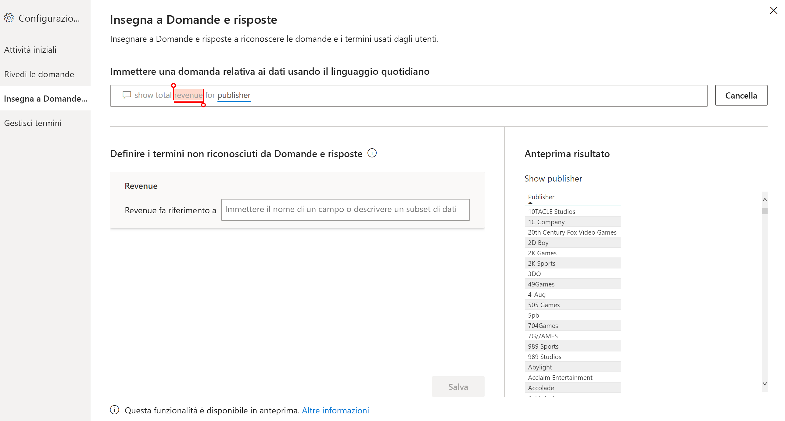
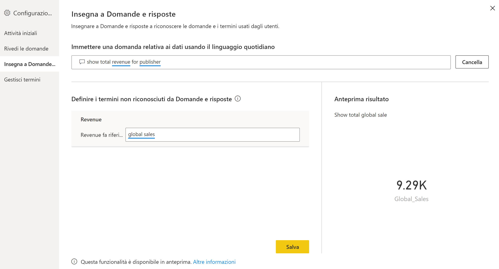
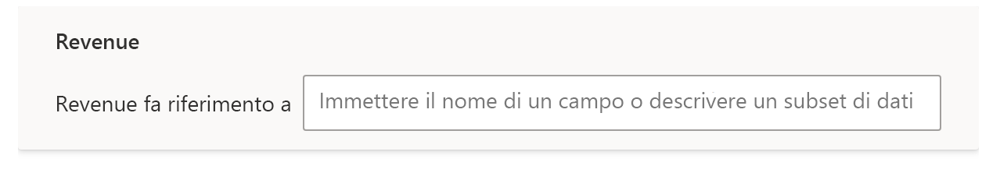
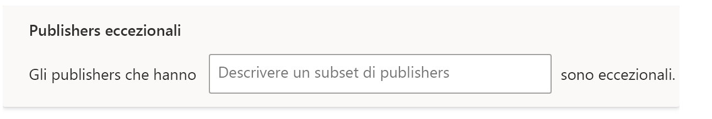
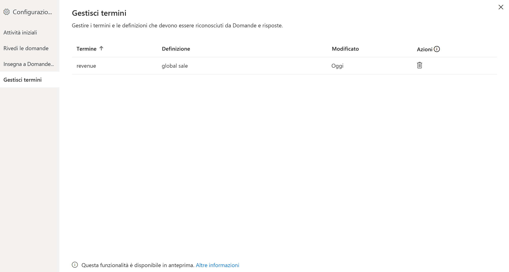

# Insegnare a Domande e risposte di Power BI a riconoscere le domande e i termini usati nelle query

Nella sezione **Insegna a Domande e risposte** in Configurazione di Domande e risposte, è possibile sottoporre a training il motore di Domande e risposte per consentirgli di comprendere le domande e i termini in linguaggio naturale che non è stato in grado di riconoscere. Per iniziare, inviare una domanda contenente una o più parole che il motore di Domande e risposte non è stato in grado di riconoscere. Domande e risposte chiederà di definire il termine. Immettere un filtro o un nome di campo che corrisponda a ciò che rappresenta tale parola. Domande e risposte reinterpreterà la domanda originale. Se si è soddisfatti dei risultati, è possibile salvarli.

> [!NOTE]
> La funzionalità Insegna a Domande e risposte supporta solo la modalità di importazione. Inoltre, non supporta ancora la connessione a un'origine dati locale o di Azure Analysis Services. Questa limitazione dovrebbe essere rimossa nelle versioni successive di Power BI.

## Iniziare a insegnare a Domande e risposte

1. In Power BI Desktop, sulla scheda **Modellazione** della barra multifunzione, selezionare **Configurazione di Domande e risposte** > **Insegna a Domande e risposte**.

    

2. Digitare una frase con un termine che Domande e risposte non riconosce e selezionare **Invia**.

3. Selezionare la parola sottolineata in rosso. 

    Domande e risposte offre suggerimenti e chiede di specificare la definizione corretta del termine. 
    
3. In **Definire i termini non riconosciuti da Domande e risposte** immettere una definizione.

    

4. Selezionare **Salva** per visualizzare in anteprima l'oggetto visivo aggiornato.

5. Immettere la domanda successiva oppure selezionare la **X** per chiudere.

I consumer del report non vedranno questa modifica finché il report non verrà pubblicato nel servizio.

## Definire sostantivi e aggettivi

È possibile insegnare a Domande e risposte due tipi di termini:

- Sostantivi
- Aggettivi

### Definire il sinonimo di un sostantivo

Quando si lavora con i dati, possono spesso essere presenti nomi di campi a cui è possibile fare riferimento con nomi alternativi. Un esempio può essere "vendite". Numerose parole o frasi possono fare riferimento al concetto di vendite, ad esempio "ricavi". Se una colonna è denominata "vendite" e i consumer del report digitano "ricavi", Domande e risposte potrebbe non riuscire a selezionare la colonna corretta per rispondere alla domanda in modo appropriato. In tal caso, è opportuno indicare a Domande e risposte che "domande" e "ricavi" fanno riferimento allo stesso concetto.

Domande e risposte rileva automaticamente che una parola non riconosciuta è un sostantivo usando informazioni di Microsoft Office. Se Domande e risposte rileva un sostantivo, chiede di specificare un sinonimo nel modo seguente:

- <your term> **fa riferimento a** 

Immettere nella casella il termine presente nei propri dati.

Se si specifica un termine diverso da un campo del modello di dati, è possibile ottenere risultati indesiderati.

### Definire una condizione di filtro con aggettivo

In alcuni casi può essere opportuno definire termini che hanno una funzione di condizione per i dati sottostanti. Un esempio può essere "Editori eccezionali". "Eccezionale" potrebbe essere una condizione che seleziona solo gli editori che hanno pubblicato un determinato numero di prodotti. Domande e risposte prova a rilevare gli aggettivi mostrando un messaggio di richiesta diverso:

- <field name> **che hanno**  

Specificare la condizione nella casella.

Di seguito sono riportate alcune condizioni di esempio che è possibile definire:

- "Paese" uguale a "Stati Uniti"
- "Paese" diverso da "Stati Uniti"
- "Peso" > 2000
- "Peso" = 2000
- "Peso" < 2000

In Strumenti è possibile definire una sola condizione. Per definire condizioni più complesse, usare DAX per creare una colonna calcolata e quindi la sezione degli strumenti per creare una singola condizione per tale colonna calcolata. Le misure non sono supportate. In alternativa, usare le colonne calcolate.

## Gestire i termini

Dopo aver specificato le definizioni, è possibile tornare indietro per visualizzare tutte le correzioni apportate e modificarle o eliminarle. 

1. In **Configurazione di Domande e risposte** passare alla sezione **Gestisci termini**.

2. Eliminare i termini che non si vogliono più usare. Al momento non è possibile modificare i termini. Per ridefinire un termine, eliminarlo e definirlo di nuovo.

    

## Passaggi successivi

Per migliorare il motore del linguaggio naturale è disponibile una serie di procedure consigliate. Per altre informazioni, vedere l'articolo seguente:

* [Procedure consigliate per Domande e risposte](q-and-a-best-practices.md)
