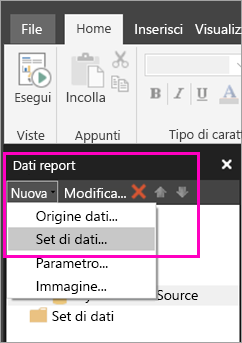
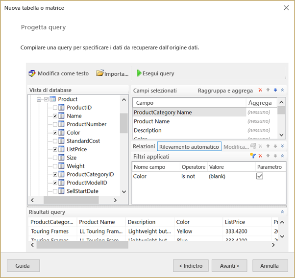
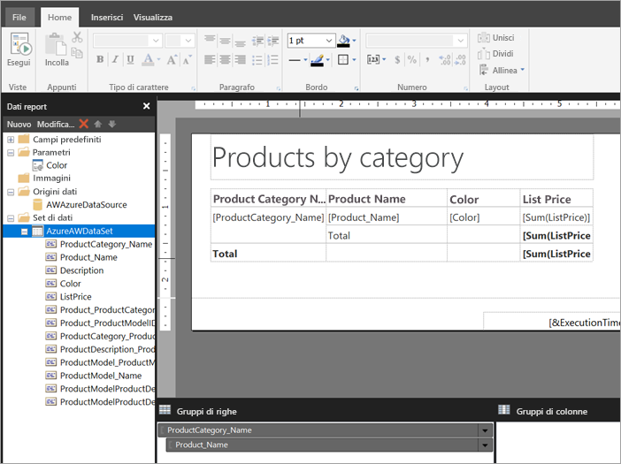

# Creare un set di dati incorporato per un report impaginato nel servizio Power BI (anteprima)

Questo articolo descrive come creare un set di dati incorporato, basato su un'origine dati incorporata, per un report impaginato nel servizio Power BI. I set di dati incorporati sono contenuti in un singolo report impaginato e possono essere usati solo in quel report. I report impaginati pubblicati nel servizio Power BI richiedono attualmente set di dati incorporati e origini dati incorporate. Si crea l'origine dati incorporata e set di dati in Generatore Report di Power BI, anche se si sta creando il report. 

Prima di poter creare il set di dati, è necessario creare un'origine dati. Per altre informazioni, vedere [Origini dati incorporate per i report impaginati nel servizio Power BI](paginated-reports-embedded-data-source.md).
  
## Creare un set di dati incorporato
  
1. Nel riquadro dati Report in Generatore Report di Power BI, selezionare **New** > **Dataset**.

1. Nella scheda **Query** della finestra di dialogo **Proprietà set di dati** assegnare un nome al set di dati. L'origine dati incorporata si trova già nella casella **Origine dati** oppure è possibile creare un'origine dati incorporata diversa selezionando l'opzione **Nuovo**.
 
     

3. In **Tipo di query** selezionare il tipo di comando o di query da usare per il set di dati. 
    - **Testo** consente di eseguire una query per recuperare i dati dal database. È il valore predefinito e viene usato per la maggior parte delle query. Digitare una query o importare una query preesistente selezionando **Importa**. Per creare graficamente la query, selezionare **Progettazione query**. Se si usa lo strumento Progettazione query per compilare una query, il testo della query verrà visualizzato in questa finestra. Selezionare il pulsante **espressione** (**fx**) per usare un'espressione per generare dinamicamente la query. 
    - **Tabella** consente di selezionare tutti i campi di una tabella. Immettere il nome della tabella da usare come set di dati.
    - **Stored procedure** consente di eseguire una stored procedure in base al nome.

4. In Progettazione query è possibile visualizzare e interagire con le tabelle e i campi del set di dati, importare una query o modificarla come testo. In questa finestra è possibile anche aggiungere filtri e parametri. 

    

5. In Progettazione query selezionare **Esegui query** per testarla e quindi scegliere **OK**.

1. Nella finestra di dialogo Proprietà set di dati, nella casella **Time out (in seconds)** (Timeout - in secondi) digitare il numero di secondi prima che si verifichi il timeout della query. Il valore predefinito è 30 secondi. È possibile lasciare la casella **Timeout** vuota oppure impostarla su un valore maggiore di zero. Se è vuota, la query non va in timeout.

7.  È possibile impostare altre proprietà relative al set di dati nelle altre schede:
    - Creare campi calcolati nella scheda **Campi**.
    - Impostare opzioni avanzate nella scheda **Opzioni**.
    - Aggiungere o aggiornare **Filtri** e **Parametri** nelle rispettive schede.

8. Selezionare **OK**
 
   Il report viene aperto nella visualizzazione Progettazione report. L'origine dati, il set di dati e la raccolta di campi del set di dati vengono visualizzati nel riquadro Dati report ed è possibile continuare a progettare il report impaginato.  

     
 
## Passaggi successivi 

- [Che cosa sono i report impaginati in Power BI Premium? (anteprima)](paginated-reports-report-builder-power-bi.md)  
- [Esercitazione: Creare un report impaginato e caricarlo nel servizio Power BI](paginated-reports-quickstart-aw.md)
- [Pubblicare un report impaginato nel servizio Power BI](paginated-reports-save-to-power-bi-service.md)

