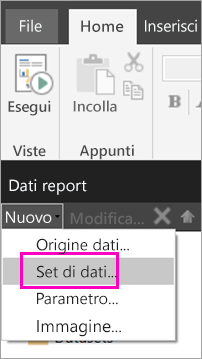
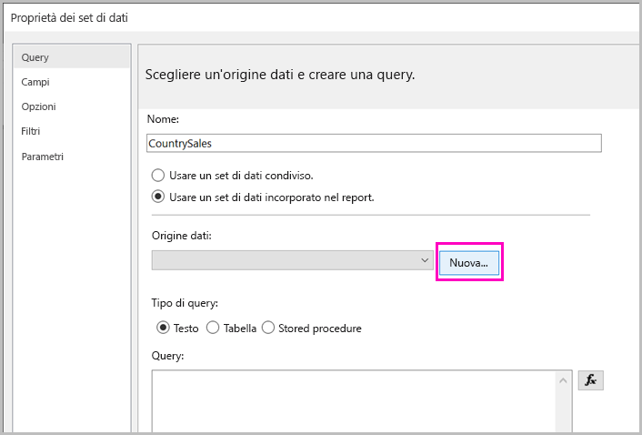
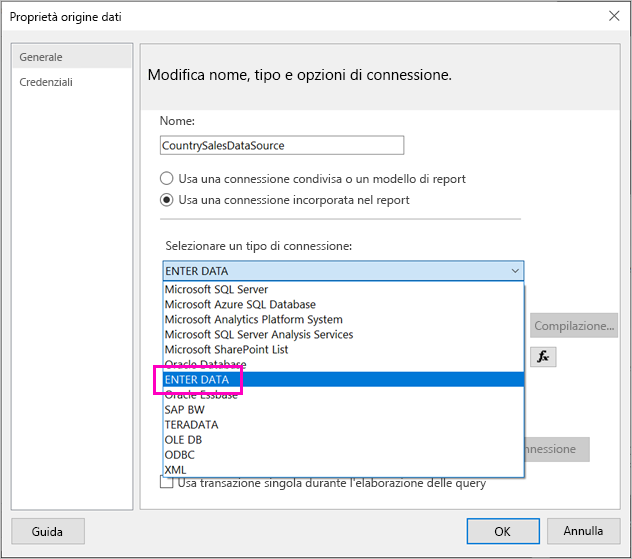
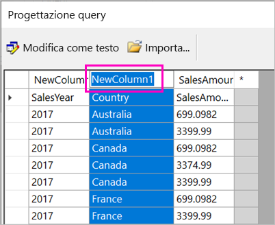
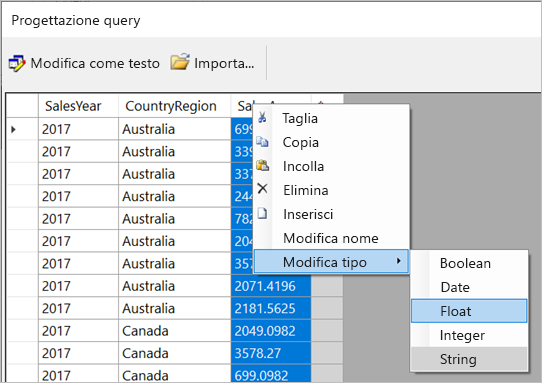
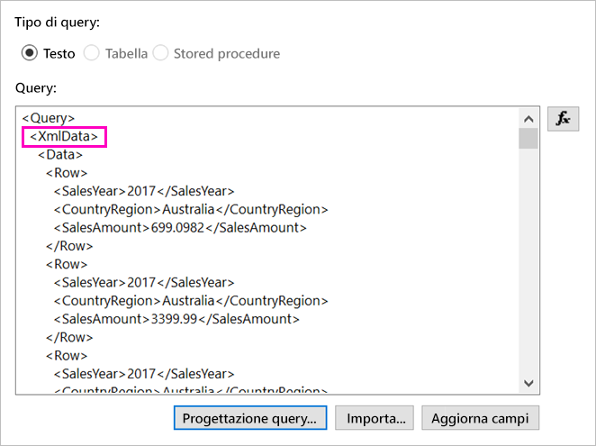
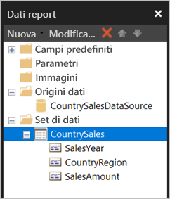

# <a name="enter-data-directly-in-a-paginated-report-in-report-builder-preview---power-bi"></a>Immettere i dati direttamente in un report impaginato in Generatore report (anteprima) - Power BI

In questo articolo viene illustrata una funzionalità della nuova versione di Generatore report di SQL Server 2016 che consente di immettere dati direttamente in un report RDL come set di dati incorporato.  Questa funzionalità è simile a Power BI Desktop. È possibile digitare i dati direttamente in un set di dati nel report o incollarli da un altro programma, ad esempio Microsoft Excel. Dopo l'immissione dei dati, il set di dati così creato può essere usato come qualsiasi altro set di dati incorporato creato in precedenza. Inoltre, è possibile aggiungere più di una tabella e usarne una come filtro per le altre. Questa funzionalità è particolarmente utile per i set di dati statici di piccole dimensioni che possono essere necessari per il report, ad esempio i parametri del report.
 
## <a name="prerequisites"></a>Prerequisiti

- Per immettere i dati direttamente in un report impaginato, installare la nuova versione di [Generatore report dall'Area download Microsoft](https://www.microsoft.com/download/details.aspx?id=53613). 
- Per salvare il report impaginato nel servizio Power BI, sono necessari un [account di Power BI Pro](service-self-service-signup-for-power-bi.md) e l'accesso in scrittura a un'area di lavoro in una [capacità Premium di Power BI](service-premium.md).
- Per salvare il report impaginato in un server di report, sono necessarie autorizzazioni per [modificare il file RSReportServer.config](#upload-the-paginated-report-to-a-report-server).

## <a name="get-started"></a>Attività iniziali

Dopo aver scaricato e installato Generatore report, seguire lo stesso flusso di lavoro usato per aggiungere un'origine dati e un set di dati incorporati al report. Nella procedura seguente, in **Origini dati** viene visualizzata una nuova opzione: **Immettere i dati**.  È sufficiente impostare questa origine dati una sola volta in un report. Successivamente, è possibile creare più tabelle di dati immessi come set di dati separati, usando quella singola origine dati.

1. Nel riquadro **Dati report** selezionare **Nuovo** > **Set di dati**.

    

1. Nella finestra di dialogo **Proprietà set di dati** selezionare **Usa un set di dati incorporato nel report**.

1. Selezionare **Nuovo** accanto a **Origine dati**.

    

1. Nella finestra di dialogo **Proprietà set di dati** selezionare **Usa una connessione incorporata nel report**.
2. Nella casella **Seleziona tipo di connessione** selezionare **ENTER DATA** > **OK**.

    

1. Di nuovo nella finestra di dialogo **Proprietà set di dati** selezionare **Progettazione Query**.
2. Nel riquadro **Progettazione query** fare clic con il pulsante destro del mouse e incollare i dati nella tabella.

    

1. Per impostare i nomi delle colonne, fare doppio clic su ogni elemento **NewColumn** e digitare il nome della colonna.

    

1. Se la prima riga contiene le intestazioni di colonna dei dati originali, fare clic con il pulsante destro del mouse ed eliminarla.
    
9. Per impostazione predefinita, il tipo di dati per ogni colonna è String. Per modificare il tipo di dati, fare clic con il pulsante destro del mouse sull'intestazione di colonna > **Modifica tipo** e impostarlo su un altro tipo di dati, ad esempio Date o Float.

    

1. Al termine della creazione della tabella selezionare **OK**.  

    La query generata è lo stessa che verrebbe visualizzata con un'origine dati XML. In effetti il provider di dati usato in questa procedura è XML,  adattato in modo da consentire anche questo tipo di scenario.

    

12. Nella finestra di dialogo **Proprietà set di dati** selezionare **OK**.

13. L'origine dati e il set di dati sono visualizzati nel riquadro dei **dati del report**.

    

È possibile usare il set di dati come base per le visualizzazioni dei dati nel report. È anche possibile aggiungere un altro set di dati e usare la stessa origine dati.

## <a name="upload-the-paginated-report-to-the-power-bi-service"></a>Caricare il report impaginato nel servizio Power BI

Ora che i report impaginati sono supportati nel servizio Power BI in versione di anteprima, è possibile caricare il proprio report impaginato in una capacità Premium. Per i dettagli, vedere [Caricare un report impaginato](paginated-reports-save-to-power-bi-service.md#upload-a-paginated-report).

## <a name="upload-the-paginated-report-to-a-report-server"></a>Creare il report impaginato in un server di report

È anche possibile caricare il report impaginato in un server di report di Power BI o di SQL Server Reporting Services 2016 o 2017. Prima di procedere, è necessario aggiungere l'elemento seguente a RSReportServer.config come estensione per i dati aggiuntiva. Eseguire il backup del file RSReportServer.config prima di apportare la modifica, nel caso in cui si verificassero problemi.

```
<Extension Name=”ENTERDATA” Type=”Microsoft.ReportingServices.DataExtensions.XmlDPConnection,Microsoft.ReportingServices.DataExtensions”>
<Configuration>
<ConfigName>ENTERDATA</ConfigName>
</Configuration>
</Extension>
```

Dopo la modifica, questo è l'aspetto che dovrebbe avere l'elenco dei provider di dati nel file di configurazione:


Questo è tutto: ora è possibile pubblicare i report che usano questa nuova funzionalità nel server di report.

## <a name="next-steps"></a>Passaggi successivi

- [Che cosa sono i report impaginati in Power BI Premium? (anteprima)](paginated-reports-report-builder-power-bi.md)
- [Che cos'è Server di report di Power BI?](report-server/get-started.md)
