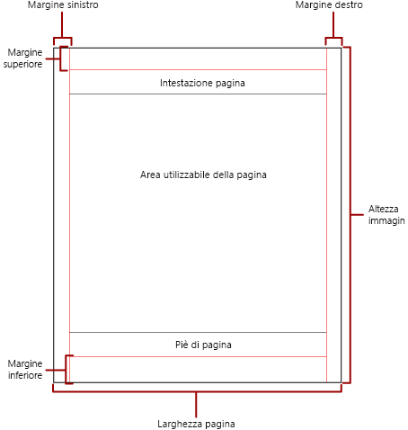
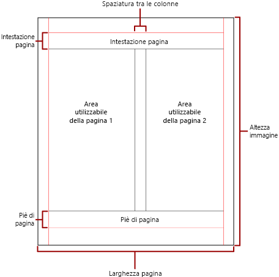

# Paginazione dei report impaginati in Power BI

 Il termine *paginazione* si riferisce al numero di pagine di un report e alla disposizione degli elementi del report in tali pagine. La paginazione nei report impaginati di Power BI varia a seconda dell'estensione per il rendering usata per visualizzare e distribuire il report. Quando nel server di report si esegue un report, quest'ultimo usa il renderer HTML. Il codice HTML segue un set di regole di impaginazione specifico. Se si esporta lo stesso report in formato PDF, ad esempio, si userà il renderer PDF, che usa un set di regole diverso. Il report viene quindi impaginato in modo diverso. È necessario comprendere le regole usate per controllare la paginazione nei report impaginati di Power BI. È quindi possibile progettare correttamente un report di facile lettura ottimizzato per il renderer che si intende usare per recapitare il report.  
  
 Questo argomento descrive l'impatto delle dimensioni della pagina fisica e del layout del report sul modo in cui i renderer interruzione di pagina manuale eseguono il rendering del report. È possibile impostare le proprietà per modificare le dimensioni e i margini delle pagine fisiche e dividere il report in colonne. Usare il riquadro **Proprietà report**, il riquadro **Proprietà** o la finestra di dialogo **Imposta pagina**. Per accedere al riquadro **Proprietà report**, fare clic sull'area blu all'esterno del corpo del report. Per accedere alla finestra di dialogo **Imposta pagina**, fare clic sulla scheda **Esegui** nella scheda Home e quindi fare clic su **Imposta pagina** nella scheda Esegui.  
  
> [!NOTE]  
>  Se un report è stato progettato in modo con le dimensioni di una pagina, ma il rendering viene eseguito su più pagine, verificare che la larghezza del corpo del report, inclusi i margini, non sia maggiore della larghezza della pagina fisica. Per impedire l'aggiunta di pagine vuote al report, è possibile ridurre le dimensioni del contenitore trascinando l'angolo del contenitore verso sinistra.  

## Corpo del report  
 Il corpo del report è un contenitore rettangolare visualizzato come spazio vuoto nell'area di progettazione. È possibile aumentare o ridurre gli elementi del report presenti nel contenitore. Il corpo del report non rispecchia le dimensioni della pagina fisica e può superarne i limiti per estendersi su più pagine del report. Alcuni renderer, ad esempio Microsoft Excel, Word, HTML e MHTML, eseguono il rendering dei report con dimensioni che aumentano o si riducono a seconda del contenuto della pagina. I report di cui viene eseguito il rendering in questi formati sono ottimizzati per la visualizzazione basata sullo schermo, ad esempio in un Web browser. Tali renderer aggiungono interruzioni di pagina verticali quando necessario.  
  
 È possibile formattare il corpo del report con un colore, uno stile e uno spessore del bordo. È anche possibile aggiungere un colore e un'immagine di sfondo.  
  
## Pagina fisica  
 Le dimensioni della pagina fisica corrispondono al formato della carta che controlla la modalità di rendering del report. I report di cui viene eseguito il rendering in formati con interruzioni di pagina manuali inseriscono le interruzioni di pagina orizzontalmente e verticalmente in base alle dimensioni fisiche della pagina. Queste interruzioni di pagina offrono un'esperienza di lettura ottimizzata quando vengono stampate o visualizzate in un formato di file con interruzioni di pagina manuali. I report di cui viene eseguito il rendering in formati con interruzioni di pagina automatiche inseriscono le interruzioni di pagina orizzontalmente in base alle dimensioni fisiche. Anche in questo caso, le interruzioni di pagina offrono un'esperienza di lettura ottimizzata quando vengono visualizzate in un Web browser.  
  
 Per impostazione predefinita, le dimensioni della pagina sono 21,60 x 27,95 cm, ma è possibile modificarle nel riquadro **Proprietà report** o nella finestra di dialogo **Imposta proprietà** cambiando le proprietà PageHeight e PageWidth nel riquadro **Proprietà**. Le dimensioni della pagina non vengono aumentate o ridotte per adattarsi al contenuto del corpo del report. Se si desidera che il report venga visualizzato in una sola pagina, tutto il contenuto del corpo del report deve corrispondere alle dimensioni della pagina fisica. Se tali dimensioni non sono sufficienti e si usa il formato di interruzione di pagina manuale, per il report saranno necessarie pagine aggiuntive. Se il corpo del report si estende oltre il bordo destro della pagina fisica, viene inserita un'interruzione di pagina orizzontale. Se il corpo del report si estende oltre il bordo inferiore della pagina fisica, viene inserita un'interruzione di pagina verticale.  
  
 Se si intende ignorare le dimensioni della pagina fisica definite nel report, è possibile specificare le dimensioni della pagina fisica tramite le impostazioni relative alle informazioni sul dispositivo per il renderer specifico usato per esportare il report. Per un elenco completo, vedere [Impostazioni relative alle informazioni sul dispositivo per le estensioni di rendering](https://docs.microsoft.com/sql/reporting-services/device-information-settings-for-rendering-extensions-reporting-services?view=sql-server-2017) nella documentazione di SQL Server Reporting Services.  
  
### Margini

 I margini vengono tracciati dal bordo delle dimensioni della pagina fisica verso l'interno fino all'impostazione di margine specificata. Se un elemento del report si estende nell'area del margine, viene tagliato in modo che l'area sovrapposta non venga sottoposta a rendering. Se si specificano le dimensioni dei margini che determinano una larghezza orizzontale o verticale della pagina uguale a zero, i valori del margine sono pari a zero per impostazione predefinita. I margini vengono specificati nel riquadro **Proprietà report** o nella finestra di dialogo **Imposta pagina** oppure modificando le proprietà TopMargin, BottomMargin, LeftMargin e RightMargin nel riquadro **Proprietà**. Se si intende ignorare le dimensioni dei margini fisica definite nel report, è possibile specificare le dimensioni dei margini tramite le impostazioni relative alle informazioni sul dispositivo per il renderer specifico usato per esportare il report.  
  
 L'area della pagina fisica rimanente dopo l'allocazione dello spazio per margini, spaziatura delle colonne, intestazione e piè di pagina, è denominata *area utilizzabile della pagina*. I margini vengono applicati solo quando si esegue il rendering e si stampano report nei formati del renderer interruzione di pagina manuale. L'immagine seguente indica il margine e l'area utilizzabile di una pagina fisica.  
  
 
  
### Colonne in formato newsletter  

 Il report può essere diviso in colonne, ad esempio le colonne di un giornale. Le colonne vengono considerate pagine *logiche* di cui viene eseguito il rendering nella stessa pagina *fisica*. Sono disposte da sinistra verso destra, dall'alto verso il basso e sono separate da spazi vuoti tra le singole colonne. Se il report è diviso in più colonne, ogni pagina fisica viene divisa verticalmente in colonne e ogni colonna viene considerata una pagina logica. Si supponga, ad esempio, che in una pagina fisica siano presenti due colonne. Il contenuto del report riempie la prima colonna e quindi la seconda. Se il report non rientra interamente nelle prime due colonne, vengono riempite la prima e la seconda colonna della pagina successiva. Le colonne continuano a essere riempite, da sinistra verso destra e dall'alto verso il basso finché non viene eseguito il rendering di tutti gli elementi del report. Se si specificano dimensioni di colonna che determina una larghezza orizzontale o verticale uguale a zero, per impostazione predefinita la spaziatura delle colonne è pari a zero.  
  
 Le colonne vengono specificate nel riquadro **Proprietà report** o nella finestra di dialogo **Imposta pagina** oppure modificando le proprietà TopMargin, BottomMargin, LeftMargin e RightMargin nel riquadro **Proprietà**. Se si intende usare una dimensione del margine non definita, è possibile specificarla tramite le impostazioni relative alle informazioni sul dispositivo per il renderer specifico in cui si esporta il report. Le colonne vengono applicate solo quando si esegue il rendering e si stampano report in formati PDF o immagine. L'immagine seguente indicata l'area utilizzabile di una pagina contenente colonne.  
  

  
## Interruzioni e nomi di pagina

 Un report può essere più leggibile e i relativi dati possono essere più facili da controllare ed esportare quando il report contiene nomi di pagina. In Reporting Services sono disponibili le proprietà per i report, aree dati in formato tabella, matrice ed elenco, gruppi e rettangoli per controllare la paginazione, reimpostare i numeri di pagina e fornire nuovi nomi di pagina nelle interruzioni di pagina. Tali funzionalità possono migliorare i report indipendentemente dal formato in cui viene eseguito il rendering, ma sono particolarmente utili quando si esportano report nelle cartelle di lavoro di Excel.

> [!NOTE]
> Le aree dati in formato tabella, matrice ed elenco hanno in realtà lo stesso tipo di dati, ovvero *tablix*. È possibile pertanto che si incontri questo nome. 

 La proprietà InitialPageName indica il nome della pagina iniziale del report. Se il report non include nomi di pagina per le interruzioni di pagina, il nome della pagina iniziale viene usato per tutte le nuove pagine create dalle interruzioni di pagina. Non è necessario usare un nome di pagina iniziale.  
  
 Un report di cui viene eseguito il rendering può indicare un nuovo nome di pagina per la nuova pagina creata da un'interruzione. Per specificare il nome della pagina, impostare la proprietà PageName di una tabella o matrice o di un elenco, un gruppo o un rettangolo. Non è necessario specificare nomi di pagina nelle interruzioni. Se tali nomi non vengono specificati, viene usato il valore InitialPageName. Se anche InitialPageName è vuoto, la nuova pagina non ha alcun nome.  
  
 Aree dati tabelle, matrici ed elenchi e gruppi e rettangoli supportano le interruzioni di pagina.  
  
 L'interruzione di pagina include le proprietà seguenti:  
  
- **BreakLocation**, che indica la posizione dell'interruzione per l'elemento del report abilitato, ovvero all'inizio, alla fine o all'inizio e alla fine. Nei gruppi la proprietà BreakLocation può essere individuata tra i gruppi.  
  
- **Disabled**, che indica se un'interruzione di pagina viene applicata all'elemento di report. Se questa proprietà restituisce true, l'interruzione di pagina viene ignorata. Questa proprietà viene usata per disabilitare dinamicamente le interruzioni di pagina in base alle espressioni usate durante l'esecuzione del report.  
  
- **ResetPageNumber**, che indica se il numero di pagina deve essere reimpostato sul valore 1 quando si verifica un'interruzione di pagina. Se questa proprietà restituisce true, il numero di pagina viene reimpostato.  
  
 È possibile impostare la proprietà BreakLocation nella finestra di dialogo **Proprietà Tablix**, **Proprietà rettangolo** o **Proprietà gruppo**, mentre le proprietà Disabled, ResetPageNumber e PageName vengono impostate nel riquadro delle proprietà di Generatore report. Se le proprietà nel riquadro Proprietà sono organizzate per categoria, sono disponibili nella categoria **PageBreak**. Per i gruppi, la categoria **PageBreak** è all'interno della categoria **Group**.  
  
 È possibile usare costanti ed espressioni semplici o complesse per impostare il valore delle proprietà Disabled e ResetPageNumber. Non è possibile, tuttavia, usare espressioni con la proprietà BreakLocation. Per altre informazioni sulla scrittura di espressioni e sul relativo uso, vedere [Espressioni in Generatore report di Power BI](report-builder-expressions.md).  
  
 Nel report è possibile scrivere espressioni che fanno riferimento ai nomi oppure ai numeri di pagina correnti tramite la raccolta **Globals**. Per altre informazioni, vedere [Riferimenti alle raccolte predefinite Globals e Users](https://docs.microsoft.com/sql/reporting-services/report-design/built-in-collections-built-in-globals-and-users-references-report-builder?view=sql-server-2017) nella documentazione di Generatore report e Reporting Services.
  
### Denominazione delle schede dei fogli di lavoro di Excel

 Queste proprietà risultano utili quando si esportano report nelle cartelle di lavoro di Excel. Usare la proprietà InitialPage per specificare un nome predefinito per la scheda del foglio di lavoro quando si esporta il report e usare le interruzioni di pagina e la proprietà PageName per specificare nomi diversi per ogni foglio di lavoro. Ogni nuova pagina del report, definita da un'interruzione di pagina, viene esportata in un foglio di lavoro diverso denominato in base al valore della proprietà PageName. Se PageName è vuoto, ma il report dispone di un nome di pagina iniziale, tutti i fogli di lavoro nella cartella di lavoro di Excel usano lo stesso nome, ovvero quello della pagina iniziale.  
  
 Per altre informazioni sul funzionamento di queste proprietà quando i report vengono esportati in Excel, vedere [Eseguire l'esportazione in Microsoft Excel](https://docs.microsoft.com/sql/reporting-services/report-builder/exporting-to-microsoft-excel-report-builder-and-ssrs?view=sql-server-2017) nella documentazione di Generatore report e di Reporting Services.  
  
## Passaggi successivi

- [Visualizzare un report impaginato nel servizio Power BI](consumer/paginated-reports-view-power-bi-service.md)
- [Evitare le pagine vuote durante la stampa di report impaginati](guidance/report-paginated-blank-page.md)
- Altre domande? [Provare la community di Power BI](https://community.powerbi.com/)
