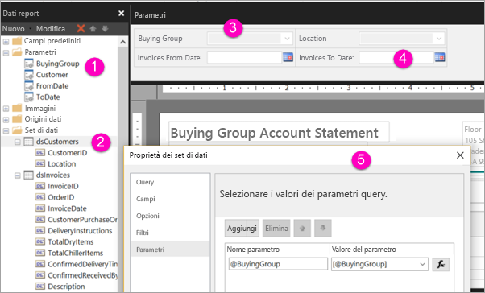

# Creare i parametri per i report impaginati nel servizio Power BI

Questo articolo descrive come creare i parametri per i report impaginati nel servizio Power BI.  Un parametro del report consente di scegliere i dati di un report e variare la presentazione del report. È possibile specificare un valore predefinito e un elenco di valori disponibili e i lettori del report possono modificare la selezione in base alle proprie preferenze.  

La figura seguente mostra la visualizzazione di progettazione in Generatore Report per un report con i parametri @BuyingGroup, @Customer, @FromDate e @ToDate. 
  

  
1.  I parametri del report nel riquadro Dati report.  
  
2.  La tabella con uno dei parametri del set di dati.  
  
3.  Il riquadro Parametri. È possibile personalizzare il layout dei parametri nel riquadro dei parametri. 
  
4.  Ai parametri @FromDate e @ToDate è associato il tipo di dati **DateTime**. Quando si visualizza il report, è possibile digitare una data nella casella di testo o scegliere una data nel controllo del calendario. 

5.  Uno dei parametri della finestra di dialogo **Proprietà set di dati**.  

  
## Creare o modificare un parametro del report  
  
1.  Aprire il report impaginato in Generatore Report.

1. Nel riquadro **Dati report** fare clic con il pulsante destro del mouse sul nodo **Parametri** > **Aggiungi parametro**. Viene visualizzata la finestra di dialogo **Proprietà parametri report**.  
  
2.  In **Nome** digitare un nome per il parametro oppure accettare quello predefinito.  
  
3.  In **Messaggio di richiesta** digitare il testo da visualizzare accanto alla casella di testo del parametro quando l'utente esegue il report.  
  
4.  In **Tipo dati** selezionare il tipo di dati da associare al valore del parametro.  
  
5.  Se il parametro può contenere un valore vuoto, selezionare **Consenti nessun valore**.  
  
6.  Se il parametro può contenere un valore Null, selezionare **Consenti valore Null**.  
  
7.  Per consentire all'utente di selezionare più di un valore per il parametro, selezionare **Consenti più valori**.  
  
8.  Impostare l'opzione di visibilità.  
  
    -   Per visualizzare il parametro sulla barra degli strumenti nella parte superiore del report, selezionare **Visibile**.  
  
    -   Per nascondere il parametro in modo che non venga visualizzato sulla barra degli strumenti, selezionare **Nascosto**.  
  
    -   Per nascondere il parametro e impedire che venga modificato sul server di report dopo la pubblicazione del report, selezionare **Interno**. Il parametro del report, quindi, potrà essere visualizzato solo nella definizione del report. Per questa opzione, è necessario impostare un valore predefinito o consentire al parametro di accettare un valore Null.  
  
9. Selezionare **OK**. 
  
## Passaggi successivi

Per informazioni sulla visualizzazione dei parametri nel servizio Power BI, vedere l'articolo [Visualizzare i parametri per i report impaginati](paginated-reports-view-parameters.md).

Per informazioni dettagliate sui parametri dei report impaginati, vedere l'articolo [Parametri report (Generatore report e Progettazione report)](https://docs.microsoft.com/sql/reporting-services/report-design/report-parameters-report-builder-and-report-designer) nella documentazione di SQL Server Reporting Services  
