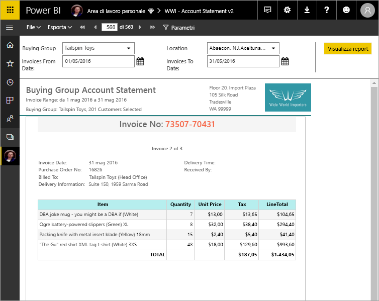

# Che cosa sono i report impaginati in Power BI Premium? (anteprima)
I report impaginati, da lungo tempo il formato di report standard in SQL Server Reporting Services, sono ora disponibili nel servizio Power BI. I report impaginati sono report progettati per essere stampati o condivisi. Vengono definiti "impaginati" perché sono formattati per adattarsi al meglio a una pagina e consentono di visualizzare tutti i dati in una tabella, ad esempio, anche se la tabella si estende su più pagine. Vengono talvolta definiti "perfetti al pixel" perché è possibile controllare esattamente il layout di pagina del report. I report impaginati sono basati sulla tecnologia di report RDL in SQL Server Reporting Services. Generatore report è lo strumento autonomo per la creazione di report impaginati. 

I report impaginati possono avere molte pagine. Il report nell'esempio seguente è costituito da 563 pagine, ognuna con un layout esatto, con una pagina per ogni fattura e intestazioni e piè di pagina ripetuti.

È possibile visualizzare in anteprima il report in Generatore report e quindi pubblicarlo nel servizio Power BI, http://app.powerbi.com. È necessaria una licenza di Power BI Pro per pubblicare un report nel servizio. È possibile pubblicare e condividere i report impaginati nell'area di lavoro personale o in aree di lavoro per le app, purché l'area di lavoro sia in una capacità Power BI Premium. Inoltre, un amministratore di Power BI deve abilitare i report impaginati nel portale di amministrazione di Power BI. Vedere altre informazioni sulla [configurazione dei carichi di lavoro](service-admin-premium-manage.md#configure-workloads). 

## Creare report in Generatore report

Per i report impaginati è disponibile uno strumento di progettazione apposito: Generatore report. Se sono già stati creati report impaginati creati per Server di report di Power BI o SQL Server Reporting Services (SSRS), è possibile usare lo stesso strumento e la stessa versione. I report impaginati creati per SSRS 2016 e 2017 o per Server di Report di Power BI in locale sono infatti compatibili con il servizio Power BI. Il servizio Power BI garantisce la compatibilità con le versioni precedenti, in modo da poter trasferire i report e aggiornare qualsiasi report impaginato di una versione precedente. Non tutte le funzionalità dei report sono disponibili nella fase di lancio. Vedere [Limitazioni e considerazioni](#limitations-and-considerations) in questo articolo per informazioni dettagliate.
     
## Report da un'ampia gamma di origini dati

Un singolo report impaginato può avere numerose origini dati diverse e non è basato su un modello di dati sottostante, come per i report di Power BI. Per la versione iniziale dei report impaginati nel servizio Power BI, è necessario creare le origini dati e i set di dati incorporati nel report stesso, anziché connettersi a origini dati o set di dati condivisi in un server. I report vengono creati in Generatore report nel computer locale. Se un report si connette ai dati in locale, dopo aver caricato il report nel servizio Power BI è necessario creare un gateway e reindirizzare la connessione dati. L'elenco seguente include le origini dati a cui è possibile connettersi per la versione iniziale:

- Database SQL di Azure e Azure SQL Data Warehouse
- SQL Server tramite un gateway
- SQL Server Analysis Services tramite un gateway
 
Altre origini dati diventeranno disponibili durante il periodo di anteprima.

## Progettare il report  

### Creare report impaginati con layout matrice, grafico e a formato libero

È possibile creare report tabella per i dati basati su colonne, report matrice (ad esempio report a campi incrociati o tabella pivot) per i dati riepilogati, report grafico per i dati grafici e report *elenco* a formato libero per qualsiasi altra esigenza, ad esempio le fatture. 
  
È possibile iniziare con una delle creazioni guidate di Generatore report. La Creazione guidata tabella, matrice o grafico consente di eseguire in modo semplificato la creazione della connessione all'origine dati incorporata e del set di dati incorporato. È quindi possibile trascinare i campi per creare una query sul set di dati, selezionare un layout e lo stile, quindi personalizzare il report.  
  
Con la Creazione guidata mappa è possibile creare report che consentono di visualizzare dati aggregati su uno sfondo geografico o geometrico. I dati della mappa possono essere dati spaziali da una query Transact-SQL o un file di forma ESRI (Environmental Systems Research Institute, Inc.). È anche possibile aggiungere uno sfondo a sezioni per una mappa di Microsoft Bing.  

### Aggiungere altri elementi al report

È possibile modificare i dati tramite filtri, raggruppamento e ordinamento oppure aggiungendo formule o espressioni. Si possono aggiungere grafici, misuratori, grafici sparkline e indicatori per riepilogare i dati in un formato visivo.  Usare parametri e filtri per filtrare i dati per ottenere visualizzazioni personalizzate. Incorporare o fare riferimento a immagini e altre risorse, inclusi i contenuti esterni.  

Per tutti gli elementi in un report impaginato, dal report stesso a ogni casella di testo, immagine, tabella e grafico, è disponibile una gamma di proprietà che è possibile impostare per ottenere l'esatto aspetto desiderato per il report.

## Creazione di una definizione del report

Quando si progetta un report impaginato, si crea effettivamente una *definizione del report*, che non contiene i dati. La definizione specifica dove ottenere i dati, quali dati ottenere e come visualizzarli. Quando si esegue il report, l'elaboratore di report acquisisce la definizione del report specificata, recupera i dati e li combina con il layout del report per generare il report. La definizione del report viene caricata nel servizio Power BI, http://app.powerbi.com, nell'area di lavoro personale o in un'area di lavoro condivisa con i colleghi. Se l'origine dati del report è locale, dopo aver caricato il report, la connessione all'origine dati viene reindirizzata per il passaggio attraverso un gateway. 

## Visualizzare il report impaginato
È possibile visualizzare il report impaginato nel servizio Power BI in un browser, nonché nelle app per dispositivi mobili di Power BI. Nel servizio Power BI è possibile esportare il report in numerosi formati orientati al Web, di pagina o per applicazioni desktop, come HTML, MHTML, PDF, XML, CSV, TIFF, Word ed Excel. È anche possibile condividerlo con altri utenti.  
  
## Limitazioni e considerazioni

L'elenco seguente include alcune altre funzionalità non supportate nella versione iniziale:

- Aggiunta di pagine del report o oggetti visivi a dashboard di Power BI.
- Funzionalità interattive come le mappe documento e i pulsanti Mostra/Nascondi.
- Sottoreport e report drill-through.
- Sottoscrizioni.
- Origini dati condivise e set di dati condivisi.
- Set di dati Power BI.
- Oggetti visivi da report di Power BI.
- Report impaginati nelle app. È possibile condividere un report impaginato da un'area di lavoro per le app, ma non è possibile includerlo quando si pubblica l'app da tale area di lavoro.
 
## Passaggi successivi

- [Installare Generatore report dall'Area download Microsoft](http://go.microsoft.com/fwlink/?LinkID=734968)

- [Esercitazione: Creare un report impaginato](paginated-reports-quickstart-aw.md)
  

