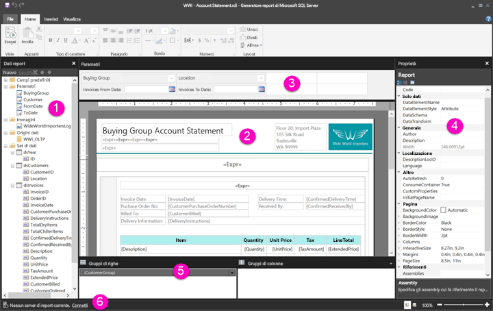

# Elementi della visualizzazione Progettazione report per i report impaginati

La visualizzazione Progettazione report in Generatore report è lo spazio di progettazione per la creazione di report impaginati che è possibile pubblicare nel servizio Power BI. L'area di progettazione è al centro di Generatore report e attorno vi sono la barra multifunzione e i riquadri. L'area di progettazione è la posizione in cui vengono aggiunti e organizzati gli elementi del report. Questo articolo illustra i riquadri che vengono usati per aggiungere, selezionare e organizzare le risorse del report e modificare le proprietà degli elementi del report.  

1.  [Riquadro dei dati del report](#report-data-pane) 
2.  [Area di progettazione report](#report-design-surface)  
3.  [Riquadro Parametri](#parameters-pane) 
4.  [Riquadro Proprietà](#properties-pane) 
5.  [Riquadro di raggruppamento](#grouping-pane) 
6.  [Barra di stato del report corrente](#current-report-status-bar)  
  
## 1 Riquadro dei dati del report  
 Nel riquadro dei dati del report si definiscono i dati del report e le risorse del report necessari per un report prima di progettarne il layout. Ad esempio, è possibile aggiungere origini dati, set di dati, campi calcolati, parametri del report e immagini nel riquadro dei dati del report.  
  
 Dopo avere aggiunto elementi al riquadro dei dati del report, trascinare i campi sugli elementi del report nell'area di progettazione per controllare la posizione di visualizzazione dei dati nel report.  
  
> [!TIP]  
>  Se si trascina un campo dal riquadro dei dati del report direttamente sull'area di progettazione del report anziché posizionarlo in un'area dati, quale una tabella o un grafico, quando si esegue il report verrà visualizzato solo il primo valore dai dati in tale campo.  
  
 È anche possibile trascinare i campi predefiniti dal riquadro dei dati del report nell'area di progettazione del report. Dopo il rendering, questi campi forniscono informazioni sul report, ad esempio il nome, il numero totale di pagine e il numero di pagina corrente.  
  
 Alcuni elementi vengono aggiunti automaticamente al riquadro dei dati del report quando si aggiunge qualcosa nell'area di progettazione del report. Ad esempio, se si incorpora un'immagine nel report, verrà aggiunta alla cartella Immagini nel riquadro dei dati del report.  
  
> [!NOTE]  
>  È possibile usare il pulsante **Nuovo** per aggiungere un nuovo elemento nel riquadro dei dati del report. È possibile aggiungere più set di dati dalla stessa origine dati o da altre origini dati nel report. Per aggiungere un nuovo set di dati dalla stessa origine dati, fare clic con il pulsante destro del mouse su un'origine dati > **Aggiungi set di dati**.  
  
## 2 Area di progettazione report  
 L'area di progettazione report di Generatore report è l'area di lavoro principale per la progettazione dei report. Per posizionare gli elementi del report, ad esempio aree dati, sottoreport, caselle di testo, immagini, rettangoli e linee, è necessario aggiungerli dalla barra multifunzione o dalla Raccolta parti del report all'area di progettazione. In questa posizione è possibile aggiungere gruppi, espressioni, parametri, filtri, azioni, visibilità e formattazione agli elementi del report.  
  
 È anche possibile modificare quanto segue:  
  
-   Le proprietà del corpo del report, ad esempio il colore del bordo e di riempimento, facendo clic con il pulsante destro del mouse sull'area bianca dell'area di progettazione, all'esterno di qualsiasi elemento del report e scegliendo **Proprietà corpo**.  
  
-   Le proprietà di intestazione e piè di pagina, ad esempio il colore del bordo e di riempimento, facendo clic con il pulsante destro del mouse sull'area bianca dell'area di progettazione nell'area di intestazione o piè di pagina, all'esterno di qualsiasi elemento del report e scegliendo **Proprietà intestazione** o **Proprietà piè di pagina**.  
  
-   Le proprietà del report stesso, ad esempio l'impostazione della pagina, facendo clic con il pulsante destro del mouse sull'area grigia attorno all'area di progettazione e scegliendo **Proprietà report**.  
  
-   Le proprietà degli elementi del report facendo clic con il pulsante destro del mouse su di essi e scegliendo **Proprietà**.  
  
### Dimensioni e area di stampa dell'area di progettazione  
Le dimensioni dell'area di progettazione potrebbero essere diverse dall'area di stampa delle dimensioni della pagina specificata per stampare il report. La modifica delle dimensioni dell'area di progettazione non influisce sull'area di stampa del report. Indipendentemente dalle dimensioni impostate per l'area di stampa del report, le dimensioni complessive dell'area di progettazione non cambiano. Per altre informazioni, vedere Tipi di rendering. 
  
- Per visualizzare il righello, nella scheda **Visualizza** selezionare la casella di controllo **Righello**.  
  
## 3 Riquadro Parametri  
 Con i parametri del report è possibile controllare i dati del report, connettere report correlati e variare la presentazione del report. Il riquadro Parametri offre un layout flessibile per i parametri del report.  
  
 Vedere altre informazioni su parametri del report   
  
## 4 Riquadro Proprietà
 A ogni elemento in un report, ad esempio aree dati, immagini, caselle di testo e il corpo del report stesso, sono associate proprietà. Ad esempio, la proprietà BorderColor di una casella di testo mostra il valore del colore del bordo della casella di testo e la proprietà PageSize del report mostra le dimensioni della pagina del report.  
  
 Queste proprietà vengono visualizzate nel riquadro Proprietà. Le proprietà nel riquadro variano a seconda dell'elemento del report selezionato.  
  
- Per visualizzare il riquadro Proprietà, nella scheda **Visualizza** nel gruppo **Mostra/Nascondi** > **Proprietà**.  
  
### Modifica dei valori delle proprietà  
 In Generatore report è possibile modificare le proprietà degli elementi del report in vari modi:  
  
-   Selezionando i pulsanti e gli elenchi sulla barra multifunzione.  
  
-   Modificando le impostazioni nelle finestre di dialogo.  
  
-   Modificando i valori delle proprietà all'interno del riquadro Proprietà.  
  
 Le proprietà usate più comunemente sono disponibili nelle finestre di dialogo e sulla barra multifunzione.  
  
 A seconda della proprietà, è possibile impostare un valore della proprietà da un elenco di riepilogo a discesa, digitare il valore o selezionare `<Expression>` per creare un'espressione.  
  
### Modifica della visualizzazione del riquadro Proprietà  
 Per impostazione predefinita, le proprietà visualizzate nel riquadro Proprietà sono organizzate in categorie ampie, ad esempio Azione, Bordo, Riempimento, Tipo di carattere e Generale. A ogni categoria è associato un set di proprietà. Ad esempio, nella categoria Tipo di carattere sono elencate le proprietà seguenti: Color, FontFamily, FontSize, FontStyle, FontWeight, LineHeight e TextDecoration. Se si preferisce, è possibile ordinare alfabeticamente tutte le proprietà elencate nel riquadro. In questo modo le categorie vengono rimosse e tutte le proprietà vengono elencate in ordine alfabetico indipendentemente dalla categoria.  
  
 Nella parte superiore del riquadro Proprietà sono disponibili tre pulsanti: **Categoria**, **Ordine alfabetico** e **Pagina delle proprietà**. Selezionare i pulsanti Categoria e Ordine alfabetico per alternare le visualizzazioni del riquadro Proprietà. Selezionare il pulsante **Pagina delle proprietà** per aprire la finestra di dialogo delle proprietà per un elemento del report selezionato.  
  
  
## 5 Riquadro di raggruppamento

 I gruppi vengono usati per organizzare i dati del report in una gerarchia visiva e per calcolare i totali. È possibile visualizzare i gruppi di righe e colonne all'interno di un'area dati nell'area di progettazione e anche nel riquadro di raggruppamento. Il riquadro di raggruppamento è suddiviso in due riquadri: Gruppi di righe e Gruppi di colonne. Quando si seleziona un'area dati, nel riquadro di raggruppamento vengono visualizzati tutti i gruppi all'interno di tale area dati come elenco gerarchico: i gruppi figlio vengono visualizzati rientrati sotto i relativi gruppi padre.  
  
 È possibile creare gruppi trascinando i campi dal riquadro dei dati del report e rilasciandoli nell'area di progettazione o nel riquadro di raggruppamento. Nel riquadro di raggruppamento è possibile aggiungere gruppi padre, adiacenti e figlio, modificare le proprietà dei gruppi ed eliminare gruppi.  
  
 Il riquadro di raggruppamento viene visualizzato per impostazione predefinita, ma è possibile chiuderlo deselezionando la casella di controllo Riquadro di raggruppamento nella scheda Visualizza. Il riquadro di raggruppamento non è disponibile per le aree dati Grafico o Misuratore.  
  
 Per altre informazioni, vedere Riquadro di raggruppamento e informazioni sui gruppi.  
  
## 6 Barra di stato del report corrente

La barra di stato del report corrente mostra il nome del server a cui è connesso il report oppure indica "Nessun server di report corrente." È possibile selezionare **Connetti** per connettersi a un server.

## Passaggi successivi

[Che cosa sono i report impaginati in Power BI Premium? (anteprima)](paginated-reports-report-builder-power-bi.md) 

  
  
