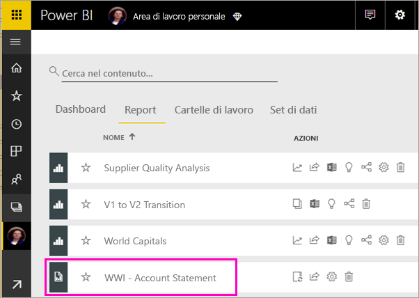
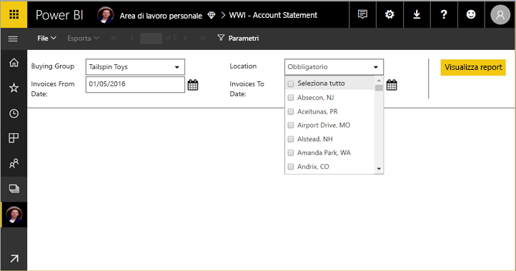
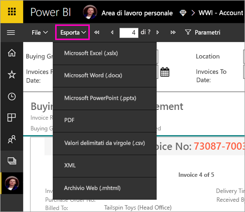

# Visualizzare un report impaginato nel servizio Power BI (anteprima)

Questo articolo illustra come visualizzare un report impaginato nel servizio Power BI. I report impaginati sono report creati in Generatore Report e caricati in qualsiasi area di lavoro assegnata a una capacità Premium. Cercare l'icona a forma di diamante  accanto al nome dell'area di lavoro. 

I report impaginati hanno un'icona specifica: .

I report impaginati possono anche essere esportati in diversi formati: 

- Microsoft Excel
- Microsoft Word
- Microsoft PowerPoint
- PDF
- Valori delimitati da virgole
- XML
- Archivio Web (.mhtml)

## Visualizzare un report impaginato

1. Selezionare il report impaginato nell'area di lavoro.

    

2. Se nel report sono presenti parametri, come in questo caso, è possibile che alla prima apertura il report non venga visualizzato. Selezionare i parametri e quindi selezionare **Visualizza report**. 

     

    I parametri possono essere modificati in qualsiasi momento.

1. Scorrere le pagine del report selezionando le frecce nella parte superiore della pagina o digitando un numero di pagina nella casella.
    
   

4. Selezionare **Esporta** per trovare un formato in cui esportare i report impaginati.

    

## Passaggi successivi

[Che cosa sono i report impaginati in Power BI Premium? (anteprima)](paginated-reports-report-builder-power-bi.md)
