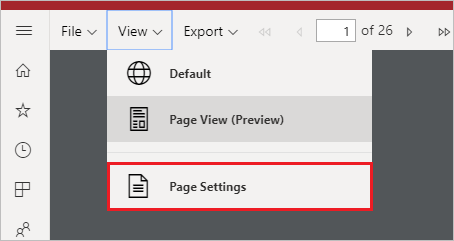

# Impostare le visualizzazioni per i report impaginati nel servizio Power BI

Quando si esegue il rendering di un report impaginato nel servizio Power BI, la visualizzazione predefinita è basata su HTML e interattiva. Un'altra visualizzazione report per i formati di pagina fissa, ad esempio PDF, è la nuova opzione Visualizzazione pagina.

**Visualizzazione interattiva predefinita**

**Visualizzazione pagina**

In Visualizzazione pagina il report di cui viene eseguito il rendering è diverso rispetto alla visualizzazione predefinita. Alcune proprietà e concetti nei report impaginati si applicano solo alle pagine fisse. La visualizzazione è simile a quella di un report stampato o esportato. È comunque possibile modificare alcuni elementi, come i valori dei parametri, ma non sono disponibili altre funzionalità interattive, ad esempio l'ordinamento delle colonne e gli interruttori.

Visualizzazione pagina supporta tutte le funzionalità supportate dal visualizzatore PDF del browser, ad esempio Zoom avanti, Zoom indietro e Adatta alla pagina.

## Passare a Visualizzazione pagina

Quando si apre un report impaginato, per impostazione predefinita ne viene eseguito il rendering in visualizzazione interattiva. Se il report include parametri, selezionare i parametri, quindi visualizzare il report.

1. Selezionare **Visualizza** sulla barra degli strumenti > **Visualizzazione pagina**.

    

2. Per modificare le impostazioni della visualizzazione pagina, scegliere **Impostazioni pagina** dal menu **Visualizza** sulla barra degli strumenti. 

    
    
    La finestra di dialogo **Impostazioni pagina** contiene opzioni per impostare **Dimensioni pagina** e **Orientamento** per la visualizzazione pagina. Dopo aver applicato le impostazioni della pagina, le stesse opzioni vengono applicate quando si stampa la pagina in un secondo momento.
   
    

3. Per tornare alla visualizzazione interattiva, selezionare **Impostazione predefinita** nella casella a discesa **Visualizza**.

## Supporto browser

Visualizzazione pagina è supportata nei browser Google Chrome e Microsoft Edge. Assicurarsi che la visualizzazione di file PDF nel browser sia abilitata. Si tratta dell'impostazione predefinita per questi browser.

Visualizzazione pagina non è supportata in Internet Explorer e in Safari, quindi l'opzione è disabilitata. Non è inoltre supportata nei browser dei dispositivi mobili o nelle app per dispositivi mobili Power BI native.  

## Passaggi successivi

- [Visualizzare un report impaginato nel servizio Power BI](../consumer/paginated-reports-view-power-bi-service.md)
- [Che cosa sono i report impaginati in Power BI Premium?](paginated-reports-report-builder-power-bi.md)
