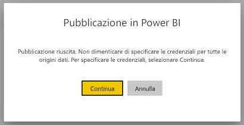
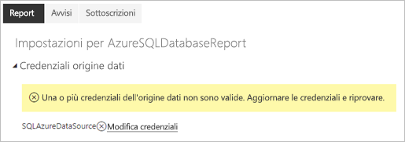
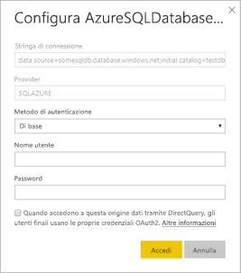

# Origini dati supportate per i report impaginati di Power BI

In questo articolo sono elencate le origini dati supportate per i report impaginati del servizio Power BI ed è illustrato come connettersi alle origini dati del database SQL di Azure. Alcune origini dati sono supportate in modalità nativa. È possibile connettersi ad altre origini dati tramite gateway dati.

## Origini dati supportate in modalità nativa

I report impaginati supportano in modalità nativa l'elenco di origini dati seguente:

| origine dati | Authentication | Note |
| --- | --- | --- |
| database SQL di Azure  Azure SQL Data Warehouse | Di base, Single Sign-On (SSO), OAuth2 | È possibile usare un gateway aziendale con il database SQL di Azure. Tuttavia, non è possibile usare SSO oppure oAuth2 per l'autenticazione in questi scenari.   |
| Istanza gestita di SQL di Azure | Basic | tramite un endpoint pubblico o privato (l'endpoint privato deve essere instradato tramite il gateway aziendale)  |
| Azure Analysis Services | SSO, OAuth2 | Il firewall AAS deve essere disabilitato o configurato in modo da consentire tutti gli intervalli IP.|
| Set di dati di Power BI | SSO | Set di dati di Power BI Premium e non Premium. Richiede l'autorizzazione di lettura |
| Set di dati di Power BI Premium (XMLA) | SSO |   |
| Immetti i dati | N/D | I dati sono incorporati nel report. |

Ad eccezione del database SQL di Azure, tutte le origini dati sono pronte per l'uso dopo il caricamento del report nel servizio Power BI. Per impostazione predefinita, le origini dati usano Single Sign-on (SSO), dove applicabile. Per Azure Analysis Services, è possibile modificare il tipo di autenticazione in OAuth2. Tuttavia, dopo che il tipo di autenticazione per una determinata origine dati viene modificato in OAuth2, non è possibile ripristinare l'uso di SSO.  Questa modifica viene applicata anche a tutti i report che usano tale origine dati in tutte le aree di lavoro per un determinato tenant.  La sicurezza a livello di riga nei report impaginati non funziona a meno che gli utenti scelgano SSO per tipo di autenticazione.

Per le origini dati del database SQL di Azure, è necessario specificare altre informazioni, come descritto nella sezione [Autenticazione del database SQL di Azure](#azure-sql-database-authentication).

## Altre origini dati

Oltre alle origini dati supportate in modalità nativa, è possibile accedere alle origini dati seguenti tramite un [gateway dati di Power BI](../service-gateway-onprem.md):

- SQL Server
- SQL Server Analysis Services
- Oracle
- Teradata

Per i report impaginati, il database SQL di Azure e Azure Analysis Services non sono attualmente accessibili tramite un gateway dati di Power BI.

## Autenticazione del database SQL di Azure

Per le origini dati del database SQL di Azure, è necessario impostare un tipo di autenticazione prima di eseguire il report. Questa opzione si applica solo quando si usa un'origine dati per la prima volta in un'area di lavoro. La prima volta viene visualizzato il messaggio seguente:

Se non si specificano le credenziali, si verifica un errore durante l'esecuzione del report. Selezionare **Continua** per passare alla pagina **Credenziali dell'origine dati** del report appena caricato:

Selezionare il collegamento **Modifica credenziali** per una determinata origine dati per visualizzare la finestra di dialogo **Configura**:

Per le origini dati del database SQL di Azure, sono supportati i tipi di autenticazione seguenti:

- Di base (nome utente e password)
- SSO (Single Sign-On)
- OAuth2 (token AAD archiviato)

Per il corretto funzionamento di SSO e OAuth2, il server del database SQL di Azure a cui è connessa l'origine dati deve avere [il supporto per l'autenticazione di AAD abilitato](https://docs.microsoft.com/azure/sql-database/sql-database-aad-authentication-configure). Per il metodo di autenticazione OAuth2, AAD genera un token e lo archivia per l'accesso futuro all'origine dati. Per usare invece [il metodo di autenticazione SSO](https://docs.microsoft.com/power-bi/service-azure-sql-database-with-direct-connect#single-sign-on), selezionare l'opzione SSO **Quando accedono a questa origine dati tramite DirectQuery, gli utenti finali usano le proprie credenziali OAuth2** visualizzata nella parte sottostante.
  
## Passaggi successivi

[Visualizzare un report impaginato nel servizio Power BI](../consumer/paginated-reports-view-power-bi-service.md)

Altre domande? [Provare la community di Power BI](https://community.powerbi.com/)
