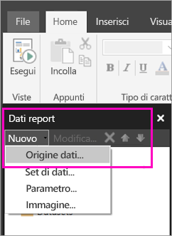

# Creare un'origine dati incorporata per i report impaginati nel servizio Power BI

Questo articolo descrive come creare e modificare un'origine dati incorporata per un report impaginato nel servizio Power BI. È possibile definire un'origine dati incorporata in un unico report e usarla solo in quel report. I report impaginati pubblicati nel servizio Power BI richiedono attualmente set di dati incorporati e origini dati incorporate e possono connettersi alle origini dati seguenti:

- Azure Analysis Services
- database SQL di Azure e 
- Azure SQL Data Warehouse
- SQL Server
- SQL Server Analysis Services
- Oracle 
- Teradata 

Per le origini dati seguenti, usare l'opzione [Connessione SQL Server Analysis Services](../admin/service-premium-connect-tools.md):

- Set di dati di Power BI Premium

I report impaginati si connettono alle origini dati locali tramite un [gateway di Power BI](../connect-data/service-gateway-onprem.md). che può essere configurato solo dopo aver pubblicato il report nel servizio Power BI.

Visualizzare [Dati dei report in Generatore report di Power BI](report-builder-data.md) per informazioni più dettagliate.

## Creare un'origine dati incorporata
  
1. Aprire Generatore report di Power BI.

1. Sulla barra degli strumenti nel riquadro Dati report selezionare **Nuovo** > **Origine dati**. Verrà visualizzata la finestra di dialogo **Proprietà origine dati** .

    
  
2.  Nella casella di testo **Nome** digitare un nome per l'origine dati o accettare quello predefinito.  
  
3.  Selezionare **Usa una connessione incorporata nel report**.  
  
1.  Nell'elenco **Seleziona tipo di connessione** selezionare un tipo di origine dati. 

1.  Specificare una stringa di connessione usando uno dei metodi seguenti:  
  
    -   Digitare la stringa di connessione direttamente nella casella di testo **Stringa di connessione** . 
  
     -   Selezionare **Compila** per aprire la finestra di dialogo **Proprietà di connessione** relativa all'origine dati scelta nel passaggio 2.  
  
        Compilare i campi della finestra di dialogo **Proprietà di connessione** in base al tipo di origine dati. Le proprietà di connessione includono il tipo di origine dati, il nome dell'origine dati e le credenziali da usare. Dopo aver specificato i valori richiesti in questa finestra di dialogo, selezionare **Test connessione** per verificare che l'origine dati sia disponibile e che le credenziali specificate siano corrette.  
  
4.  Selezionare **Credenziali**.  
  
     Specificare le credenziali da usare per questa origine dati. Il proprietario dell'origine dati sceglie il tipo di credenziali supportate. Per altre informazioni, vedere [Specificare le credenziali e le informazioni sulla connessione per le origini dati del report](https://docs.microsoft.com/sql/reporting-services/report-data/specify-credential-and-connection-information-for-report-data-sources).
  
5.  Selezionare **OK**.  
  
     L'origine dati verrà visualizzata nel riquadro dei dati del report.  
     
## Limitazioni e considerazioni

I report impaginati connessi a set di dati di Power BI seguono le regole per i set di dati condivisi in Power BI con alcune piccole modifiche.  Per fare in modo che gli utenti possano visualizzare correttamente i report impaginati con i set di dati di Power BI e per accertarsi che la sicurezza a livello di riga venga abilitata e applicata per gli utenti, assicurarsi di seguire queste regole:

### App e aree di lavoro classiche

- File con estensione rdl nella stessa area di lavoro del set di dati (stesso proprietario): Supportato
- File con estensione rdl in un'area di lavoro diversa dal set di dati (stesso proprietario): Supportato
- File con estensione rdl condiviso: ogni utente che visualizza il report a livello di set di dati deve avere l'autorizzazione di lettura
- App condivisa: ogni utente che visualizza il report a livello di set di dati deve avere l'autorizzazione di lettura
- File con estensione rdl nella stessa area di lavoro del set di dati (utente diverso): Supportato
- File con estensione rdl in un'area di lavoro diversa dal set di dati (utente diverso): ogni utente che visualizza il report a livello di set di dati deve avere l'autorizzazione di lettura
- Sicurezza a livello di ruolo: affinché sia applicata, ogni utente che visualizza il report a livello di set di dati deve avere l'autorizzazione di lettura.

### App e aree di lavoro nella nuova esperienza

- File con estensione rdl nella stessa area di lavoro del set di dati: Supportato
- File con estensione rdl in un'area di lavoro diversa dal set di dati (stesso proprietario): Supportato
- File con estensione rdl condiviso: ogni utente che visualizza il report a livello di set di dati deve avere l'autorizzazione di lettura
- App condivisa: ogni utente che visualizza il report a livello di set di dati deve avere l'autorizzazione di lettura
- File con estensione rdl nella stessa area di lavoro del set di dati - Supportato
- File con estensione rdl in un'area di lavoro diversa dal set di dati (utente diverso): ogni utente che visualizza il report a livello di set di dati deve avere l'autorizzazione di lettura
- Sicurezza a livello di ruolo: affinché sia applicata, ogni utente che visualizza il report a livello di set di dati deve avere l'autorizzazione di lettura

## Passaggi successivi

- [Creare un set di dati incorporato per un report impaginato nel servizio Power BI](paginated-reports-create-embedded-dataset.md)
- [Che cosa sono i report impaginati in Power BI Premium?](paginated-reports-report-builder-power-bi.md)

