# Esercitazione: Creare un report impaginato e caricarlo nel servizio Power BI

In questa esercitazione, ci si connette a un database SQL di Azure di esempio. Poi si usa una procedura guidata in Generatore report di Power BI per creare un report impaginato con una tabella estesa su più pagine. Quindi si carica il report impaginato in un'area di lavoro in una capacità Premium nel servizio Power BI.

Ecco i passaggi che verranno completati in questa esercitazione:

> [!div class="checklist"]
> * Creare un database di esempio di Azure.
> * Creare una matrice in Generatore report di Power BI con l'aiuto di una procedura guidata.
> * Formattare il report con titolo, numeri di pagina e intestazioni di colonna in ogni pagina.
> * Formattare la valuta.
> * Caricare il report nel servizio Power BI.

Se non si ha una sottoscrizione di Azure, prima di iniziare creare un [account gratuito](https://azure.microsoft.com/free/?WT.mc_id=A261C142F).
 
## Prerequisiti  

Questi sono i prerequisiti per la creazione del report impaginato:

- Installare [Generatore report di Power BI dall'Area download Microsoft](https://go.microsoft.com/fwlink/?linkid=2086513). 

- Seguire la guida introduttiva [Creare un database SQL di Azure nel portale di Azure](https://docs.microsoft.com/azure/sql-database/sql-database-get-started-portal). Copiare e salvare il valore nella casella **Nome server** nella scheda **Panoramica**. Ricordare il nome utente e la password creati in Azure.

Questi sono i prerequisiti per il caricamento del report impaginato nel servizio Power BI:

- È necessaria una [licenza di Power BI Pro](../service-admin-power-bi-pro-in-your-organization.md).
- È necessaria un'area di lavoro nel servizio in una [capacità Power BI Premium](../service-premium-what-is.md). È contraddistinta da un'icona a forma di diamante  accanto al nome dell'area di lavoro.

## Creare la matrice con una procedura guidata
  
1.  Avviare Generatore report di Power BI dal computer.  
  
     Verrà visualizzata la finestra di dialogo **Attività iniziali**.  
  
     
  
1.  Nel riquadro sinistro verificare che sia selezionata l'opzione **Nuovo report** e nel riquadro destro selezionare **Creazione guidata tabella o matrice**.  
  
4.  Nella pagina **Scegliere un set di dati** selezionare **Creare un set di dati** > **Avanti**.  

    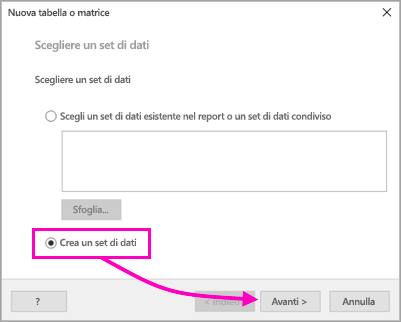
  
5.  Nella pagina **Scegliere una connessione a un'origine dati** selezionare **Nuova**. 

    
  
     Viene visualizzata la finestra di dialogo **Proprietà origine dati**.  
  
6.  È possibile assegnare il nome desiderato all'origine dati, usando caratteri e caratteri di sottolineatura. Per questa esercitazione, nella casella **Nome** digitare **MyAzureDataSource**.  
  
7.  Nella casella **Seleziona tipo di connessione** selezionare **Database SQL di Microsoft Azure**.  
  
8.  Selezionare **Compila** accanto alla casella **Stringa di connessione**. 

    

9. **In Azure:** tornare al portale di Azure e selezionare **Database SQL**.

1. Selezionare il database SQL di Azure creato nella guida introduttiva "Creare un database SQL di Azure nel portale di Azure" nella sezione **Prerequisiti** di questo articolo.

1. Nella scheda **Panoramica** copiare il valore nella casella **Nome server**.

2. **In Generatore report**: nella finestra di dialogo **Proprietà di connessione** incollare il nome del server copiato in **Nome server**. 

1. In **Accesso al server** assicurarsi che sia selezionata l'opzione **Usa autenticazione di SQL Server** e quindi digitare il nome utente e la password creati in Azure per il database di esempio.

1. In **Connessione al database** selezionare la freccia a discesa e selezionare il nome del database creato in Azure.
 
    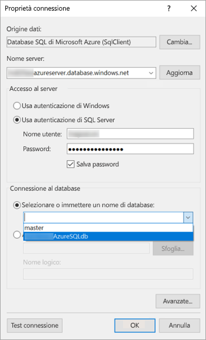

1. Selezionare **Test connessione**. Viene visualizzato il messaggio **Risultati verifica** che indica **Test della connessione riuscito**.

1. Selezionare **OK** > **OK**. 

   A questo punto, nella casella **Stringa di connessione** Generatore report visualizza la stringa di connessione appena creata. 

    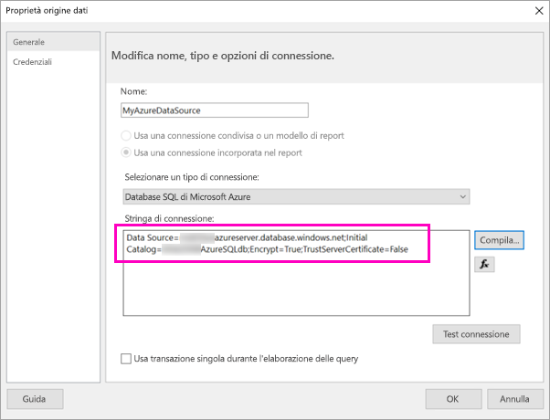

1. Seleziona **OK**.
  
9. Nella pagina **Scegliere una connessione a un'origine dati** viene visualizzata l'indicazione "(in questo report)" sotto la connessione dati appena creata. Selezionare tale origine dati > **Avanti**.  

    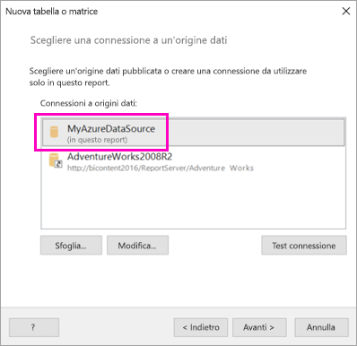

10. Digitare il nome utente e la password nella casella. 
  
10. Nella pagina **Progetta query** espandere SalesLT, espandere Tabelle e selezionare queste tabelle:

    - Indirizzo
    - Cliente
    - Product
    - ProductCategory
    - SalesOrderDetail
    - SalesOrderHeader

     Dato che sono selezionate le opzioni **Relazioni** > **Rilevamento automatico**, Generatore report rileva le relazioni tra queste tabelle. 
    
    
 
1.  Selezionare **Esegui query**. Generatore report visualizza il riquadro **Risultati query**. 
 
     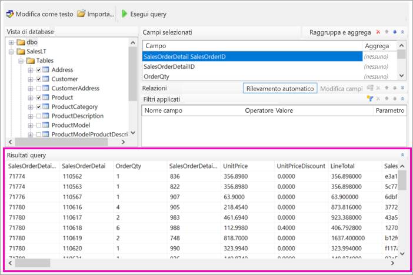

18. Selezionare **Next** (Avanti). 

19. Nella pagina **Scegliere un set di dati** scegliere il set di dati appena creato > **Avanti**.

    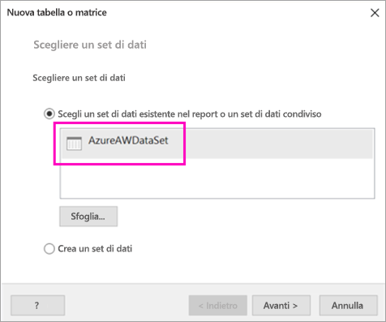

1. Nella pagina **Disponi campi** trascinare i campi dalla casella **Campi disponibili** alla casella **Gruppi di righe**:

    - CompanyName
    - SalesOrderNumber
    - Product_Name

1. Trascinare questi campi dalla casella **Campi disponibili** alla casella **Valori**:

    - OrderQty
    - UnitPrice
    - LineTotal

    Generatore report imposta automaticamente i campi nella casella **Valori** come somme.

    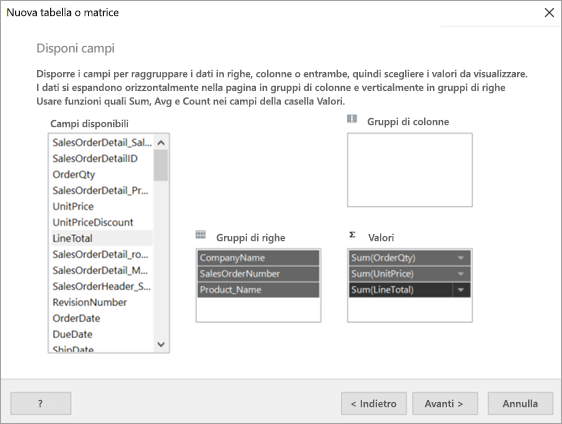

24. Nella pagina **Scegliere il layout** mantenere tutte le impostazioni predefinite, ma deselezionare **Espandi/comprimi gruppi**. In generale, la funzionalità Espandi/comprimi gruppi è molto utile, ma in questo caso si vuole che la tabella venga estesa su più pagine.

1. Selezionare **Avanti** > **Fine**. La tabella viene visualizzata nell'area di progettazione.
 
## Risultati

È opportuno dedicare un po' di tempo a esaminare i risultati della procedura guidata.

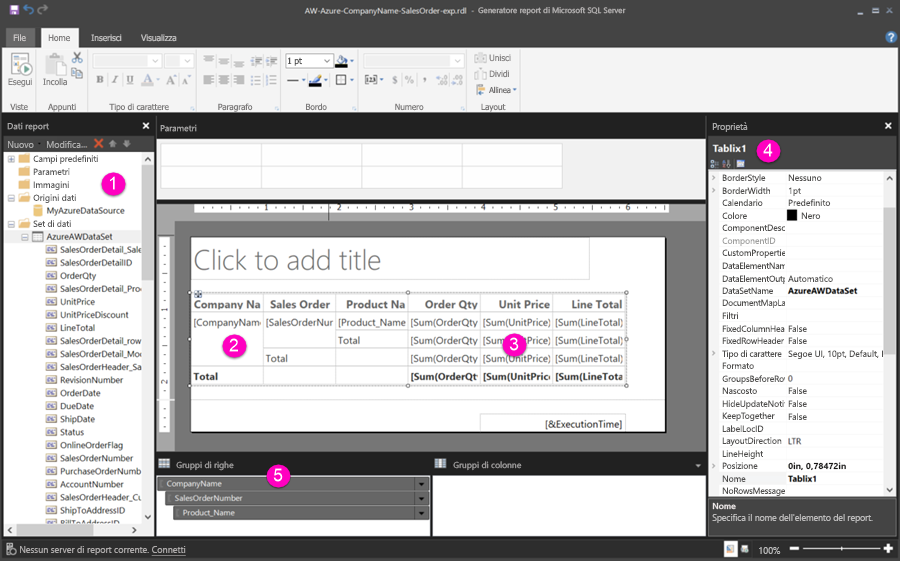

1. Nel riquadro dei dati del report vengono visualizzati l'origine dati incorporata di Azure e il set di dati incorporati basati su di essa, entrambi creati nei passaggi precedenti. 

2. L'area di progettazione ha una larghezza di circa 15 cm. Nell'area di progettazione è visibile la matrice in cui sono visualizzati le intestazioni di colonna e i valori segnaposto. La matrice include sei colonne con altezza di solo cinque righe. 

3. Order Qty, Unit Price e Line Total sono tutte somme ed è disponibile un subtotale per ogni gruppo di righe. 

    I valori dei dati effettivi non sono ancora visualizzati. Per visualizzarli, è necessario eseguire il report.

4. Nel riquadro Proprietà la matrice selezionata è denominata Tablix1. Una *tablix* in Generatore report è un'area dati che visualizza i dati in righe e colonne. Può trattarsi di una tabella o di una matrice.

5. Nel riquadro di raggruppamento sono visualizzati i tre gruppi di righe creati nella procedura guidata: 

    - CompanyName
    - Sales Order
    - Product Name

    Questa matrice non include gruppi di colonne.

### Eseguire il report

Per visualizzare i valori effettivi, è necessario eseguire il report.

1. Selezionare **Esegui** sulla barra degli strumenti **Home**.

   È ora possibile visualizzare i valori. La matrice ha molte più righe di quante erano visibili nella visualizzazione progettazione. Si noti che Generatore report indica che questa è la pagina **1** di **2?** . Generatore report carica il report il più rapidamente possibile, quindi recupera solo dati sufficienti per poche pagine alla volta. Il punto interrogativo indica che Generatore report non ha ancora caricato tutti i dati.

   

2. Selezionare **Layout di stampa**. Questo sarà il formato del report per la stampa. Generatore report ora sa che il report è costituito da 33 pagine e ha aggiunto automaticamente un indicatore di data e ora nel piè di pagina.

## Formattare il report

È ora disponibile un report con una matrice estesa su 33 pagine. Si vedrà ora come aggiungere altre funzionalità e migliorare l'aspetto. È possibile eseguire il report dopo ogni passaggio, per controllare il risultato man mano.

- Nella scheda **Esegui** della barra multifunzione selezionare **Progettazione** in modo da poter continuare a modificarlo.  

### Impostare la larghezza della pagina

In genere, un report impaginato viene formattato per la stampa e una pagina tipica ha dimensioni di 21 x 29,7 cm. 

1. Trascinare il righello per impostare una larghezza di 7 pollici per l'area di progettazione. I margini predefiniti sono di 1 pollice su ciascun lato, pertanto i margini laterali devono essere più stretti.

1. Fare clic nell'area grigia intorno all'area di progettazione per visualizzare le proprietà **Report**.

    Se il riquadro Proprietà non è visualizzato, fare clic sulla scheda **Visualizza** > **Proprietà**.

2. Espandere **Margini** e modificare i valori **Sinistra** e **Destra** da 1in a 0,75in. 

    
  
### Aggiungere un titolo al report  

1. Selezionare le parole **Fare clic per aggiungere il titolo** nella parte superiore della pagina e quindi digitare **Sales by Company** (Vendite per azienda).  

2. Selezionare il testo del titolo e nel riquadro Proprietà, in **Tipo di carattere**, impostare **Colore** su **Blu**.
  
### Aggiungere un numero di pagina

Si è notato che il report include un indicatore data e ora nel piè di pagina. È possibile aggiungere anche un numero di pagina nel piè di pagina.

1. Nella parte inferiore dell'area di progettazione, si può vedere [&ExecutionTime] a destra nel piè di pagina. 

2. Nel riquadro dei dati del report espandere la cartella Campi predefiniti. Trascinare **Numero di pagina** sul lato sinistro del piè di pagina, alla stessa altezza di [&ExecutionTime].

3. Trascinare la parte destra della casella [&PageNumber] per renderla quadrata.

4. Selezionare **Casella di testo** nella scheda **Inserisci**.

5. Fare clic a destra di [&PageNumber], digitare "di" e quindi rendere la casella di testo quadrata.

6. Trascinare **Pagine totali complessive** nel piè di pagina, a destra di "di" e quindi trascinare il lato destro per rendere anche questa casella quadrata.

    

### Allargare la tabella  

A questo punto è possibile allargare la matrice a sufficienza per riempire la larghezza della pagina e ingrandire le colonne di testo in modo che i nomi non scorrano troppo. 
 
1. Selezionare la matrice e quindi selezionare la colonna Company Name.

3. Passare il mouse sulla barra grigia nella parte superiore della matrice sul bordo destro della colonna Company Name. Trascinare verso destra, fino a quando la colonna non termina su 3,5 cm. 

    

4. Trascinare il bordo destro della colonna Product Name finché non termina su 9,5 cm.   

A questo punto la matrice è più o meno larga quanto l'area di stampa.

### Formattare la valuta

Durante l'esecuzione del report si è probabilmente notato che gli importi in denaro non sono ancora formattati come valuta.

1. Selezionare la cella in alto a sinistra [Sum(OrderQty)], tenere premuto MAIUSC e quindi selezionare la cella in basso a destra [Sum(LineTotal)].

    

2. Nella scheda **Home** selezionare il simbolo della valuta per il dollaro ( **$** ) e quindi selezionare la freccia accanto a **Stili segnaposto** > **Valori di esempio**.
 
    

    Si può ora vedere che i valori sono formattati come valuta.

    

### Aggiungere le intestazioni di colonna in ogni pagina

Si vedrà ora come apportare un altro miglioramento della formattazione prima di pubblicare il report nel servizio Power BI: visualizzare le intestazioni di colonna in ogni pagina del report.

1. All'estrema destra della barra superiore nel riquadro di raggruppamento, selezionare la freccia in giù > **Modalità avanzata**.

    

2. Selezionare la barra **Statico** in alto in **Gruppi di righe**. Si noterà che la cella Company Name nella matrice è selezionata.

   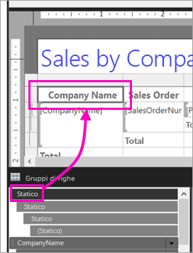

3. Nel riquadro **Proprietà** vengono visualizzate le proprietà per **Membro Tablix**. Impostare **KeepWithGroup** su **After** e **RepeatOnNewPage** su **True**.

    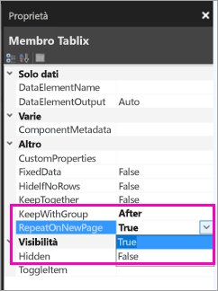

    È tempo di eseguire il report e verificarne l'aspetto.

5. Selezionare **Esegui** nella scheda **Home**.

6. Selezionare **Layout di stampa** se non è già selezionato. Il report è composto ora da 29 pagine. Scorrere alcune pagine. Si noterà che la valuta è formattata, che le colonne hanno le intestazioni in ogni pagina e che il report ha un piè di pagina con i numeri di pagina e l'indicatore di data e ora su ogni pagina.
 
    

7. Salvare il report nel computer.
 
##  Caricare il report nel servizio

Ora che è stato creato il report impaginato, è possibile caricarlo nel servizio Power BI.

1. Nel riquadro di spostamento del servizio Power BI (https://app.powerbi.com) ) selezionare **Aree di lavoro** > **Crea area di lavoro**.

2. Assegnare all'area di lavoro il nome **Azure AW** o un altro nome univoco. Per il momento si è l'unico membro. 

3. Selezionare la freccia accanto ad **Avanzate** e attivare **Capacità dedicata**. 

    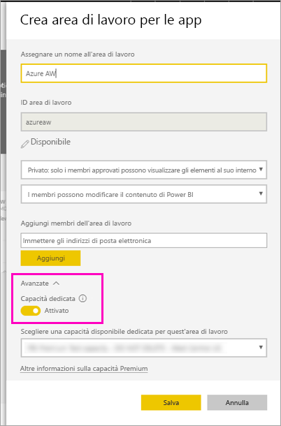

    Se non è possibile attivarla, è necessario chiedere all'amministratore di Power BI di concedere le autorizzazioni per aggiungere l'area di lavoro alla capacità Premium dedicata.

4. Scegliere una **capacità disponibile dedicata per quest'area di lavoro** se necessario > **Salva**.
    
    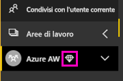

    Se l'area di lavoro non è in una capacità Premium, quando si prova a caricare il report viene visualizzato il messaggio "Non è possibile caricare il report impaginato". Contattare l'amministratore di Power BI per spostare l'area di lavoro.

1. Nella nuova area di lavoro selezionare **Recupera dati**.

2. Nella casella **File** > **Scarica**.

3. Selezionare **File locale**, passare al percorso in cui è stato salvato il file > **Apri**.

   Power BI importa il file, che verrà visualizzato in **Report** nella pagina dell'elenco delle app.

    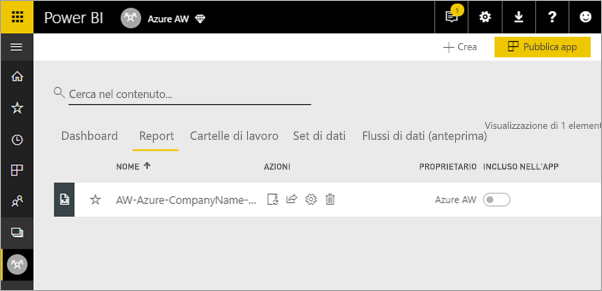

4. Selezionare il report per visualizzarlo.

5. Se si verifica un errore, potrebbe essere necessario immettere nuovamente le credenziali. Selezionare l'icona **Gestisci**.

    

6. Selezionare **Modifica credenziali** e immettere le credenziali usate in Azure quando è stato creato il database di Azure.

    

7. È ora possibile visualizzare il report impaginato nel servizio Power BI.

    

## Passaggi successivi

[Che cosa sono i report impaginati in Power BI Premium?](paginated-reports-report-builder-power-bi.md)

