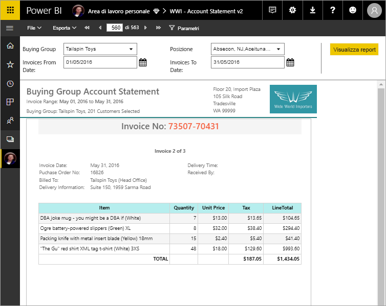

# Che cosa sono i report impaginati in Power BI Premium?

I report impaginati, da lungo tempo il formato di report standard in SQL Server Reporting Services, sono ora disponibili nel servizio Power BI. Questi report possono essere stampati o condivisi. Vengono definiti "impaginati" perché sono formattati in modo da adattarsi meglio alla pagina. Visualizzano tutti i dati in una tabella, anche se la tabella si estende su più pagine. Vengono talvolta definiti "perfetti al pixel" perché è possibile controllare esattamente il layout di pagina del report. I report impaginati sono basati sulla tecnologia di report RDL in SQL Server Reporting Services. Generatore report è lo strumento autonomo per la creazione di report impaginati. 

I report impaginati possono avere molte pagine. Ad esempio, questo report contiene 563 pagine. Ogni pagina ha un layout esatto, con una pagina per ogni fattura e intestazioni e piè di pagina ripetuti.

È possibile visualizzare in anteprima il report in Generatore report e quindi pubblicarlo nel servizio Power BI, `https://app.powerbi.com`. È necessaria una licenza di Power BI Pro per pubblicare un report nel servizio. È possibile pubblicare e condividere i report impaginati nell'area di lavoro personale o in aree di lavoro, purché l'area di lavoro sia in una capacità Power BI Premium. Un amministratore di Power BI deve anche abilitare i report impaginati nella [sezione Capacità Premium](../service-admin-premium-workloads.md#paginated-reports) nel portale di amministrazione di Power BI. 

## Creare report in Generatore report di Power BI

Per i report impaginati è disponibile uno strumento di progettazione apposito chiamato Generatore report di Power BI. Si tratta di un nuovo strumento che condivide le stesse basi degli strumenti usati in precedenza per creare report impaginati per Server di report di Power BI o SQL Server Reporting Services (SSRS). I report impaginati creati per SSRS 2016 e 2017 o per Server di Report di Power BI in locale sono infatti compatibili con il servizio Power BI. Il servizio Power BI garantisce la compatibilità con le versioni precedenti, in modo da poter trasferire i report e aggiornare qualsiasi report impaginato di una versione precedente. Non tutte le funzionalità di report sono disponibili al momento del lancio. Per i dettagli, vedere [Limitazioni e considerazioni](#limitations-and-considerations) in questo articolo.
     
## Report da un'ampia gamma di origini dati

Un singolo report impaginato può avere numerose origini dati diverse e non è basato su un modello di dati sottostante, come per i report di Power BI. Per la versione iniziale dei report impaginati nel servizio Power BI, è necessario creare origini dati e set di dati incorporati nel report stesso. Per il momento, non è possibile usare origini dati condivise o set di dati condivisi. I report vengono creati in Generatore report nel computer locale. Se un report si connette ai dati in locale, dopo aver caricato il report nel servizio Power BI è necessario creare un gateway e reindirizzare la connessione dati. Di seguito sono elencate le origini dati a cui è possibile connettersi in questo momento:

- Database SQL di Azure e Azure SQL Data Warehouse (tramite Basic e oAuth)
- Azure Analysis Services (tramite SSO)
- SQL Server tramite un gateway
- SQL Server Analysis Services tramite un gateway
- Set di dati Power BI
- Oracle
- Teradata

## Progettare il report  

### Creare report impaginati con layout matrice, grafico e a formato libero

I report tabella sono adatti ai dati basati su colonne. I report matrice, ad esempio i report a campi incrociati o di tabella pivot, sono ideali per i dati riepilogati. I report grafici presentano i dati in formato grafico e i report *elenco* in formato libero possono presentare praticamente qualsiasi altra informazione, ad esempio le fatture. 
  
È possibile iniziare con una delle creazioni guidate di Generatore report. La Creazione guidata tabella, matrice o grafico consente di eseguire in modo semplificato la creazione della connessione all'origine dati incorporata e del set di dati incorporato. È quindi possibile trascinare i campi per creare una query sul set di dati, selezionare un layout e lo stile, quindi personalizzare il report.  
  
Con la Creazione guidata mappa è possibile creare report che consentono di visualizzare dati aggregati su uno sfondo geografico o geometrico. I dati della mappa possono essere dati spaziali da una query Transact-SQL o un file di forma ESRI (Environmental Systems Research Institute, Inc.). È anche possibile aggiungere uno sfondo a sezioni per una mappa di Microsoft Bing.  

### Aggiungere altri elementi al report

È possibile modificare i dati tramite filtri, raggruppamento e ordinamento oppure aggiungendo formule o espressioni. Si possono aggiungere grafici, misuratori, grafici sparkline e indicatori per riepilogare i dati in un formato visivo.  Usare parametri e filtri per filtrare i dati per ottenere visualizzazioni personalizzate. Incorporare o fare riferimento a immagini e altre risorse, inclusi i contenuti esterni.  

Per tutti gli elementi in un report impaginato, dal report stesso a ogni casella di testo, immagine, tabella e grafico, è disponibile una gamma di proprietà che è possibile impostare per ottenere l'esatto aspetto desiderato per il report.

## Creazione di una definizione del report

Quando si progetta un report impaginato, si crea effettivamente una *definizione del report*, che non contiene i dati. La definizione specifica dove ottenere i dati, quali dati ottenere e come visualizzarli. Quando si esegue il report, l'elaboratore di report acquisisce la definizione del report specificata, recupera i dati e li combina con il layout del report per generare il report. La definizione del report viene caricata nel servizio Power BI, `https://app.powerbi.com`, nell'area di lavoro personale o in un'area di lavoro condivisa con i colleghi. Se l'origine dati del report è locale, dopo aver caricato il report, la connessione all'origine dati viene reindirizzata per il passaggio attraverso un gateway. 

## Visualizzare il report impaginato
Nel servizio Power BI il report impaginato viene visualizzato in un browser e nelle app per dispositivi mobili di Power BI. Il report può essere esportato dal servizio Power BI in diversi formati, ad esempio HTML, MHTML, PDF, XML, CSV, TIFF, Word ed Excel. È anche possibile condividerlo con altri utenti.  

## Creare una sottoscrizione al report

È ora possibile configurare la sottoscrizione per se stessi e altri utenti di report impaginati nel servizio Power BI tramite un messaggio di posta elettronica. Il processo è generalmente identico a quello previsto per la sottoscrizione di report e dashboard nel servizio Power BI. Durante la configurazione delle sottoscrizioni, è possibile scegliere la frequenza di ricezione dei messaggi di posta elettronica: giornaliera, settimanale oppure oraria. La sottoscrizione contiene un allegato PDF dell'output dell'intero report.

Per informazioni dettagliate, vedere l'articolo [Sottoscrivere per se stessi e altri utenti un report impaginato nel servizio Power BI](../consumer/paginated-reports-subscriptions.md). 

## Limitazioni e considerazioni

L'elenco seguente include alcune altre funzionalità non supportate nella versione iniziale:

- Aggiunta di pagine del report o oggetti visivi a dashboard di Power BI. È comunque possibile aggiungere visualizzazioni a un dashboard di Power BI da un report impaginato in locale in un Server di report di Power BI o un server di report di Reporting Services. Per altre informazioni, vedere [Pin Reporting Services items to Power BI Dashboards](https://docs.microsoft.com/sql/reporting-services/pin-reporting-services-items-to-power-bi-dashboards) (Aggiungere elementi di Reporting Services ai dashboard di Power BI).
- Mappe documento.
- Sottoreport e report drill-through.  È tuttavia possibile prendere in considerazione l'uso di parametri URL con i report impaginati per ottenere scenari di drill-through.
- Origini dati condivise e set di dati condivisi.

 
## Passaggi successivi

- [Installare Generatore report di Power BI dall'Area download Microsoft](https://go.microsoft.com/fwlink/?linkid=2086513)
- [Esercitazione: Creare un report impaginato](paginated-reports-quickstart-aw.md)
- [Immettere i dati direttamente in un report impaginato](paginated-reports-enter-data.md)
- [Esercitazione: Incorporare report impaginati di Power BI in un'applicazione per i clienti](../developer/embed-paginated-reports-customers.md)